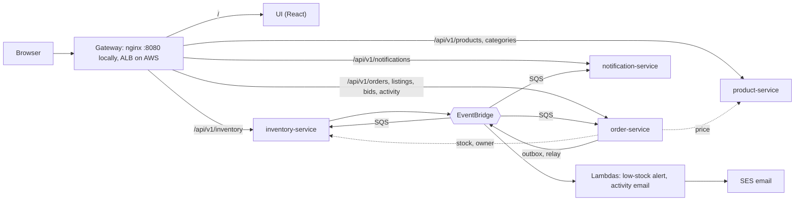
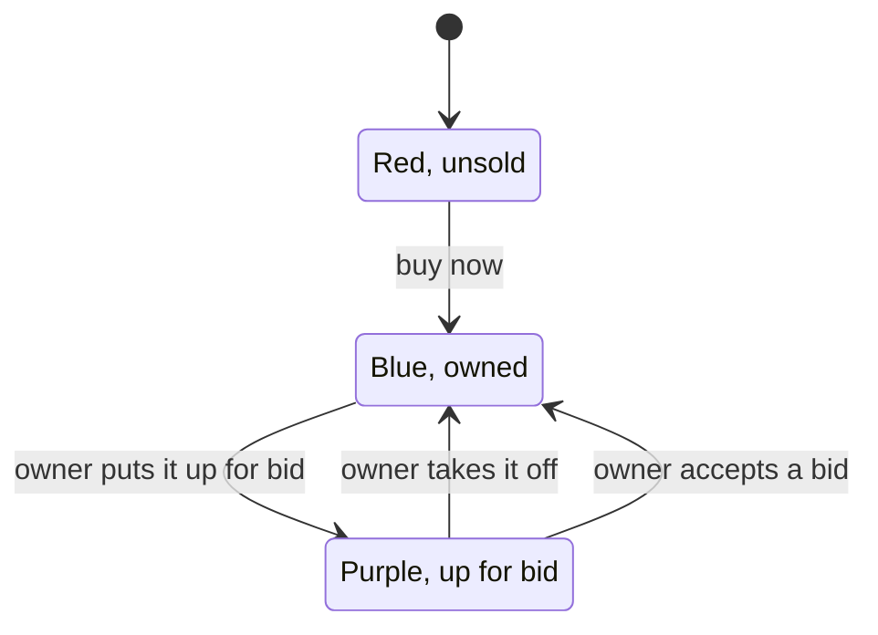
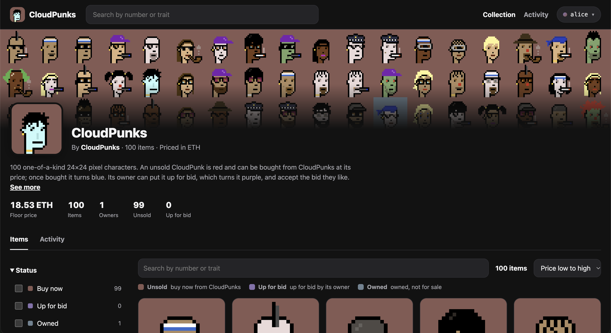
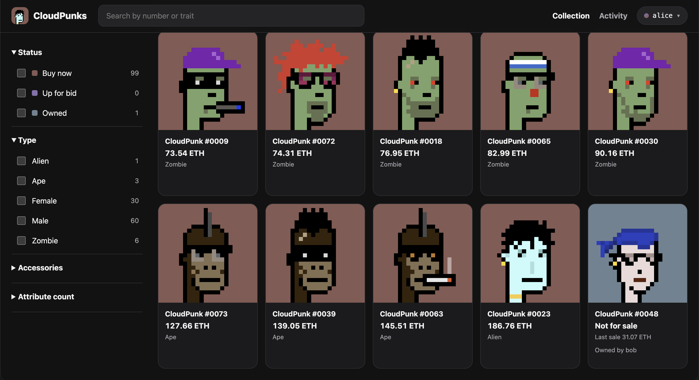
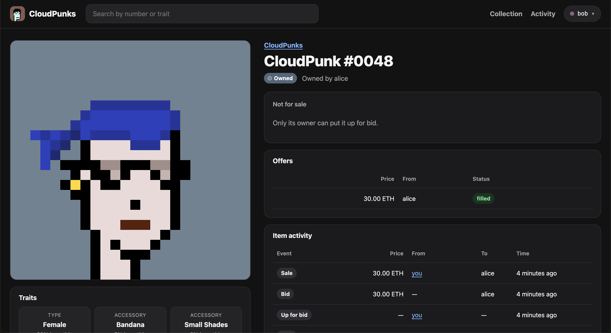

# CloudPunks

A marketplace for one collection of 100 one-of-a-kind 24×24 pixel-art characters, **CloudPunks**: buy one from the platform, put it up for bid, accept the bid you like. Under it sit four microservices that talk through asynchronous events: an order goes `PENDING` → `CONFIRMED` or `REJECTED` while inventory moves the CloudPunk to its new owner. There is no blockchain, wallet or payment: a sale is an order, prices are in ETH as two-decimal strings, and your customer id plays the part of a wallet address.

It runs end to end with Docker Compose (LocalStack stands in for AWS, so no account or credential is involved), on a local Kubernetes cluster (OrbStack), and on AWS EKS, built and operated only by GitHub Actions.



*Dashed: synchronous REST. Everything after an order is accepted travels as events.*

| Service | Owns | Store |
| --- | --- | --- |
| product-service | The 100 CloudPunks, their types and prices | PostgreSQL `product_db`, Valkey cache |
| inventory-service | Stock and who owns each CloudPunk | DynamoDB |
| order-service | Orders, listings, bids, activity, the outbox | PostgreSQL `order_db` |
| notification-service | Order notifications | DynamoDB |

## How the market works



| Tile colour | State | What you can do |
| --- | --- | --- |
| **Red** | Unsold: the platform holds it | **Buy now** at its price. The first buyer wins |
| **Blue** | Owned, not on the market | Its owner can **put it up for bid** |
| **Purple** | Up for bid | Anyone but the owner **makes an offer**; the owner **accepts** one or **takes it off** |

The UI is a marketplace collection page: Items and Activity tabs, filters, a page per CloudPunk, **My CloudPunks**, and a customer menu in the header to switch between customers, so one browser can play buyer and seller. Every sale, bid and listing also produces an email (LocalStack keeps it locally; in dev it goes through SES). The art is generated into `nft-collection/` (`make cloudpunks`).

## Screenshots

The collection page: banner, stats and the status filter.



The items grid, filtered by type, with an owned CloudPunk shown blue.



A CloudPunk's page: owner, offers and item activity after a sale.



## Prerequisites

- Docker with Compose (developed on OrbStack, Apple Silicon)
- [`uv`](https://docs.astral.sh/uv/) and Python 3.13
- Node 24 (`ui/.nvmrc`), only for the `ui-*` targets; `make ui-e2e` also needs Playwright's Chromium (`cd ui && npx --no-install playwright install chromium`)
- A LocalStack auth token: <https://app.localstack.cloud>

## Run it

```sh
make .env                # copies .env.example to .env (git-ignored)
# edit .env: set LOCALSTACK_AUTH_TOKEN and LOCALSTACK_TAG
make up                  # build and start everything; blocks until healthy
make seed                # the 100 CloudPunks and one unit of stock each (idempotent)
```

Open <http://localhost:8080/> (the UI and `/api/v1/...`). Run everything through `make`: Compose needs `IMAGE_TAG` and `--env-file .env`, and images are tagged `dev-<git sha>`, never `:latest`. After a LocalStack restart run `make seed` again; `make reset`, `make up`, `make seed` is the clean start (`docs/runbooks/local-environment.md`).

Each service is also on its own port (`:8001` product, `:8002` inventory, `:8003` order, `:8004` notification) with `/health/ready`, `/metrics` and `/docs`. `make obs-up` adds Prometheus (<http://localhost:9090>) and Grafana (<http://localhost:3000>).

## Make targets

| Target | Purpose |
| --- | --- |
| `up`, `down`, `reset`, `seed`, `logs s=<service>` | Start, stop, drop all data, load the collection, follow logs |
| `lint`, `fmt` | ruff, mypy per service, OpenAPI and art checks, UI type check, eslint, prettier, production build |
| `test` | Unit tests (hermetic: no AWS, no LocalStack) and UI tests; 80% coverage gates |
| `itest` | Integration tests against the running stack |
| `e2e`, `ui-e2e` | Acceptance steps, market steps and failure drills through the gateway; browser journeys (Playwright) |
| `drills`, `drill-<name>` | The failure drills alone |
| `dlq-peek q=<queue>-dlq`, `dlq-redrive q=<queue>-dlq` | Inspect or redrive a dead-letter queue (local) |
| `obs-up`, `obs-down`, `rules-test` | Prometheus and Grafana; promtool tests of the alert rules |
| `k8s-ingress`, `k8s-deploy`, `k8s-e2e`, `k8s-resilience`, `k8s-monitoring`, `k8s-rollback`, `k8s-down` | The same platform on OrbStack Kubernetes |
| `ui-*`, `openapi`, `cloudpunks`, `ui-art` | The UI's own steps, the OpenAPI snapshots in `docs/openapi/`, the art |
| `lock`, `sync` | Refresh or install the uv environment |

The full check, from nothing:

```sh
make reset && make up && make seed
make lint test itest e2e ui-e2e
```

The end-to-end suites work on their own items (`E2E-A`, `E2E-B`, `E2E-N`), and the browser journeys hand back the CloudPunks they buy, so the collection stays as you left it.

## Observability

Every process logs JSON with a `correlation_id` (send `X-Correlation-ID`, or one is generated) and serves Prometheus metrics. The **Retail platform** Grafana dashboard shows request rate, errors and latency per service, events by outcome, queue and dead-letter depth, outbox lag, stuck orders and time to a final status. On AWS the same metrics feed an in-cluster Prometheus, Alertmanager and a view-only Grafana, logs go to CloudWatch, and alarms arrive by email through one SNS topic. Every alarm has a runbook: `docs/runbooks/README.md`.

## Layout

```text
libs/common/       shared package: settings, logging, metrics, health, events, consumer loop
services/*/        product, inventory, order, notification (FastAPI; one image per service, several processes)
functions/         the two Lambdas: low-stock-alert and market-activity-email
ui/                React SPA, the marketplace (npm project outside the uv workspace)
nft-collection/    the 100 CloudPunk SVGs (generated; the UI bundles a copy)
gateway/           nginx routing, mirrors the ALB rules
local/             Compose file, LocalStack bootstrap, PostgreSQL init, seed data, Prometheus and Grafana config
tests/e2e/         acceptance steps, market steps and failure drills
docs/              DESIGN.md, adr/ (history), runbooks/, generated OpenAPI snapshots
deploy/helm/       the retail-service, secret-store and monitoring charts, and the values per release
infra/terraform/   bootstrap, dev/platform, dev/cluster-addons, dev/alb-alarms, dev/dns and dev/alb-dns (applied only from workflows)
scripts/           the art generator, DLQ tools, OpenAPI export, db_init, packaging and k8s helpers (tests in scripts/tests)
.github/workflows/ every workflow (see its README)
```

## Documentation

| Read | For |
| --- | --- |
| `docs/DESIGN.md` | The design: decisions, architecture, API and event contracts, data model, tests, the cloud, the marketplace |
| `docs/runbooks/README.md` | What to do when an alarm fires, and the local procedures (clean start, drills, local cluster) |
| `docs/adr/README.md` | How it was built: change history, what went wrong, closed questions, the old build plan |
| `.github/workflows/README.md` | Every workflow, the run and teardown order, browser access to dev, branches and releases |
| `infra/terraform/README.md` | The stacks, the one-time manual setup, the alarms |
| `docs/openapi/`, `ui/README.md` | The generated API contracts; the UI |

## Local Kubernetes

The processes can run in OrbStack's Kubernetes cluster while PostgreSQL, Valkey and LocalStack stay in Compose, the shape EKS has: `make k8s-ingress`, `make k8s-deploy`, `make k8s-e2e`, then open <http://retail.k8s.orb.local/>. Steps and caveats: `docs/runbooks/local-environment.md`.

## Running on AWS Dev Environment

Dev runs in `us-east-1`: two EKS nodes, RDS for PostgreSQL, ElastiCache for Valkey, DynamoDB, EventBridge and SQS, behind an internal ALB, plus an optional internet-facing viewer ALB open to one address. With a domain set (`DEV_DOMAIN`), both ALBs serve HTTPS with an ACM certificate under names in Route 53: `https://dev.<domain>` for the viewer, `https://internal.dev.<domain>` inside the VPC (`docs/runbooks/https-and-domain.md`). No AWS credential exists on any laptop: every change is a workflow, started by hand, with an approval on the `bootstrap` or `dev` GitHub Environment. The one-time manual setup is in `infra/terraform/README.md`; the run order, the teardown order, resetting the market and opening the app in a browser are in `.github/workflows/README.md`.

The short version: `bootstrap-*`, `platform-create`, `addons-create`, `app-database`, `app-prepare`, `app-deploy`, `app-seed`; for a browser view `app-expose`; for HTTPS `dns-create` before `app-deploy` and `alb-dns-create` after it. `app-deploy` runs the acceptance suite through the load balancer. Dev costs roughly $360 a month while it runs (a list-price estimate; the budget alert is $350), so destroy it when idle.
