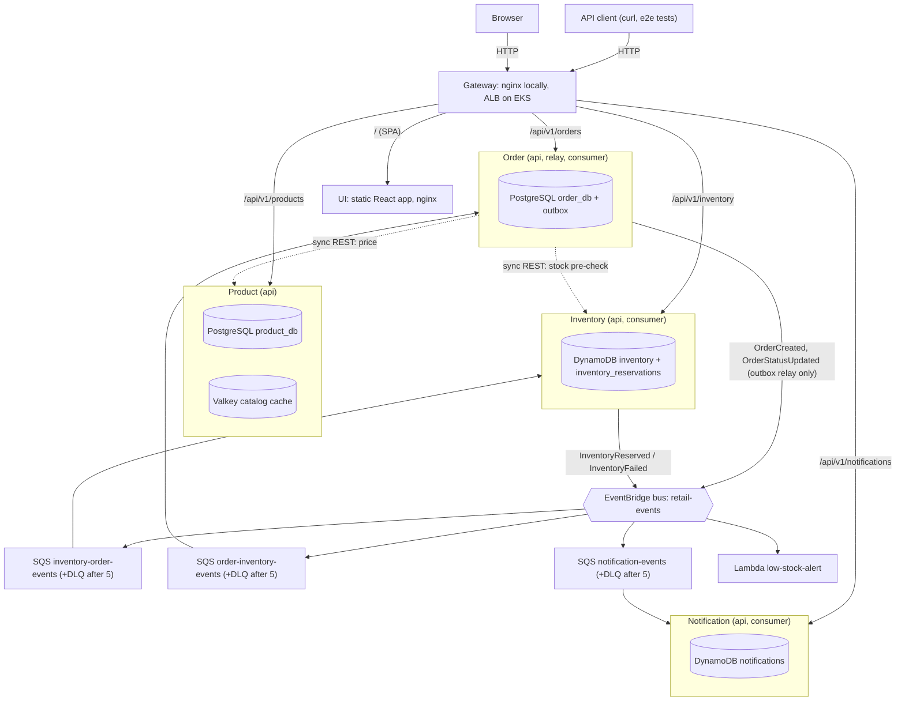
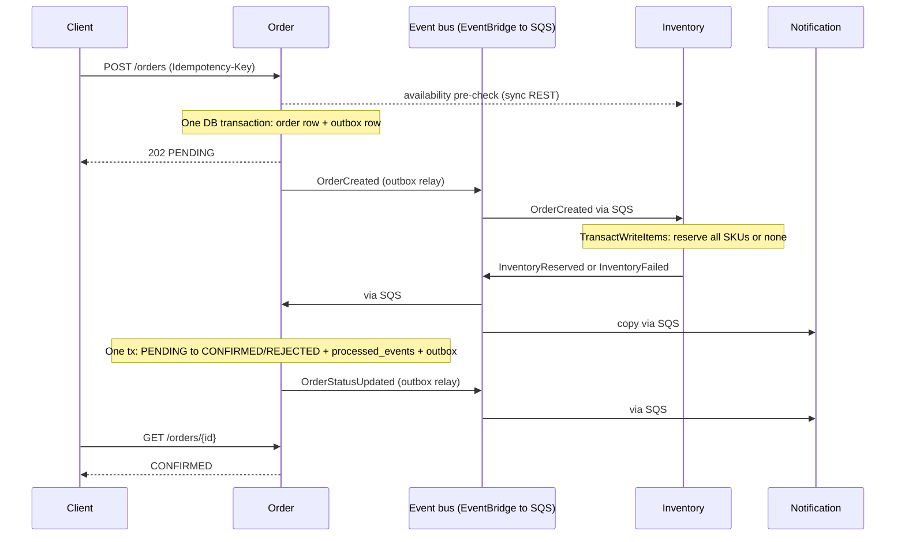

# Retail Microservices Platform — Design Doc

Author: M.L. · Status: M0–M10 built (Phase 1 complete); Phase 2 built and running in dev on AWS (2 Oct 2026); Phase 3 built (2 Oct 2026, release v0.1.0); Phase 4 not started. Change history and as-built notes: `docs/adr/README.md`.

## 1. Overview

We build a four-service retail order platform that runs end-to-end on localhost first, then moves to AWS EKS with no application code changes — only configuration. Every AWS dependency is reached through an adapter whose endpoint is an environment variable, so LocalStack, PostgreSQL and Valkey containers stand in for EventBridge/SQS/DynamoDB, RDS and ElastiCache.

**Goals**

- A customer can browse products, place an order, and see it move `PENDING → CONFIRMED | REJECTED` via asynchronous events.
- Correct under retries and duplicates: no double reservation, no lost events, no stuck orders.
- Observable from day one: structured logs with correlation IDs, Prometheus metrics, health endpoints.
- Cloud-portable: the same container images and env-var contract run on Docker Compose and EKS.
- The same journey works in a browser: a React single-page app (section 15) on top of the public API, served through the same gateway.

**Non-goals (this week)**

- Payments, carts, auth/login, cancellations, returns, multi-currency.
- Service mesh, Kafka, GitOps (ArgoCD/Flux) — documented as extensions only.
- Login, payments and server-side carts stay out even with a UI: the UI uses a demo customer id and a client-side basket (section 15). Also out: SSR, PWA/offline, i18n, analytics.

**Build strategy**

| Phase | Scope | Plan day | Exit criterion |
| --- | --- | --- | --- |
| 1a — Local (Compose on OrbStack) | Services, data layer, events, tests | Day 1–2 | Acceptance test passes on `make up` |
| 1b — UI (React) | `ui/` single-page app and nginx image, gateway `/` route, Playwright journeys (M8; section 15) | Day 2 (late) | Browser journeys pass on Compose via `make ui-e2e` |
| 1c — Local Kubernetes (OrbStack) | Helm chart for every process including the UI, probes, HPA, ingress, rollback on the local cluster | Day 3 (morning) | Same test (API acceptance and UI journeys) passes via local ingress; `helm rollback` demonstrated |
| 2 — Cloud infra, built through CI (built 2 Oct 2026) | Manual OIDC provider + `cloudbatch818-loria-retail-bootstrap` role; `bootstrap-state-bucket.yml`, `bootstrap-ci-roles.yml`; minimal `platform-create.yml`; Terraform, ECR, EKS, in-VPC runners; the 1b chart with dev values. No AWS access exists outside GitHub Actions (ADR-14) | Day 3 | Same test passes against the EKS ingress, run from a workflow. **Met:** `app-deploy.yml` runs the acceptance suite through the dev ALB (10 passed, none skipped; the dead-letter-queue count inside step 9 is not checked in the cloud) |
| 3 — CI/CD (built 2 Oct 2026) | `pr.yml` with one required `ci` gate, Trivy image and config scans, Checkov, tflint, actionlint; protected `stage` and `prod` branches and Environments; `promote.yml`; `app-rollback.yml`; release `v0.1.0`. The deploy and destroy workflows already exist from Phase 2. No push trigger for the deploy (decided) | Day 4 | **Met in part:** a pull request is gated by `ci` (shown red, then green, on PR #1). Not demonstrated: `app-rollback.yml` has never run, and `promote.yml` has never run because stage and prod are not deployed |
| 4 — Reliability (scoped 2 Oct 2026, P4.1 to P4.7 in section 13) | Dashboards, SLOs, alarms, failure drills, runbooks | Day 5 | Each drill in section 11 detected and recovered |

This document is detailed for Phase 1 and gives forward-compatible contracts for Phases 2–4 so nothing built locally has to be rewritten.

## 2. Key architecture decisions

Each decision below is binding for Claude Code; changing one means updating this table first.

| # | Decision | Why | Rejected alternative |
| --- | --- | --- | --- |
| ADR-01 | Python 3.13 + FastAPI for all four services | Fastest path to working, typed APIs; one toolchain; small learning surface for the week | Go (smaller images, more boilerplate), Spring Boot (JVM memory/startup on small nodes) |
| ADR-02 | Monorepo, one image per service, shared `libs/common` package | Atomic changes to event schemas; one CI pipeline with path filters | Polyrepo (schema drift, 4× pipeline work) |
| ADR-03 | Database per service: `product_db` and `order_db` are separate PostgreSQL databases with separate roles | Services cannot join across boundaries; enables independent migration | Shared schema (hidden coupling) |
| ADR-04 | Transactional outbox for Order Service events | Order write and event publish must be atomic; `POST /orders` is not a retryable message | Publish after commit (lost events on crash), 2PC (unavailable) |
| ADR-05 | Inventory uses idempotent redelivery instead of an outbox | It is triggered by SQS; if publish fails, the message is not deleted and the retry re-emits from the stored reservation | DynamoDB Streams + EventBridge Pipes (better in cloud, weak local emulation) — Phase 4 option |
| ADR-06 | EventBridge custom bus → SQS queue per consumer → DLQ | Bus gives content routing and fan-out; SQS gives durability, backpressure, retries | SNS→SQS (no content filtering on detail), direct SQS (producer knows consumers) |
| ADR-07 | All consumers idempotent keyed on `event.id` | SQS standard is at-least-once and unordered | FIFO queues (throughput caps, still need idempotency across the bus) |
| ADR-08 | Synchronous inventory pre-check, asynchronous reservation | Fast feedback for obvious out-of-stock; reservation remains authoritative and race-safe | Sync reservation (tight coupling, distributed rollback) |
| ADR-09 | Cache-aside with TTL for catalog reads only | Catalog is read-heavy and tolerates 5 min staleness; stock never cached | Write-through (more code), caching inventory (oversell risk) |
| ADR-10 | AWS SDK endpoint via `AWS_ENDPOINT_URL`, no code branches for local | Identical code path local and cloud; boto3 honours the env var natively | `if ENV == local` branches (untested prod paths) |
| ADR-11 | Schema migrations run as a separate one-shot process, never at app startup | N replicas racing migrations; later maps to a Helm pre-upgrade Job | Migrate on boot (race, slow readiness) |
| ADR-12 | Valkey 9.0 locally and on ElastiCache | ElastiCache now offers Valkey at lower cost than Redis OSS; wire-compatible with `redis-py` | Redis OSS 7 (fine, pricier on ElastiCache) |
| ADR-13 | PostgreSQL 17 locally, Amazon RDS for PostgreSQL 17 in cloud (changed from Aurora on 1 Oct 2026 to cut cost and moving parts; deviates from the original brief's Aurora/RDS MySQL; that brief is not in this repo) | Transactional DDL (a failed migration rolls back cleanly), `JSONB` for the outbox, partial indexes, `INSERT … ON CONFLICT DO NOTHING` for dedupe, `SKIP LOCKED` | Aurora MySQL 3 (the original brief's default; non-transactional DDL, weaker partial-index story) |
| ADR-14 | AWS is reached only from GitHub Actions through OIDC role assumption; no IAM users, access keys or local AWS credentials exist. The OIDC provider and the `cloudbatch818-loria-retail-bootstrap` role are created by hand once; all other roles are Terraform-managed | Removes long-lived credentials entirely; every cloud change is reviewed, logged and reproducible | Local `terraform apply` with SSO or keys (unreviewed changes, credentials on a laptop) |
| ADR-15 | Jobs that need the EKS API (helm, kubectl, e2e, drills) run on ephemeral self-hosted runners inside the VPC; all other jobs use GitHub-hosted runners | EKS endpoint stays private and the ALB can be internal; Terraform AWS-API calls need no VPC access | Public EKS endpoint with IAM auth (simpler, larger attack surface) |
| ADR-16 | The UI is a React + TypeScript single-page app built with Vite into static files, served by an unprivileged nginx container (`ui`), and reached through the same gateway/ALB as the API on the same origin (`/` goes to `ui`, `/api/v1/*` to the services) | No CORS and no per-environment API URL in the bundle (it calls relative `/api/v1`), so one image runs on Compose, local Kubernetes and EKS; static files need no Node runtime to operate | Next.js (a Node SSR runtime to run and patch for no benefit here); Create React App (deprecated); S3 + CloudFront (cloud-only, breaks "same image everywhere"; a possible later option); a separate UI origin with CORS |
| ADR-17 | The UI is a pure client of the public API: no new endpoints, no direct database or AWS access, a client-side basket (not a server cart), and a browser-generated demo customer id that is explicitly not authentication | Keeps the backend contracts as the only source of truth and the non-goals (auth, payments, carts) intact; anything the UI needs that the API cannot do is an API-contract question, not UI logic | Server-side carts and sessions (scope and state to operate); a login form that only pretends |

**Enterprise note:** ADR-04 and ADR-07 are the two that separate a demo from a system you would put your name on. Most event-driven outages in practice are lost or duplicated events, not slow ones.

## 3. System architecture

The customer path is synchronous only up to order acceptance; everything after `202 Accepted` happens through the event bus. Each service owns its store, and no service reads another's database.



*Orders enter through REST and settle through events. Dashed = synchronous REST; solid into the bus = events published; bus to queue to service = SQS delivery.*

Order is the only service with both sync dependencies (Product for price, Inventory for the pre-check) and an outbox; Notification only listens. Product has no events this week.

### Local to AWS mapping

| Concern | Local (Phase 1) | AWS (Phase 2+) | What changes |
| --- | --- | --- | --- |
| Compute | Docker Compose containers (M0–M9), then OrbStack Kubernetes (M10) | EKS Deployments on managed node groups | Nothing in the image; Helm values |
| Ingress | nginx gateway on :8080; Traefik in M10 | ALB via AWS Load Balancer Controller | Same path rules in Ingress (`/api/v1/*` to the services, everything else to `ui`) |
| UI | `ui` container (nginx serving static files) behind the gateway | EKS Deployment behind the ALB's default rule, image from ECR | Helm values only |
| Relational | PostgreSQL 17 container | RDS for PostgreSQL 17 (dev Single-AZ, prod Multi-AZ) | `DB_HOST`, secret source |
| Key-value | LocalStack DynamoDB | DynamoDB on-demand | `AWS_ENDPOINT_URL` unset |
| Cache | Valkey 9.0 container | ElastiCache for Valkey (TLS) | `CACHE_URL` |
| Events | LocalStack EventBridge + SQS | EventBridge + SQS | `AWS_ENDPOINT_URL` unset; `QUEUE_NAME` resolved at startup |
| Function | LocalStack Lambda | Lambda (Terraform-deployed; the zip is built by `scripts/package_lambda.py`) | Packaging only |
| Secrets | `.env` (git-ignored) | Secrets Manager + KMS via External Secrets Operator | Same env var names |
| AWS credentials | `test`/`test` for LocalStack | EKS Pod Identity role per ServiceAccount | SDK default chain, no code change |
| Metrics and logs | Prometheus + Grafana profile; stdout | Prometheus/Grafana + CloudWatch Logs | Same `/metrics` and JSON logs |

## 4. Service specifications and API contracts

All services expose JSON over HTTP under `/api/v1`, plus `/health/live`, `/health/ready` and `/metrics` at the root. Each service also emits an OpenAPI spec at `/openapi.json`; that generated spec is the contract of record once built.

| Service | Owns | Port (local) | Stores | Publishes | Consumes |
| --- | --- | --- | --- | --- | --- |
| product-service | Catalog, categories, prices | 8001 | PostgreSQL `product_db`, Valkey | — | — |
| inventory-service | Stock levels, reservations | 8002 | DynamoDB `inventory`, `inventory_reservations` | InventoryReserved, InventoryFailed | OrderCreated |
| order-service | Orders, order items, status | 8003 | PostgreSQL `order_db` (incl. outbox) | OrderCreated, OrderStatusUpdated | InventoryReserved, InventoryFailed |
| notification-service | Customer notifications (simulated) | 8004 | DynamoDB `notifications` | — | InventoryReserved, InventoryFailed, OrderStatusUpdated |
| ui | The React single-page app (static files, section 15) | 8005 | — | — | — |
| gateway (nginx) | Path routing, stands in for ALB | 8080 | — | — | — |

### Endpoints

| Service | Method + path | Purpose | Notes |
| --- | --- | --- | --- |
| product | `GET /api/v1/products?category=&page=&size=` | List products | Cached per query key, TTL 300 s |
| product | `GET /api/v1/products/{sku}` | Product detail | Cache-aside, TTL 300 s |
| product | `POST /api/v1/products` | Create product (admin) | Invalidates list cache keys |
| product | `PUT /api/v1/products/{sku}` | Update price/details (admin) | Deletes `product:{sku}` and list keys |
| product | `GET /api/v1/categories` | List categories | Cached, TTL 3600 s |
| inventory | `GET /api/v1/inventory/{sku}` | Stock for one SKU | Never cached; strongly consistent read |
| inventory | `POST /api/v1/inventory/availability` | Batch check; body and response in the OpenAPI spec | Advisory only; reservation is authoritative |
| inventory | `PUT /api/v1/inventory/{sku}` | Set stock (admin/seed) | — |
| order | `POST /api/v1/orders` | Create order | Requires `Idempotency-Key` header; returns 202 + order in `PENDING` |
| order | `GET /api/v1/orders/{order_id}` | Order with items and status | — |
| order | `GET /api/v1/orders?customer_id=` | Orders for a customer | Newest first, paginated |
| notification | `GET /api/v1/notifications?order_id=` | Notifications for an order | For demo and test assertions |

The generated OpenAPI specs (`docs/openapi/<service>.json`, written by `make openapi`) are the contract of record for fields, limits and error codes; narrative summaries as built are in `docs/adr/README.md`.

### Create-order contract

Request:

```json
POST /api/v1/orders
Idempotency-Key: 6f1c2b1e-4a7d-4c55-9a51-0b8e3f0d2c11
{
  "customer_id": "cust-1001",
  "items": [ { "sku": "SKU-TSHIRT-BLK-M", "quantity": 2 } ]
}
```

Response `202 Accepted`:

```json
{
  "order_id": "01J9Z6Q4W8K3M2N1P0R7S5T4V3",
  "status": "PENDING",
  "total_amount": "39.98",
  "currency": "USD",
  "items": [ { "sku": "SKU-TSHIRT-BLK-M", "quantity": 2, "unit_price": "19.99" } ],
  "created_at": "2026-10-05T14:03:11Z"
}
```

Rules:

- Order Service fetches price from Product Service and **snapshots `unit_price` into the order**. Later price changes never alter existing orders.
- Same `Idempotency-Key` + same body (no expiry; the key is unique per customer) → return the original order (200). Same key + different body → 422.
- Pre-check says unavailable → 409 `OUT_OF_STOCK`, no order row written.
- Product or Inventory unreachable → 503 with `Retry-After`; no partial order.
- Money is `NUMERIC(10,2)` in PostgreSQL, `Decimal` in Python and a string in JSON. Never floats.
- IDs are ULIDs (sortable, safe to expose).
- `items` holds 1–20 lines with distinct SKUs and `quantity` 1–100; anything else → 422 before any downstream call.
- Concurrent requests with the same key: the loser hits `uq_orders_customer_idem`. Catch that violation (no bare `except`), roll back, load the winner's row and apply the same-body/different-body rule above.

### Error shape (all services)

```json
{ "error": { "code": "OUT_OF_STOCK", "message": "SKU-TSHIRT-BLK-M: requested 2, available 1", "correlation_id": "…" } }
```

## 5. Data model

Two PostgreSQL 17 databases (plain PostgreSQL features only, so RDS for PostgreSQL runs them unchanged), three DynamoDB tables, one cache namespace per service. Migrations use Alembic; every migration must be backward compatible with the previous app version (expand → migrate → contract), because Phase 3 rollbacks roll back code, not schema.

Each database has two roles: `<svc>_owner` owns the schema and runs migrations; `<svc>_app` gets `SELECT, INSERT, UPDATE, DELETE` through `ALTER DEFAULT PRIVILEGES`, so the running service cannot alter its own schema. Tables live in the `public` schema of each database.

### product_db (PostgreSQL)

```sql
CREATE TABLE categories (
  id    INTEGER GENERATED ALWAYS AS IDENTITY PRIMARY KEY,
  slug  VARCHAR(64)  NOT NULL UNIQUE,
  name  VARCHAR(128) NOT NULL
);

CREATE TABLE products (
  sku          VARCHAR(64)   PRIMARY KEY,
  name         VARCHAR(255)  NOT NULL,
  description  TEXT,
  category_id  INTEGER       NOT NULL REFERENCES categories (id),
  price        NUMERIC(10,2) NOT NULL CHECK (price >= 0),
  currency     CHAR(3)       NOT NULL DEFAULT 'USD',
  active       BOOLEAN       NOT NULL DEFAULT TRUE,
  created_at   TIMESTAMPTZ   NOT NULL DEFAULT now(),
  updated_at   TIMESTAMPTZ   NOT NULL DEFAULT now()   -- set by the app on update
);

-- PostgreSQL does not index foreign keys automatically
CREATE INDEX ix_products_category_active ON products (category_id) WHERE active;
```

### order_db (PostgreSQL)

```sql
CREATE TABLE orders (
  order_id         CHAR(26)      PRIMARY KEY,                 -- ULID
  customer_id      VARCHAR(64)   NOT NULL,
  status           VARCHAR(16)   NOT NULL
                   CHECK (status IN ('PENDING', 'CONFIRMED', 'REJECTED')),
  status_reason    VARCHAR(255),
  total_amount     NUMERIC(12,2) NOT NULL,
  currency         CHAR(3)       NOT NULL,
  idempotency_key  VARCHAR(64)   NOT NULL,
  request_hash     CHAR(64)      NOT NULL,                    -- sha256 of canonical body
  version          INTEGER       NOT NULL DEFAULT 1,          -- optimistic lock
  created_at       TIMESTAMPTZ   NOT NULL DEFAULT now(),
  updated_at       TIMESTAMPTZ   NOT NULL DEFAULT now(),
  CONSTRAINT uq_orders_customer_idem UNIQUE (customer_id, idempotency_key)
);
CREATE INDEX ix_orders_customer_created ON orders (customer_id, created_at DESC);
CREATE INDEX ix_orders_pending_created  ON orders (created_at) WHERE status = 'PENDING';  -- stuck-order sweeper

CREATE TABLE order_items (
  order_id    CHAR(26)      NOT NULL REFERENCES orders (order_id),
  sku         VARCHAR(64)   NOT NULL,
  quantity    INTEGER       NOT NULL CHECK (quantity BETWEEN 1 AND 100),
  unit_price  NUMERIC(10,2) NOT NULL,
  PRIMARY KEY (order_id, sku)
);

CREATE TABLE outbox (
  id            BIGINT GENERATED ALWAYS AS IDENTITY PRIMARY KEY,
  event_id      CHAR(26)     NOT NULL UNIQUE,
  detail_type   VARCHAR(64)  NOT NULL,
  payload       JSONB        NOT NULL,                        -- full envelope
  created_at    TIMESTAMPTZ  NOT NULL DEFAULT now(),
  published_at  TIMESTAMPTZ,
  attempts      INTEGER      NOT NULL DEFAULT 0,
  last_error    VARCHAR(512)
);
CREATE INDEX ix_outbox_unpublished ON outbox (id) WHERE published_at IS NULL;

CREATE TABLE processed_events (
  event_id      CHAR(26)    PRIMARY KEY,
  processed_at  TIMESTAMPTZ NOT NULL DEFAULT now()
);
```

PostgreSQL-specific rules:

- Status is a `CHECK` constraint, not a `CREATE TYPE … AS ENUM`: adding a value later is a plain constraint swap, which fits expand/contract better.
- Dedupe is `INSERT INTO processed_events (event_id) VALUES (:id) ON CONFLICT DO NOTHING`; `rowcount = 0` means duplicate. No exception-driven control flow, no aborted transaction.
- `updated_at` has no `ON UPDATE` equivalent; SQLAlchemy sets it via `onupdate=func.now()`. No triggers.
- Alembic migrations run inside a transaction; PostgreSQL DDL is transactional, so a failed migration leaves no half-applied schema. Exception: `CREATE INDEX CONCURRENTLY` cannot run in a transaction and needs its own migration with `autocommit_block()`.
- **Gotcha — outbox bloat:** every publish is an `UPDATE`, which leaves a dead tuple. The relay deletes rows published more than 7 days ago in batches of 1,000, and the partial index keeps the hot scan small. Without this, autovacuum falls behind and relay latency creeps up over weeks.

### DynamoDB tables (on-demand capacity)

| Table | PK | SK | Attributes | Access pattern |
| --- | --- | --- | --- | --- |
| `inventory` | `sku` (S) | — | `available` (N), `reserved` (N), `updated_at` (S) | Get by SKU; conditional decrement on reserve |
| `inventory_reservations` | `order_id` (S) | — | `items` (L), `status` (S: RESERVED/FAILED), `event_id` (S), `reason` (S), `failed_items` (L, FAILED only), `remaining` (M, RESERVED only), `created_at` (S), `ttl` (N) | Idempotency record per order (TTL 35 days, at least 30, so it outlives SQS retention and any archive replay; otherwise a replayed OrderCreated reserves twice); replay source for re-emitting the outcome event |
| `notifications` | `order_id` (S) | `event_id` (S) | `type`, `channel`, `message`, `created_at`, `ttl` | Conditional put `attribute_not_exists(event_id)` = dedupe; query by order |

Reservation is one `TransactWriteItems` call: a `Put` on `inventory_reservations` with `attribute_not_exists(order_id)` plus one `Update` per SKU with `ConditionExpression: available >= :qty`, setting `available = available - :qty, reserved = reserved + :qty`. All succeed or none do. Limit: 100 items per transaction, well above the 20-line order cap.

**Gotcha:** On `TransactionCanceledException`, inspect `CancellationReasons`. `ConditionalCheckFailed` on the reservation item means a duplicate (re-emit stored outcome). On an inventory item it means insufficient stock (write a FAILED reservation, emit InventoryFailed). Treating both the same way is the classic oversell/double-fail bug.

**Unknown vs insufficient:** a missing `inventory` item and a stock shortfall both fail `available >= :qty`. Add `attribute_exists(sku)` to the condition and set `ReturnValuesOnConditionCheckFailure: ALL_OLD` on each `Update`; `CancellationReasons[i].Item` is then absent for an unknown SKU (`UNKNOWN_SKU`) and present, with `available`, for a shortfall (`OUT_OF_STOCK`, `failed_items[].available`). Use `ConsistentRead=True` for `GET /inventory/{sku}` and the availability check.

### Cache design (Valkey)

| Key | Value | TTL | Invalidation |
| --- | --- | --- | --- |
| `product:v1:{sku}` | Product JSON | 300 s | Delete on PUT |
| `products:v1:list:{category}:{page}:{size}` | Page JSON | 300 s | Delete pattern via a tracked key set `products:v1:listkeys` on any write |
| `categories:v1` | Categories JSON | 3600 s | Delete on category change |

Cache is optional at runtime: a Valkey error logs a warning, increments `cache_errors_total`, and falls through to PostgreSQL. The service must stay ready with the cache down. Never use `KEYS *` for invalidation; it blocks Valkey on large keyspaces.

## 6. Event design

One custom EventBridge bus `retail-events`, one SQS queue per consumer service, one DLQ per queue, and a versioned envelope shared through `libs/common/events`.

### Envelope

EventBridge `PutEvents` entry: `Source = retail.<service>`, `DetailType = <EventName>`, `Detail = envelope JSON`. Consumers receive the full EventBridge event in the SQS body and read `detail`.

```json
{
  "event_id": "01J9Z6R0C4…",          
  "event_type": "OrderCreated",
  "schema_version": "1.0",
  "occurred_at": "2026-10-05T14:03:11.412Z",
  "producer": "order-service",
  "correlation_id": "b7e1…",           
  "causation_id": null,                
  "data": { }
}
```

- `event_id`: ULID, the idempotency key for every consumer.
- `correlation_id`: from the originating HTTP request; propagated unchanged through every event and log line.
- `causation_id`: `event_id` of the event that triggered this one.
- `occurred_at`: UTC with millisecond precision. The model truncates at construction so an envelope equals itself after a round trip over the wire.
- Versioning: additive fields keep the major version. A breaking change creates `schema_version: "2.0"` and the producer dual-publishes until all consumers migrate. Consumers ignore unknown fields.

### Catalog

| Event | Producer | Consumers | `data` payload |
| --- | --- | --- | --- |
| OrderCreated | order-service (via outbox) | inventory | `order_id, customer_id, items[{sku, quantity}], total_amount, currency` |
| InventoryReserved | inventory-service | order, notification, low-stock Lambda | `order_id, items[{sku, quantity, remaining}]` |
| InventoryFailed | inventory-service | order, notification | `order_id, reason (OUT_OF_STOCK / UNKNOWN_SKU), failed_items[{sku, requested, available}]` |
| OrderStatusUpdated | order-service (via outbox) | notification | `order_id, customer_id, old_status, new_status, reason` |

### Routing

| Rule | Event pattern | Target |
| --- | --- | --- |
| `to-inventory` | `detail-type: [OrderCreated]` | SQS `inventory-order-events` |
| `to-order` | `detail-type: [InventoryReserved, InventoryFailed]` | SQS `order-inventory-events` |
| `to-notification` | `detail-type: [InventoryReserved, InventoryFailed, OrderStatusUpdated]` | SQS `notification-events` |
| `to-low-stock` | `detail-type: [InventoryReserved]` | Lambda `low-stock-alert` (async invoke, on-failure DLQ) |
| `archive-all` | `source: [{prefix: "retail."}]` | EventBridge archive, 7-day retention (cloud only; enables replay) |

Queue settings (all three):

- `VisibilityTimeout` = 60 s (≥ 6× p99 handler time; handlers target < 5 s).
- Redrive: `maxReceiveCount = 5` → `<queue>-dlq`, `MessageRetentionPeriod` 14 days on DLQ.
- Long polling: `WaitTimeSeconds = 20`, batch size 10.
- Delete a message only after the handler's DB transaction commits.

**Gotcha:** EventBridge→SQS needs a queue resource policy allowing `events.amazonaws.com` with `aws:SourceArn` = the rule ARN. Missing it fails silently — the rule matches, nothing arrives. Watch the rule's `FailedInvocations` metric.

### Consumer contract (every handler)

1. Parse envelope; unknown `event_type` → log and delete (not an error).
2. Validate `data` against the Pydantic model for that `schema_version`; invalid → raise `PoisonMessage`, never retried in-process, lands in DLQ after `maxReceiveCount`.
3. Dedupe on `event_id` inside the same transaction as the business write.
4. Apply business change guarded by current state (state machine in section 7).
5. Commit, then delete the SQS message. Transient errors → do not delete; SQS redelivers after visibility timeout.

### Order Service outbox relay

- `POST /orders` writes `orders`, `order_items` and an `outbox` row in one PostgreSQL transaction.
- A relay process (same image, command `relay`) loops: `SELECT … FROM outbox WHERE published_at IS NULL ORDER BY id LIMIT 50 FOR UPDATE SKIP LOCKED`, calls `PutEvents` (max 10 entries per call), sets `published_at` for entries with no `ErrorCode`, increments `attempts` for failures.
- `SKIP LOCKED` lets multiple relay replicas run safely. Poll interval 500 ms when idle.
- `PutEvents` returns HTTP 200 with partial failures in `FailedEntryCount`; check per entry.
- Consequence: events can be published more than once (crash between PutEvents and UPDATE). That is why ADR-07 exists.

### Lambda: low-stock-alert

Python 3.13 function triggered directly by EventBridge (not SQS) to show a second integration pattern. For each item with `remaining < LOW_STOCK_THRESHOLD` (default 5), log a structured `low_stock` record and put a `LowStockDetected` CloudWatch metric (EMF log format, so no extra API call). Idempotency is not required: the effect is a log and a metric.

## 7. Order saga and state machine

An order is accepted in one PostgreSQL transaction and reaches a terminal status only through events; local target is p50 under 2 s from `202` to `CONFIRMED`, SLO 99% within 30 s.



*Happy path shown; InventoryFailed takes the same route and ends in REJECTED.*

The three boxed steps are the only places state changes, and each is a single local transaction. Nothing ever spans two services' stores.

### Order status transitions

| Current status | Event received | Action | Emits (via outbox) |
| --- | --- | --- | --- |
| PENDING | InventoryReserved | Set CONFIRMED | OrderStatusUpdated |
| PENDING | InventoryFailed | Set REJECTED, `status_reason` = event reason | OrderStatusUpdated |
| CONFIRMED or REJECTED | Any inventory outcome | Ignore; log `stale_event`; count `outcome=duplicate` | — |
| Any | `event_id` already in `processed_events` | Acknowledge and skip | — |

Implementation rule: the transition is `UPDATE orders SET status = :new, version = version + 1 WHERE order_id = :id AND status = 'PENDING'`, followed in the same transaction by the `processed_events` insert and the outbox insert. `rowcount = 0` means the order is already terminal: commit only the `processed_events` row and delete the message. This guard, not message ordering, is what keeps out-of-order and duplicate deliveries harmless.

## 8. Cross-cutting concerns

Every service implements the same config, health, logging, metrics and resilience contract via `libs/common`, so Kubernetes manifests in Phase 2 are one template.

### Configuration (12-factor, Pydantic Settings)

| Variable | Example (local) | Cloud source |
| --- | --- | --- |
| `SERVICE_NAME` | `order-service` | Helm values |
| `ENVIRONMENT` | `local` | Helm values (`dev` / `prod`) |
| `LOG_LEVEL` | `INFO` | ConfigMap |
| `AWS_REGION` | `us-east-1` | ConfigMap |
| `AWS_ENDPOINT_URL` | `http://localstack:4566` | **Unset** in cloud |
| `DB_HOST` / `DB_PORT` / `DB_NAME` | `postgres` / `5432` / `order_db` | ConfigMap (RDS instance endpoint, or RDS Proxy if kept) |
| `DB_USER` / `DB_PASSWORD` | from `.env` (`order_app`; migrate job uses `order_owner`) | Secrets Manager → Kubernetes Secret (External Secrets Operator) |
| `DB_SSLMODE` | `disable` | `require` in dev for now (RDS enforces TLS; `require` encrypts but does not check the certificate). `verify-full` needs the RDS CA bundle in the images: **open**, verify in Phase 2 |
| `CACHE_URL` | `redis://valkey:6379/0` | ConfigMap (`rediss://` with TLS) |
| `EVENT_BUS_NAME` | `retail-events` | ConfigMap |
| `QUEUE_NAME` | `inventory-order-events` | ConfigMap. Consumers call `GetQueueUrl` at startup, so no LocalStack-specific URL format leaks into config |
| `INVENTORY_TABLE` / `RESERVATIONS_TABLE` / `NOTIFICATIONS_TABLE` | `inventory` / `inventory_reservations` / `notifications` (the defaults) | ConfigMap: the Terraform table names, prefixed `loria-` (for example `loria-inventory`) |
| `PRODUCT_SERVICE_URL` / `INVENTORY_SERVICE_URL` | `http://product-service:8001` | ClusterIP DNS |
| `HTTP_TIMEOUT_CONNECT_S` / `HTTP_TIMEOUT_READ_S` | `1.0` / `2.0` | ConfigMap |

No credentials in code, images, or Git. Locally, `AWS_ACCESS_KEY_ID=test` / `AWS_SECRET_ACCESS_KEY=test` for LocalStack only. In cloud the SDK uses EKS Pod Identity credentials; no keys exist.

### Health endpoints

- `GET /health/live` → 200 if the process event loop responds. **Checks no dependencies.** A DB outage must not trigger restart storms across every pod.
- `GET /health/ready` → 200 only if required dependencies respond within 500 ms: PostgreSQL `SELECT 1` or DynamoDB `DescribeTable` (cached 10 s). Cache is **not** required. Returns JSON with per-dependency status.
- Consumers/relay expose the same endpoints on a small side HTTP server (port 9000) so Kubernetes probes them the same way.

### Logging

- JSON to stdout via `structlog`, one line per event: `timestamp, level, service, environment, message, correlation_id, event_id?, order_id?, trace_id?`.
- `X-Correlation-ID` accepted on inbound HTTP or generated; forwarded on outbound HTTP; placed in every event envelope.
- Never log request bodies with customer data, secrets, or full SQL parameters.

### Metrics (Prometheus, `/metrics`)

| Metric | Type | Labels |
| --- | --- | --- |
| `http_requests_total` | counter | `method, route, status` |
| `http_request_duration_seconds` | histogram | `method, route` |
| `events_published_total` / `events_publish_failures_total` | counter | `event_type` |
| `events_consumed_total` | counter | `event_type, outcome` (`processed / duplicate / poison / error`) |
| `event_handler_duration_seconds` | histogram | `event_type` |
| `outbox_unpublished` | gauge | — |
| `outbox_oldest_unpublished_age_seconds` | gauge | — |
| `orders_stuck` | gauge | — (orders PENDING over 5 min; order-relay; `NaN` if the database cannot be read) |
| `queue_messages` | gauge | `queue, state` (`visible` / `in_flight`; each consumer reports its queue and its DLQ) |
| `orders_total` | counter | `final_status` |
| `order_time_to_terminal_seconds` | histogram | — (PENDING→CONFIRMED/REJECTED) |
| `cache_hits_total` / `cache_misses_total` / `cache_errors_total` | counter | `keyspace` |

Use the `route` template (`/api/v1/orders/{order_id}`), never the raw path — raw IDs explode label cardinality and cost real money on Datadog/AMP.

### Resilience

- Outbound HTTP: `httpx2` with connect 1 s / read 2 s timeouts; retry only GETs plus the read-only `POST /inventory/availability` (the single allowed POST retry), max 2 retries, exponential backoff with jitter (`tenacity`). Never retry any other POST.
- DB pool: SQLAlchemy with psycopg 3, `pool_size=5, max_overflow=5, pool_pre_ping=True, pool_recycle=1800`. Each PostgreSQL connection is a backend process, so keep `replicas × (pool_size + max_overflow)` well under the instance `max_connections`; in cloud put RDS Proxy in front so HPA scale-out cannot exhaust connections.
- Set `statement_timeout = 5s` and `idle_in_transaction_session_timeout = 30s` on the `<svc>_app` roles. A stuck transaction holding the outbox lock is the failure you want killed, not waited on.
- Stuck-order sweeper (order-service, runs in the relay process every 60 s): orders `PENDING` longer than 5 min are logged and counted in `orders_stuck` gauge (`SWEEP_INTERVAL_S`, default 60). No auto-reject this week; this is the alarm source for the stuck-queue runbook.
- Graceful shutdown: on SIGTERM, stop accepting HTTP, finish in-flight requests, consumers stop polling and finish the current batch within 25 s (Kubernetes `terminationGracePeriodSeconds: 30`).

## 9. Repository layout and tech stack

One monorepo, `uv` workspaces, one Dockerfile per service built from the repo root so `libs/common` is included. Folders for Phases 2–4 are created now as empty placeholders with a README, so paths never move.

```text
retail-platform/
├── CLAUDE.md                     # working rules (section 14); git-ignored, kept locally
├── docs/
│   ├── DESIGN.md                 # this document
│   ├── adr/                      # one file per ADR when decisions change
│   └── runbooks/                 # Phase 4
├── libs/common/                  # installable package: retail_common
│   └── retail_common/
│       ├── config.py             # BaseServiceSettings, AwsSettings
│       ├── service.py            # create_service_app(): wires logging, correlation, metrics, errors, health
│       ├── logging.py            # structlog setup, correlation-id middleware
│       ├── metrics.py            # Prometheus middleware + shared metrics
│       ├── health.py             # live/ready router with pluggable checks
│       ├── http_client.py        # httpx2 client w/ timeouts, retries, header propagation
│       ├── events/
│       │   ├── envelope.py       # Envelope model, ULID ids
│       │   ├── schemas.py        # OrderCreated, InventoryReserved, … (v1)
│       │   ├── publisher.py      # EventBridgePublisher (PutEvents, partial-failure handling)
│       │   └── consumer.py       # SqsConsumer loop, dedupe hook, poison handling
│       └── errors.py             # error model + exception handlers
├── services/
│   ├── product-service/
│   │   ├── app/  (main.py, config.py, api/, domain/, repo/, cache.py)
│   │   ├── migrations/           # Alembic
│   │   ├── tests/  (unit/, integration/)
│   │   ├── Dockerfile
│   │   └── pyproject.toml
│   ├── inventory-service/        # app/ + consumer entrypoint
│   ├── order-service/            # app/ + relay entrypoint + migrations/
│   └── notification-service/     # consumer + small read API
├── functions/low-stock-alert/    # Lambda handler + tests
├── ui/                           # React SPA, an npm project outside the uv workspace (section 15)
├── gateway/nginx.conf            # path routing, mirrors ALB Ingress rules (/ goes to ui)
├── local/
│   ├── docker-compose.yml
│   ├── localstack/init/ready.d/10-bootstrap.sh
│   ├── postgres/init/01-databases.sh
│   ├── seed/                     # catalog.py (data) + seed.py; shipped in the product image
│   └── observability/ (prometheus.yml, grafana/)
├── tests/e2e/                    # acceptance (test_acceptance.py) + failure drills (test_drills.py)
├── scripts/                      # export_openapi.py, dlq.py
├── README.md                     # run instructions
├── deploy/helm/                  # retail-service chart, values/ (per release, per env), third-party/ (Traefik)
├── infra/terraform/              # Phase 2 (placeholder)
├── .github/workflows/            # Phases 2–3: bootstrap-state-bucket, bootstrap-ci-roles, platform-create, platform-destroy, addons-create, addons-destroy, app-prepare, app-database, app-seed, app-deploy, app-expose, app-destroy, app-rollback, pr, promote
├── Makefile
├── .env.example                  # committed; .env is git-ignored
└── pyproject.toml                # uv workspace root, ruff, mypy, pytest config
```

Inside each service: `api/` (FastAPI routers, request/response models) → `domain/` (pure logic, no I/O) → `repo/` (SQLAlchemy / boto3 adapters). Domain code never imports boto3, SQLAlchemy or httpx2; that is what makes unit tests fast and the cloud swap config-only.

Every service's top-level package is named `app`, so two services cannot share one Python environment. Services are therefore uv workspace members with `package = false` (run from their own directory or image, never installed), and `make lint` / `make test` run mypy and pytest once per service in separate processes with separate caches.

### Stack (pin exact versions in `uv.lock`)

| Concern | Choice |
| --- | --- |
| Runtime | Python 3.13, FastAPI, Uvicorn |
| Validation / config | Pydantic v2, pydantic-settings |
| SQL | SQLAlchemy 2.x (sync), psycopg 3 (binary), Alembic |
| AWS | boto3 (EventBridge, SQS, DynamoDB); `moto` for unit tests |
| Cache | redis-py against Valkey 9.0 |
| HTTP client | httpx2 + tenacity |
| IDs | `python-ulid` |
| Logging / metrics | structlog, prometheus-client |
| Tooling | uv, ruff (lint + format), mypy (strict on `libs/common` and `domain/`), pytest, pytest-cov |
| Frontend | TypeScript (strict), React 19.x, Vite 8, React Router, TanStack Query, CSS Modules; Node 24 LTS, npm + `package-lock.json` (section 15) |
| Frontend tooling | Vitest, Testing Library, MSW, Playwright (Chromium), openapi-typescript, ESLint (typescript-eslint, react-hooks, jsx-a11y), Prettier |
| Containers | OrbStack (Docker engine + single-node Kubernetes), Docker Compose v2, docker buildx (multi-arch); base image `python:3.13-slim`, non-root user, multi-stage |

`httpx2` is the Pydantic team's successor to `httpx` (same API for what we use). Starlette's `TestClient` requires it and deprecates `httpx`, so using it for both our outbound client and the tests avoids shipping two HTTP libraries.

The Dockerfile is production-shaped from day one: multi-stage, `uv sync --frozen --no-dev`, non-root UID 10001, no shell tools in the final stage beyond what the base provides, `HEALTHCHECK` omitted (Kubernetes probes own that).

## 10. Local environment

`make up` brings the whole platform up with Docker Compose in under 2 minutes; `make e2e` runs the acceptance test against `http://localhost:8080`. Each service image runs several processes by command, mirroring the Deployments it becomes on EKS.

### Process inventory

| Compose service | Image | Command | Port | Becomes on EKS |
| --- | --- | --- | --- | --- |
| postgres | `postgres:17` | — | 5432 | RDS for PostgreSQL 17 (RDS Proxy optional) |
| valkey | `valkey/valkey:9.0` | — | 6379 | ElastiCache for Valkey |
| localstack | `localstack/localstack` at a pinned CalVer tag (2026.03.0 or later), auth token required | — | 4566 | EventBridge, SQS, DynamoDB, Lambda |
| product-migrate / order-migrate | service image | `migrate` | — | Helm pre-install/pre-upgrade Job |
| seed | product image | `seed` | — | `app-seed.yml` on the runner (dev only): the same `local/seed/seed.py`, run from the checkout, as the `db` role |
| product-service | product | `api` | 8001 | Deployment + HPA |
| inventory-service | inventory | `api` | 8002 | Deployment + HPA |
| inventory-consumer | inventory | `consumer` | 9000 | Deployment (scale on queue depth, KEDA later) |
| order-service | order | `api` | 8003 | Deployment + HPA |
| order-relay | order | `relay` | 9000 | Deployment, 1–2 replicas |
| order-consumer | order | `consumer` | 9000 | Deployment |
| notification-service | notification | `api` | 8004 | Deployment |
| notification-consumer | notification | `consumer` | 9000 | Deployment |
| ui | `ui` (nginx-unprivileged, static files) | — | 8005 | Deployment (2 replicas, PDB) |
| gateway | `nginx:1.27-alpine` | — | 8080 | ALB via AWS Load Balancer Controller Ingress |
| prometheus / grafana | official images | profile `observability` | 9090 / 3000 | kube-prometheus-stack or AMP/AMG |

Container ports 9000 on consumers are internal only (health + metrics).

### LocalStack bootstrap (`local/localstack/init/ready.d/10-bootstrap.sh`)

Creates exactly the resources Terraform will create in Phase 2, with the same names. Keep the two in sync; a stretch goal is to replace this script with the Phase 2 Terraform module applied via `tflocal`.

LocalStack state is in memory: the script runs on every start, and DynamoDB data (seeded stock) does not survive a restart while PostgreSQL data does. Run `make seed` after `make up`.

**LocalStack needs an auth token (verified).** Since release 2026.03.0, `localstack/localstack` is a single image that will not start without `LOCALSTACK_AUTH_TOKEN`, and tags use calendar versioning. The free Hobby plan covers the services used here but is for non-commercial use; for employer work, use a paid or CI token. Put the token in `.env` (git-ignored) and pin a CalVer tag in `LOCALSTACK_TAG`. If a token is not an option, fall back to `amazon/dynamodb-local` + ElasticMQ for SQS + an in-process `LocalEventBus` adapter that applies the routing table above; the publisher port in `retail_common.events` makes that a config switch, not a rewrite.

LocalStack does not enforce IAM, SQS queue policies or Lambda invoke permissions. Terraform must still create `aws_lambda_permission` for EventBridge and the queue policies from section 6, or the cloud flow fails silently where the local one worked.

**Compose gotchas.** The Makefile always runs `docker compose --env-file .env -f local/docker-compose.yml`. Without `--env-file`, `${VAR}` interpolation reads `local/.env`, not the repo-root `.env`, and passwords silently become empty. The Postgres healthcheck uses `-h 127.0.0.1` because the image's init phase runs a socket-only temporary server; a socket-based `pg_isready` reports ready before the init script has created the databases and roles.

### Makefile targets

`up`, `down`, `reset` (drop volumes), `logs s=<svc>`, `seed`, `test` (unit), `itest` (integration), `e2e` (acceptance and all drills), `drills`, `drill-consumer-down`, `drill-poison`, `drill-duplicate`, `drill-bus-down`, `drill-cache-down`, `drill-db-down`, `lint`, `fmt`, `dlq-peek q=<queue>-dlq`, `dlq-redrive q=<queue>-dlq`, `obs-up`, `obs-down`, `openapi`, `ui-*`; plus `lock` and `sync` for the uv environment.

### OrbStack and local Kubernetes

OrbStack is the local runtime for both local stages: its Docker engine runs Compose (M0–M9), and its built-in single-node Kubernetes cluster runs the Helm chart (M10) before anything touches EKS. That makes Helm, probes, HPA and rollback free to rehearse, which is where most first EKS deployments fail.

| Stage | Apps run in | Backing services run in | Ingress | Purpose |
| --- | --- | --- | --- | --- |
| Compose (M0–M9) | Compose containers | Compose | nginx gateway :8080 | Fast inner loop |
| Local Kubernetes (M10) | OrbStack Kubernetes, namespace `retail` | Compose, outside the cluster | Traefik | Rehearse Helm, probes, HPA, rollback |
| EKS (Phase 2) | EKS, namespace `retail` | RDS, ElastiCache, DynamoDB, EventBridge/SQS | ALB | Production shape |

PostgreSQL, Valkey and LocalStack stay outside the cluster in M10 on purpose. That matches EKS, where data lives in managed services, and keeps stateful workloads out of Kubernetes.

Pre-research for M10 (host access from pods, ingress, architecture, resources, context safety): `docs/adr/README.md`. Every `k8s-*` Make target passes `--context orbstack` explicitly.

Additional Make targets: `k8s-lint`, `k8s-build`, `k8s-build-multiarch`, `k8s-secrets`, `k8s-ingress` (Traefik, metrics-server), `k8s-deploy` (`helm upgrade --install --rollback-on-failure` with local values), `k8s-e2e` (acceptance steps and UI journeys through the local ingress), `k8s-resilience` (delete each workload's pod under load), `k8s-rollback`, `k8s-down`. How it was built and what differs from this sketch: `docs/adr/README.md`.

## 11. Testing strategy

Three layers, each runnable alone; `pr.yml` runs the unit layer on every pull request. Integration, the drills and the browser journeys need LocalStack and its token, so they stay local; the end-to-end layer runs against real AWS in `app-deploy.yml` after a deploy.

| Layer | Scope | Tools | Target runtime | Gate |
| --- | --- | --- | --- | --- |
| Unit | `domain/`, envelope, handlers with fakes | pytest, moto, fakeredis | < 30 s total | ≥ 80% line coverage on `domain/` and `libs/common` |
| Integration | One service + its real stores | pytest against Compose PostgreSQL/Valkey/LocalStack | < 3 min | All green |
| End-to-end | Whole platform via gateway | `tests/e2e`, httpx2, polling with timeout | < 2 min | Acceptance + drills below |
| UI | Components, `ui/src/lib` logic, browser journeys | Vitest + Testing Library + MSW; Playwright (headless Chromium) | < 1 min unit; < 3 min journeys | ≥ 80% lines on `ui/src/lib`; journeys green; axe clean on every screen |

Unit tests that must exist (these catch the real bugs):

- Reservation: sufficient stock; insufficient on one of several SKUs (nothing decremented); duplicate `OrderCreated` (no second decrement, same outcome event re-emitted); unknown SKU.
- Order consumer: `InventoryReserved` on PENDING → CONFIRMED + OrderStatusUpdated in outbox; same event twice → one transition; `InventoryFailed` after CONFIRMED → ignored and logged (out-of-order guard).
- Create order: idempotent replay returns same order; same key different body → 422; price snapshot stored.
- Outbox relay: partial `PutEvents` failure marks only successful rows published.
- Cache: Valkey down → product read still succeeds from PostgreSQL.

### Integration tests

Each service's integration suite runs the app in-process against the real Compose stores. Unit tests are hermetic (no AWS, no LocalStack); integration tests force LocalStack with dummy credentials, use a private bus and queue, and clean up only rows they created. Rules learned while building them: `docs/adr/README.md`.

### Acceptance test (steps 1–10)

The same suite runs against three targets: Compose (`make e2e`), the local cluster (`make k8s-e2e`) and dev on EKS (the last step of `app-deploy.yml`, `E2E_CLOUD=1`). In the cloud the low-stock Lambda test reads the real CloudWatch log group (`E2E_LAMBDA_LOG_GROUP`), and the dead-letter-queue count inside step 9 is skipped until queue alarms exist.

1. `GET /api/v1/products` returns seeded products; second call of `GET /api/v1/products/{sku}` is a cache hit (`cache_hits_total` increments).
2. Record stock for SKU A (`GET /api/v1/inventory/A`).
3. `POST /api/v1/orders` with 2 × A → 202, `PENDING`.
4. Poll `GET /api/v1/orders/{id}` every 250 ms, max 15 s → `CONFIRMED`.
5. Stock for A decreased by exactly 2.
6. `GET /api/v1/notifications?order_id=` shows InventoryReserved and OrderStatusUpdated notifications.
7. Async rejection: stop inventory-consumer, POST an order for SKU B (pre-check passes), set B's stock to 0, start the consumer → `REJECTED` with reason `OUT_OF_STOCK`.
8. Replay step 3 with the same `Idempotency-Key` → same `order_id`, stock unchanged.
9. All `/health/ready` return 200; all DLQs empty.
10. Every log line for the order shares one `correlation_id` across all four services.

### Failure drills (local now, EKS in Phase 4)

| Drill | How | Expected detection | Expected recovery |
| --- | --- | --- | --- |
| Consumer down | `docker compose stop inventory-consumer`, place 5 orders | Orders stay PENDING; queue depth 5; `orders_stuck` rises after 5 min | Start consumer → queue drains, all CONFIRMED, no duplicates |
| Poison message | Publish malformed `OrderCreated` directly to the bus | `events_consumed_total{outcome="poison"}`; message in DLQ after 5 receives | Inspect via `make dlq-peek`; fix; `make dlq-redrive` |
| Duplicate delivery | Send the same `OrderCreated` envelope twice | `outcome="duplicate"` increments | Stock decremented once |
| Bus unavailable | Make EventBridge unreachable **for the relay only**: run it with `AWS_ENDPOINT_URL_EVENTBRIDGE` pointing at a dead address, then place orders | `POST /orders` still returns 202 (outbox); `outbox_unpublished` > 0, `last_error` set, `events_publish_failures_total` rising; relay stays ready | Relay with a working endpoint → drains the outbox, nothing lost or duplicated, order CONFIRMED |
| Cache down | Stop Valkey | `cache_errors_total` rises; latency up | Reads still 200; readiness unaffected |
| DB down | Stop PostgreSQL | order/product `/health/ready` → 503; `/health/live` stays 200 | PostgreSQL back → ready without restarts |

The "Bus unavailable" drill is the one that proves ADR-04. If it fails, the outbox is not actually transactional.

## 12. Phase 1 milestones (Claude Code work plan)

Eleven milestones (M0 to M10), each a separate PR-sized unit that leaves `make up` working. Claude Code finishes one, runs its checks, and stops for review before the next.

- [x] **M0 — Scaffold.** Repo tree from section 9, uv workspace, ruff/mypy/pytest config, Makefile, `.env.example`, `CLAUDE.md`, empty service apps returning `/health/live`. *Done when:* `make lint test` passes; `make up` starts four services with 200 on `/health/live`.
- [x] **M1 — `libs/common`.** Settings, structlog + correlation middleware, metrics middleware, health router, error model, httpx2 client, envelope + v1 schemas, EventBridge publisher, SQS consumer loop. *Done when:* unit tests cover partial `PutEvents` failure, poison vs transient handling, correlation propagation.
- [x] **M2 — Local infrastructure.** Compose with PostgreSQL, Valkey, LocalStack (auth token in .env), gateway; PostgreSQL init (two DBs; per service an owner role for migrations and an app role with DML only); LocalStack bootstrap (including DynamoDB TTL and a stub `functions/low-stock-alert/handler.py` that M7 replaces); seed script (5 categories, 20 products, stock 10–50 each; the catalog half needs the M3 migration and fails loudly if the schema is missing; stock seeds regardless). *Done when:* `awslocal events list-rules --event-bus-name retail-events` shows 4 rules; tables and queues exist; seed is idempotent.
- [x] **M3 — Product Service.** Alembic migration, CRUD, cache-aside + invalidation, readiness on PostgreSQL. *Done when:* integration tests pass with Valkey up and down.
- [x] **M4 — Inventory Service API.** Get stock, batch availability, admin set-stock. *Done when:* strongly consistent reads verified in integration test.
- [x] **M5 — Order Service (sync path + outbox).** Migration (all four order tables, including `processed_events`, which M6 first uses), create order with price snapshot, idempotency key, pre-check, outbox write in the same transaction, relay process. *Done when:* `POST /orders` → row in `orders` + `outbox`; relay publishes; the "Bus unavailable" drill passes.
- [x] **M6 — Async flow.** Inventory consumer (transactional reservation, duplicate re-emit), Order consumer (state machine, `processed_events`), outcome → `OrderStatusUpdated` via outbox. *Done when:* acceptance steps 1–5, 7 and 8 pass (`make e2e`); step 6 needs M7's notifications and is tested there.
- [x] **M7 — Notification + Lambda.** Notification consumer + read API; low-stock Lambda with unit test and LocalStack invocation. *Done when:* acceptance steps 1–10 pass (step 6 first runs here); low-stock log visible in LocalStack logs.
- [x] **M8 — UI (React).** `ui/` built to section 15: a Vite + TypeScript SPA with catalog (category filter, pagination, stock badges), product, basket, checkout, live order tracking (polls to `CONFIRMED`/`REJECTED`, shows notifications), my orders, and a demo-tools page behind a build flag; API types generated from committed OpenAPI snapshots; `ui` nginx image; gateway `/` route; `make ui-*` targets. Depends on M7 (order status transitions and notifications must exist). *Done when:* `make lint test` runs and passes the UI checks (eslint, `tsc`, vitest, production build within the bundle budget); after `make reset && make up && make seed` the UI is served at `http://localhost:8080/`; `make ui-e2e` passes every journey in section 15.6 including the async `REJECTED` order and the double-submit idempotency case; its Helm values (`values-ui-local.yaml`) and Traefik route arrive with M10.
- [x] **M9 — Hardening.** All failure drills scripted as Make targets and pytest e2e cases; stuck-order sweeper; Prometheus + Grafana profile with one dashboard (RED per service, queue depth, outbox lag); README with run instructions. *Done when:* `make e2e` runs acceptance + all drills green from a clean `make reset && make up`, and `make ui-e2e` passes on the same clean start.
- [x] **M10 — Local Kubernetes on OrbStack.** Helm library chart `deploy/helm/retail-service` built to the section 13 spec, `values-<svc>-local.yaml` (including `values-ui-local.yaml`), Traefik ingress mirroring the gateway paths, migration Jobs as `pre-install,pre-upgrade` hooks, HPA on the API services, PDBs, multi-arch `docker buildx` build. *Done when:* `make k8s-deploy k8s-e2e` passes (API acceptance and the UI journeys); `kubectl delete pod` on any service recovers with no failed orders; a deliberately broken release (bad readiness path) fails `--atomic`, and `helm rollback` restores a passing e2e.

M8 deliberately sits right after M7, which it needs (order status transitions and notifications), and before hardening and Kubernetes: it is the first real client of the APIs, and it touches the gateway, Compose, the clean-start e2e and the Helm chart, so building it first means M9 and M10 include it instead of reopening them.

Phase 1 is complete when M10 (local Kubernetes) is done. Only then start Phase 2 (Terraform, ECR, EKS).

## 13. Phases 2–4: cloud, CI/CD, reliability

These are contracts Phase 1 must not violate, not a full spec; each phase gets its own design pass before build. Items marked **verify** depend on current AWS versions or pricing. **Provisional:** Phases 3 and 4 are still contracts. Phase 2 is built (below); the remote repo holds the dev environment only.

### Phase 2 — Bootstrap, Terraform, ECR, EKS, Helm, all through CI (Day 3)

**Status: built and running in dev (2 Oct 2026).** The exit criterion is met: `app-deploy.yml` deploys every release to the EKS cluster and runs the acceptance suite through the internal ALB from the in-VPC runner (10 passed, none skipped; the dead-letter-queue count inside step 9 is not checked in the cloud). Three stacks are applied only from workflows: `bootstrap` (the CI roles), `dev/platform` (141 resources: network, ECR, EKS, RDS, ElastiCache, DynamoDB, EventBridge and SQS, the low-stock Lambda, the runner, the workload roles) and `dev/cluster-addons` (12 resources). What changed against this section, what went wrong on the way, and what is still open: `docs/adr/README.md`, "Cloud (dev on AWS) as built". Not done in Phase 2: alarms and dashboards, `verify-full` database TLS, a Valkey AUTH token, HTTPS and a domain, pinned EKS add-on versions, and any run of the teardown workflows.

**AWS access model (ADR-14, ADR-15).** No AWS credential exists outside GitHub Actions. Every workflow assumes a role by ARN through OIDC (`aws-actions/configure-aws-credentials`, pinned by SHA, `permissions: id-token: write, contents: read`). Role ARNs are GitHub Actions *variables* per Environment (an ARN is not a secret). Claude Code can therefore write and statically check the cloud code (`terraform fmt/validate` with `init -backend=false`, tflint, checkov, `helm lint`, kubeconform) but can never run `plan`, `apply`, `aws` or `kubectl` against AWS; those happen only in workflows, so workflows must print diagnostics on failure (`terraform show`, `helm status`, `kubectl describe`/events).

Bring-up order:

1. **Manual, once, by the owner (console or CloudShell):** create the IAM OIDC provider `token.actions.githubusercontent.com` (audience `sts.amazonaws.com`) and the role `cloudbatch818-loria-retail-bootstrap`. Trust: `aud = sts.amazonaws.com` and `sub = <sub prefix>:environment:bootstrap`, where the prefix is `repo:<owner>@<owner id>/<repo>@<repo id>` because this repo uses immutable OIDC subjects (check `gh api repos/<owner>/<repo>/actions/oidc/customization/sub`). Permissions: S3 on the state bucket, and IAM create/update on `role/cloudbatch818-loria-*` and `policy/cloudbatch818-loria-*`, with an explicit Deny on IAM actions against its own role (its name matches the prefix, so the Allow would otherwise cover it). Create the GitHub Environment `bootstrap` (required reviewer, deployment branch limited to `dev`) and set `AWS_ROLE_ARN_BOOTSTRAP` and `AWS_REGION`. Nothing else is created by hand. Because this role can mint roles it is effectively admin; the pinned `sub`, the reviewer gate, and `workflow_dispatch`-only trigger are its controls.
2. **`bootstrap-state-bucket.yml` (`workflow_dispatch`, environment `bootstrap`):** idempotent AWS CLI calls (not Terraform; there is no state to start from) create `loria-retail-tfstate-<account-id>-<region>` with versioning, SSE, all public access blocked, a TLS-only bucket policy and noncurrent-version expiry. Then **`bootstrap-ci-roles.yml`** (also `workflow_dispatch`, environment `bootstrap`, independent of the first) runs `terraform apply` of `infra/terraform/bootstrap/` (state key `bootstrap/terraform.tfstate`), which uses the `github-oidc` module to create the roles in the table below.
3. **`platform-create.yml` on GitHub-hosted runners** applies `envs/<env>/platform` (network, eks, data, events, ecr, runners). The EKS endpoint is private, but creating the cluster only needs the AWS API, so hosted runners suffice.
4. **`addons-create.yml` on the in-VPC runners** applies `envs/<env>/cluster-addons` (AWS Load Balancer Controller, External Secrets Operator, namespace, `ExternalSecret`/ingress class). Terraform's `helm`/`kubernetes` providers need the private API, so this stack cannot run on hosted runners.
5. `app-prepare.yml` tests, builds and pushes to ECR, and verifies; `app-deploy.yml` runs `helm upgrade --install --atomic` and e2e on the in-VPC runners.

| Role | Trust `sub` | Permissions | Used by |
| --- | --- | --- | --- |
| `cloudbatch818-loria-retail-bootstrap` (manual) | `environment:bootstrap` | State bucket S3; IAM on `cloudbatch818-loria-*` | `bootstrap-state-bucket.yml`, `bootstrap-ci-roles.yml` |
| `cloudbatch818-loria-retail-tf-<env>` | `environment:<env>` | One role for plan, apply and destroy. Broad service access (accepted least-privilege gap for this week, recorded here); IAM limited to `cloudbatch818-loria-retail-<env>-*` so it cannot edit the CI roles; state limited to `<env>/*`. There is no `pull_request` role: a PR run would use broad credentials without the environment's approval, so Terraform runs only in `infra-create.yml` and `infra-destroy.yml`, behind the reviewer | `platform-create.yml`, `platform-destroy.yml`, `addons-create.yml`, `addons-destroy.yml` |
| `cloudbatch818-loria-retail-db-<env>` | `environment:<env>` | Read the RDS master secret (and decrypt it through Secrets Manager); create and read secrets under `loria-retail-<env>/*`; describe the one RDS instance. Nothing else | `app-database.yml` (runner) |
| `cloudbatch818-loria-retail-deploy-<env>` | `environment:<env>` | ECR push/pull, `eks:DescribeCluster`; EKS access entry with `AmazonEKSEditPolicy` scoped to namespace `retail` | `app-deploy.yml`, `app-rollback.yml`, `promote.yml`, drills (runners) |

Terraform references the OIDC provider with a `data` source (an account can hold one provider per URL) and never manages `cloudbatch818-loria-retail-bootstrap`. Tear-down is `platform-destroy.yml` (manual, environment-gated); `bootstrap` resources are never destroyed by it.

**In-VPC runners (`modules/runners`).** Ephemeral EC2 runners (arm64, private-app subnets, one job each via `--ephemeral`), label `retail-vpc`, in a runner group limited to this repo. Their instance profile grants nothing beyond SSM; jobs get AWS access only through OIDC, never the instance role. The runner registration credential is a GitHub App key or fine-grained token held in Secrets Manager (a GitHub credential, not an AWS one). Mechanism (decided 2 Oct 2026): one arm64 EC2 instance in an Auto Scaling group of one. A systemd loop registers it with `--ephemeral`, runs one job, deregisters and repeats. The registration credential is a fine-grained PAT (Administration: read and write on this repository) that the loop reads from Secrets Manager as root; job processes run as another user, and iptables blocks that user's traffic to the instance metadata service, so jobs cannot borrow the instance role. Scale-to-zero (webhook-launched instances) and actions-runner-controller were rejected for now: the first adds API Gateway, Lambda and SQS, and ARC needs a first runner to install through the private API. **The repo is public, so:** self-hosted jobs run only for `push` to `dev` (the default branch), `workflow_dispatch`, tags, and approved environments — never `pull_request`; enable "Require approval for all outside collaborators"; fork PRs never reach these runners.

**Terraform layout:** `infra/terraform/{bootstrap,modules/{network,eks,data,events,ecr,github-oidc,runners,observability},envs/{dev,prod}/{platform,cluster-addons}}`. Remote state in the bootstrap bucket with native locking (`use_lockfile = true`, Terraform ≥ 1.11, where S3 locking is GA); DynamoDB state locking is deprecated. Pin provider versions; one state per env and stack.

| Area | Decision | Enterprise note |
| --- | --- | --- |
| Network | VPC across 3 AZs: public (ALB, NAT), private-app (nodes), private-data (RDS, ElastiCache; an RDS subnet group needs two AZs even for a Single-AZ instance) | Single NAT in dev, one per AZ in prod. Add VPC endpoints (S3 + DynamoDB gateway; ECR api/dkr, SQS, STS, Secrets Manager, EventBridge, Logs interface) — NAT data processing is the #1 surprise bill on EKS |
| EKS | Managed node group, AL2023 AMIs, **one node** (decided 1 Oct 2026): 1 × m7g.large Graviton/arm64 (2 vCPU, 8 GiB; **verify** it fits the 9 workloads at their requests plus add-ons and the pod limit), matching Apple Silicon builds and cheaper per vCPU, access entries instead of `aws-auth` ConfigMap | One node means no node-level availability: a node replacement, node-group update or EKS upgrade takes the platform down for minutes, zone spread and PDBs protect nothing, and HPA maxima are bounded by the node (cap them at about 4). Accepted for dev. Kubernetes 1.36, the newest EKS version in standard support (until 2 Aug 2027); pin it in Terraform. EKS publishes no Amazon Linux 2 AMIs after 1.32, so AL2023 or Bottlerocket only. EKS Auto Mode is a valid simpler alternative with less learning value |
| Add-ons | vpc-cni, coredns, kube-proxy, eks-pod-identity-agent, metrics-server; Helm: AWS Load Balancer Controller, External Secrets Operator | Install add-ons via Terraform `aws_eks_addon` / `helm_release`, versions pinned |
| Workload IAM | EKS Pod Identity, one IAM role per ServiceAccount | Least privilege per process: relay = `events:PutEvents` on the bus only; each consumer = receive/delete on its own queue only |
| RDS | RDS for PostgreSQL 17 (latest 17.x minor, pinned in Terraform; 18 is available but 17 matches local PostgreSQL 17, revisit after the week — **verify** current minors), dev a single `db.t4g` instance, Single-AZ; prod Multi-AZ; KMS CMK; 7-day backups; deletion protection; RDS-managed master secret. RDS Proxy is optional: with one node and about 15 pods at `pool_size 5 + max_overflow 5` the instance's `max_connections` is not at risk, so the default is to leave it out and add it with a second node group or HPA headroom | The application databases and roles are created by `scripts/db_init.py` (workflow `app-database.yml`, on the runner, as a dedicated `db` role); each password is generated there and stored in Secrets Manager, never in Terraform state or outputs |
| ElastiCache | Valkey 9.0, TLS in transit, AUTH, prod 1 replica Multi-AZ | ElastiCache Serverless is simpler but has a minimum hourly cost — **verify** pricing |
| DynamoDB | On-demand, PITR on, SSE with KMS, TTL on `ttl` | — |
| Events | Same names as bootstrap script, prefixed `loria-` in cloud (bus, queues, rules, Lambda; the table names come from config); SQS SSE; queue policies scoped by `aws:SourceArn`; EventBridge archive | — |
| ECR | One repo per service (including `ui`), tag immutability, scan on push (Inspector enhanced), lifecycle keep 30 | Tags `sha-<git sha>`; deploy by digest in prod |

**Helm:** the M10 library chart, reused unchanged with new values files, `deploy/helm/retail-service` + `values-<service>-<env>.yaml`. The chart renders, per process: Deployment (rolling, `maxUnavailable: 0`, `maxSurge: 25%`), ServiceAccount, Service (APIs only), PodDisruptionBudget (`minAvailable: 1`), HPA (APIs: CPU 70%, min 2, max 4 while there is one node), zone `topologySpreadConstraints`, probes on `/health/live` and `/health/ready`, `securityContext` (`runAsNonRoot`, `readOnlyRootFilesystem`, drop ALL, plus an `emptyDir` mounted at `/tmp`), ExternalSecret, and the migration Job as a `pre-install,pre-upgrade` hook. The UI is one more release of the same chart (`values-ui-<env>.yaml`: port 8005, probes on `/healthz`, a writable `emptyDir` for nginx's temp and cache paths). One shared Ingress (ALB, `scheme: internal` so e2e runs from the in-VPC runners, HTTPS via ACM, `group.name: retail`) mirrors `gateway/nginx.conf` paths, with `/` as the default rule to `ui`. There is no domain yet, so dev serves HTTP on the internal ALB; HTTPS via ACM needs a domain you control plus a Route 53 private zone and is deferred. Because no laptop has AWS access (ADR-14), a person who wants a browser view of dev runs `app-expose.yml`, which adds a second, internet-facing ALB (release `gateway-public`) allowed from one address held in the `DEV_VIEWER_CIDR` environment secret; the internal ALB and the e2e test are unchanged. Dev only.

### Phase 3 — GitHub Actions (Day 4)

| Workflow | Trigger | Steps |
| --- | --- | --- |
| `bootstrap-state-bucket.yml`, `bootstrap-ci-roles.yml` | `workflow_dispatch`, environment `bootstrap` (two independent workflows, run in that order) | Phase 2 step 2: the state bucket (AWS CLI), then the `bootstrap/` Terraform stack that creates the `cloudbatch818-loria-*` roles. Hosted runner, `cloudbatch818-loria-retail-bootstrap` |
| `pr.yml` | Pull request into `dev`, `stage` or `prod` (hosted runners, read-only token, no secrets, no AWS) | `detect` picks checks from the changed files; `code` (`make lint test`: ruff, mypy, unit tests, OpenAPI and UI checks, `helm lint` + kubeconform); `images` (builds the five images, Trivy fails on fixable HIGH/CRITICAL); `terraform` (`fmt -check`, `validate`, tflint, Checkov with inline reasoned skips); `config-scan` (Trivy over Dockerfiles, Helm, Terraform); `workflows` (actionlint); `ci`, the one required check, which fails if any job failed or was cancelled. No `terraform plan` on PRs (it runs in `platform-create.yml` behind the `dev` approval) and no LocalStack in CI |
| `app-prepare.yml`, `app-deploy.yml` (replace `main.yml`) | `workflow_dispatch` only (decided: no push trigger) | Build once (hosted arm64) → push `sha-<sha>` to ECR → on `retail-vpc` runners: OIDC assume `cloudbatch818-loria-retail-deploy-dev` → `helm upgrade --install --rollback-on-failure --wait --timeout 10m` → e2e acceptance against dev |
| `promote.yml` | `workflow_dispatch` from the `stage` or `prod` branch | The branch names the Environment. `check` (hosted): the image's commit is in the branch's history, the Environment has a deploy role and its Helm values; then the **same image digest** (never a rebuild) is deployed by `image.digest` on a `retail-vpc` runner → smoke test. **Built, not run:** stage and prod are not deployed |
| `app-rollback.yml` | `workflow_dispatch`, runner, `dev` approval | `helm rollback` of one release (to the previous or a named revision) or all nine, `--wait`, then the storefront must answer. Does not undo migrations |
| `platform-create.yml` | `workflow_dispatch` (action `plan` or `apply`; no PR plan) | Plan, then apply after a second approval: the `platform` stack on hosted runners |
| `addons-create.yml` | `workflow_dispatch` (action `plan` or `apply`) | The same two approvals for the `cluster-addons` stack, on the `retail-vpc` runner (the cluster API is private) |
| `addons-destroy.yml`, `platform-destroy.yml` | `workflow_dispatch`, environment-gated | Destroy an env in two steps, addons first (on the runner), then platform, which refuses to start while the addons state still has resources. Never touch `bootstrap`. Support the idle-cost rule in §14. Each is a saved `plan -destroy`, then a second approval to apply it |
| `alarms-create.yml`, `alarms-destroy.yml` | `workflow_dispatch` (create: action `plan` or `apply`), hosted runner | The `dev/alb-alarms` stack: the ALB's 5xx-rate and p95 alarms (Phase 4, P4.1). Run after `app-deploy`, because the ALB is created by the load balancer controller; the same two approvals as the other stacks. Destroy first: `platform-destroy` refuses while the stack has resources |
| `app-prepare.yml` | `workflow_dispatch`; `build` and `verify` run from `dev` only | `prepare` (the tag `sha-<sha>`; only `dev` publishes) → `test` (parallel legs: `code`, `terraform`, `config-scan`, `workflows` and an arm64 build plus Trivy scan per image: the checks `pr.yml` runs, all of them, hosted, no AWS) → `build` pushes `sha-<sha>` to ECR and lists the digests (`dev` approval) → `verify` on the runner, read-only: lists the ECR tags and digests, compares each running pod's pulled digest with ECR's digest for its tag (a difference fails), warns when the running tag is older than the code the images are built from, and prints the tag to paste into `app-deploy` (second `dev` approval) → `notify` |
| `app-database.yml` | `workflow_dispatch`, runner | `scripts/db_init.py`: the two databases, the owner and app roles, and the four passwords in Secrets Manager, as the `db` role |
| `app-seed.yml` | `workflow_dispatch`, runner | `local/seed/seed.py`: the catalog into `product_db` and the starting stock into DynamoDB |
| `app-expose.yml` | `workflow_dispatch`, runner | Dev only: a second, internet-facing ALB reachable from one address held in the `DEV_VIEWER_CIDR` environment secret (checked by `scripts/viewer_cidr.py`); `remove` takes it away |
| `app-destroy.yml` | `workflow_dispatch`, runner | Plan, optional `helm uninstall` of every release, then delete an image tag (or all) from the five repositories |

Non-negotiables: each OIDC trust policy is pinned to an exact `sub` (`environment:<env>`; never a wildcard or `ref:*`); third-party actions pinned by commit SHA; branch protection: `stage` and `prod` accept only a pull request with one approving review (stale approvals dismissed, the last pusher cannot approve) and a passing, up-to-date `ci`, for admins too, with no force push or deletion; `dev` blocks force pushes and deletion only, so the owner pushes to it directly and the `dev` Environment gate is the control on what reaches AWS (the `stage` and `prod` Environments accept only their own branch and need a reviewer); no long-lived AWS keys in GitHub; self-hosted runners never serve `pull_request` or fork code (public repo). Rollback = `app-rollback.yml` (`helm rollback <release> <revision>`) or redeploy the previous digest; works only because migrations are expand/contract (section 5).

### Phase 4 — Observability and reliability (Day 5)

| SLI | SLO (28-day) | Source |
| --- | --- | --- |
| Availability: non-5xx share of `/api/*` requests | 99.5% | ALB metrics + `http_requests_total` |
| Read latency p95 (`GET` products/orders) | < 300 ms | `http_request_duration_seconds` |
| Create-order latency p95 | < 500 ms | same |
| Order processing: orders reaching a terminal state within 30 s | 99% | `order_time_to_terminal_seconds` |

Alarms (page vs ticket decided in the Phase 4 pass): SQS `ApproximateAgeOfOldestMessage` > 120 s; any DLQ `ApproximateNumberOfMessagesVisible` > 0; `outbox_oldest_unpublished_age_seconds` > 60; ALB 5xx rate and p95 `TargetResponseTime`; RDS CPU, `DatabaseConnections`, `FreeableMemory`, `FreeStorageSpace`; MaximumUsedTransactionIDs > 1 billion (wraparound risk); replica lag if a replica exists; pod restarts > 3 in 10 min; EventBridge rule `FailedInvocations` > 0. Logs via Fluent Bit (Container Insights) to CloudWatch; metrics via kube-prometheus-stack or Amazon Managed Service for Prometheus + Grafana.

The failure drills in section 11 run on EKS as `workflow_dispatch` jobs on the `retail-vpc` runners using `cloudbatch818-loria-retail-deploy-<env>` (for example `kubectl scale deploy/inventory-consumer --replicas=0`); there is no laptop access to the cluster.

Runbooks to write, each tied to an alarm: failed deployment/rollback, unhealthy pods, database connectivity, stuck queue/DLQ redrive, outbox lag.

**Scope as decided (2 Oct 2026).** Seven milestones, one at a time, each ending with a summary: **P4.1** AWS-native alarms (each DLQ above 0, SQS oldest message, EventBridge `FailedInvocations`, Lambda errors, ALB 5xx and p95, RDS CPU, connections, memory, storage and transaction-ID wraparound) to an SNS topic with one email subscription (the address is a `dev` environment secret, never in the repo), plus an AWS Budgets alert at $350 a month with a forecast warning; **P4.2** logs through Container Insights and Fluent Bit with set retention, and a saved Logs Insights query that follows one `correlation_id`; **P4.3** app metrics and dashboards; **P4.4** pod-restart, outbox-age and `orders_stuck` alerts; **P4.5** `drills.yml`, the six drills as a choice, run on the `retail-vpc` runner; **P4.6** the five runbooks, each followed during a drill; **P4.7** close-out. Decisions:

- **Metrics and dashboards: one in-cluster Prometheus and one Grafana** (reusing `local/observability`), not kube-prometheus-stack (the node's pod limit makes it too heavy) and not Amazon Managed Prometheus and Grafana (they need IAM Identity Center and add a monthly cost). Grafana is viewed through the same one-address viewer ALB pattern as `app-expose.yml`. Prometheus alert rules show in its UI; notifications come from the CloudWatch alarms. This departs from the paragraph above, which names kube-prometheus-stack or AMP.
- **Drills change configuration, never AWS resources.** Consumer down scales the consumer to 0. Bus unavailable, cache down and DB down point the process at a dead bus, host or address with `helm --set`, and `helm rollback` undoes them. Poison and duplicate publish to the real bus, so the deploy role gains `events:PutEvents` on `loria-retail-events` (a `bootstrap-ci-roles` change).
- **SLOs are defined and their current values shown;** a 28-day result is not claimed.
- **Cheap win:** once the DLQ alarms exist, the deploy role may read the DLQ counts so the check the cloud acceptance suite skips can run.
- **Out of scope:** HTTPS and a domain, a Valkey AUTH token, `verify-full` database TLS, Inspector enhanced scanning, and running the three teardown workflows, `app-rollback` and a promotion once (still open from earlier phases).

## 14. Guardrails for Claude Code, open questions, risks

### Working rules (copy into `CLAUDE.md`)

```markdown
# CLAUDE.md
Source of truth: docs/DESIGN.md. If code and doc disagree, stop and ask; do not silently diverge.

## Workflow
- Work one milestone (M0–M10) at a time. Finish with: make lint test (and itest/e2e when the milestone says so).
- Stop after each milestone with a summary of what changed, what was verified, and any deviation from DESIGN.md.
- Ask before adding a dependency, a service, a table, an event type, or changing an API contract.
- `dev` is the default branch and the only one developed on (no `main`). `stage` and `prod` exist for promotion and take changes only by a reviewed pull request, never a direct push; `dev` blocks force pushes and deletion but needs no pull request. Develop and push on `dev`; PRs only when asked. Commit, push and open PRs only when asked. No AI attribution in commits or PRs.
- Record a changed API contract in the same change (`make openapi` for the generated spec; baseline in DESIGN.md).
- Run lint, test, up, down, seed, logs and the local cluster (`k8s-*`) through `make` (Compose needs its `IMAGE_TAG` and `--env-file .env`).
- Unit tests are hermetic (no AWS, no LocalStack). Integration tests touch only their own data and never the shared queues or the real `retail-events` bus.
- A test that guards critical behavior must be shown able to fail: break the code once, see it fail, restore it.
- Every service's package is named `app`: run mypy and pytest once per service, never over several.
- Node work goes through `make ui-*`; `npm ci`, never `npm install`; ask before adding an npm dependency outside DESIGN.md section 15.2.
- Operating notes and lessons from earlier milestones: docs/adr/README.md.

## Must
- Domain code has no I/O imports (boto3, sqlalchemy, httpx2, redis).
- Every consumer is idempotent on event_id; dedupe happens in the same transaction as the business write.
- Order events go through the outbox. Never call PutEvents from a request handler.
- Money: Decimal, strings in JSON (NUMERIC(10,2) prices, NUMERIC(12,2) totals; JSON numbers rejected). IDs: ULID.
- AWS clients are built from env only; no endpoint URLs or credentials in code.
- Liveness checks nothing external. Readiness checks required stores only.
- Structured JSON logs with correlation_id; metric labels use route templates.
- Migrations: Alembic, backward compatible, forward-only, run via the migrate command only, as the schema owner role.
- Stock reads use `ConsistentRead=True`; inventory responses are `Cache-Control: no-store`.
- Make downstream calls (HTTP, bus) before opening the write transaction, never while holding a database connection (the outbox relay is the one exception).
- A store that cannot serve a request is a 503 with Retry-After and a generic message, never a 500. A cache failure is a miss, never an error.
- Cloud AWS access only through GitHub Actions OIDC roles; jobs that touch EKS run on the in-VPC ephemeral runners.
- UI (`ui/`, DESIGN.md section 15) is a pure client of the public `/api/v1` API, same-origin through the gateway: relative URLs, no secrets, no AWS or database access. A need the API cannot meet is a question for the owner, never a new endpoint.
- UI money is integer minor units (`BigInt`) formatted by string; browser totals are labelled estimates. Every order submit sends an `Idempotency-Key` (same basket, same key); every request sends `X-Correlation-ID`; error panels show the `correlation_id`.
- UI: TypeScript `strict`; wrap every `localStorage` access in try/catch; UI image built from `ui/` only, multi-stage, non-root; `VITE_DEMO_TOOLS` off outside local.

## Must not
- Commit secrets or .env (use .env.example), or read, print or log values from .env.
- Cache inventory/stock data.
- Cache stock in the UI either (`staleTime: 0`, `gcTime: 0`, never persisted).
- In the UI: use a JS `number` or `parseFloat` for money, `any`, `dangerouslySetInnerHTML`, inline scripts or styles, or external requests.
- Use :latest image tags anywhere, KEYS * in Valkey, floats for money, or bare except.
- Add Kafka, a service mesh, auth, payments, or GitOps tooling (login, payments and server-side carts stay out even with the UI).
- Write Terraform or GitHub Actions before M10 is done.
- Run kubectl or helm without an explicit --context (local work targets `orbstack`).
- Use, request, create or store AWS credentials, or run terraform plan/apply, aws, kubectl or helm against AWS/EKS from the laptop (locally only: terraform fmt/validate, tflint, checkov, helm lint, kubeconform).
- Manage the OIDC provider or the `cloudbatch818-loria-retail-bootstrap` role in Terraform, or run self-hosted runners for fork PRs.

```

### Open questions

- [ ] Demo-tools page (set stock and price through the unauthenticated admin endpoints): include it behind a build flag that is off in cloud builds (the default)? It makes the out-of-stock and `REJECTED` journeys demonstrable by hand.
- [ ] API types in the UI: generated from committed OpenAPI snapshots with openapi-typescript (the default; drift fails the build) or hand-written types validated at runtime with zod?
- [ ] Node: pin 24 LTS (Active LTS today); Node 26 becomes LTS on 28 Oct 2026 — revisit then.
- [x] Visual design: decided 1 Oct 2026, a light colourful theme with product art; see `docs/adr/README.md`.
- [ ] Later hosting: serve the static files from S3 + CloudFront instead of a container? Not before the cloud strategy pass.
- [ ] Should `reserved` stock ever be released or committed? This design never releases (no cancellation). Needed before adding cancellations in a later week.
- [x] Pipeline, cloud and Terraform strategy: decided and built for dev (Phase 2); the choices are in `docs/adr/README.md`. Phases 3 and 4 remain provisional.
- [ ] Budget ceiling for the week's AWS spend (EKS control plane, NAT, RDS, ElastiCache run 24/7; one node and RDS instead of Aurora are decided). Decides single-NAT, instance sizes, and whether to destroy dev nightly. A rough list-price estimate for what is built (not measured) is about $300 a month, about $10 a day, in `docs/adr/README.md`.
- [x] The low-stock Lambda in the cloud: built 2 Oct 2026 in the `events` module, packaged by `scripts/package_lambda.py` (no `archive` provider); the cloud acceptance suite checks it.
- [ ] Database TLS: dev uses `DB_SSLMODE=require`. `verify-full` needs the RDS CA bundle in the images.
- [ ] A Valkey AUTH token (it has TLS and a security-group limit now), pinned EKS add-on versions and a pinned PostgreSQL minor.
- [ ] HTTPS and a domain (ACM certificate, Route 53). Until then dev is plain HTTP.
- [ ] Alarms and dashboards (Phase 4), including dead-letter-queue alarms; the cloud acceptance suite skips the dead-letter count until they exist.
- [x] Phase 3 (2 Oct 2026): `pr.yml`, Trivy, branch protection, stage and prod branches and Environments, `promote.yml`, `app-rollback.yml` and release `v0.1.0`. The deploy keeps `workflow_dispatch` only. Still open: run `app-rollback` once in dev; a promotion has never run; the owner cannot approve their own pull request into `stage` or `prod`, so a first promotion needs a second reviewer or a deliberate relaxation of that rule.

Decided questions are recorded in `docs/adr/README.md`.

### Risks

| Risk | Impact | Mitigation |
| --- | --- | --- |
| LocalStack behaviour differs from AWS (IAM not enforced, queue policies ignored) | Works locally, fails silently in cloud | Phase 2 re-runs the full e2e and drills against dev; alarm on `FailedInvocations`. **Phase 2 result:** the acceptance suite passes in dev; the drills have not been run there yet |
| Outbox relay implemented as "publish then mark" outside a lock | Duplicate or skipped events | Unit test for partial failure; `SKIP LOCKED`; idempotent consumers absorb duplicates |
| Reservation logic conflates duplicate vs out-of-stock cancellations | Oversell or false rejects | Explicit `CancellationReasons` handling + unit tests (section 5) |
| Scope creep from Day 1–2 into Day 3+ | No cloud deployment by Day 5 | Milestone gates; M10 is the hard stop for Phase 1 |
| UI scope creep (login, payments, carts, pixel polish) | Delays the cloud phase | The non-goals are fixed in section 15; the UI holds no backend logic; M8 has a done-when gate |
| npm supply-chain compromise | Malicious code in the build or the shipped bundle | Exact versions in the lockfile, `npm ci` only, a short approved dependency list, `npm audit` and Trivy in CI, no secrets anywhere near the build |
| Playwright and Chromium on top of the stack on an 8 GB Mac | Memory pressure and Docker engine restarts (seen in M5) | Headless Chromium, one worker, run on a freshly started stack with other apps closed; CI runs it on hosted runners |
| Wrong money or stale stock shown in the UI | Customers see wrong totals or buy what is not there | Integer minor-unit arithmetic with server totals authoritative; stock never cached (`staleTime: 0`, `gcTime: 0`); both covered by tests |
| Idle AWS resources over nights/weekend | Unexpected bill | Tag everything `project=retail-week3`, AWS Budgets alert, destroy dev via `addons-destroy.yml` then `platform-destroy.yml` when idle |
| Self-hosted runner on a public repo executes untrusted fork code | Code execution inside the VPC next to the cluster | Runners serve only push-to-`dev`/dispatch/tag/environment jobs, never `pull_request`; approval required for outside collaborators; ephemeral single-job runners; instance profile grants SSM only |
| `cloudbatch818-loria-retail-bootstrap` can create IAM roles | Effectively admin if the trust is widened or the workflow is edited | Exact `sub` pin to `environment:bootstrap`, required reviewer, `workflow_dispatch` only, the `bootstrap` environment accepts only the `dev` branch (branch protection on `.github/` is not set up yet) |
| No local way to run plan/apply/kubectl | Slow feedback; cloud errors surface only in CI | Static checks locally; workflows dump diagnostics on failure; small, frequent infra PRs |
| Public viewer ALB (`app-expose.yml`) | Anyone at the allowed address reaches an app with no login and unauthenticated admin endpoints, over plain HTTP | Dev only; one address from an environment secret (masked, never in the repo); `scripts/viewer_cidr.py` refuses anything wider than a /24, private addresses and `0.0.0.0/0`; `remove` deletes it |
| One node holds every pod | Pods stay `Pending` if the node's pod limit (about 29) or CPU is reached, for example when an HPA scales up | The application ran with about 13 pods plus the add-ons; HPA maximum stays at 4 while there is one node; check `kubectl get pods -A` after changes |
| Teardown workflows never run | `app-destroy`, `addons-destroy` and `platform-destroy` are untested end to end; a destroy could hang on an ALB or a security group | Order is fixed (app, addons, platform); `platform-destroy` refuses while the addons state has resources; run them once in dev before relying on them |

## 15. Frontend UI (React)

Added in v1.6 (1 Oct 2026). Binding decisions are ADR-16 and ADR-17 in section 2. The UI is milestone M8 (section 12).

### 15.1 Scope

A customer can browse the catalog, build a basket, place an order, and watch it move `PENDING → CONFIRMED | REJECTED`, entirely in a browser. It is a pure client of the existing public API (ADR-17): no endpoint was added for it, and it adds no backend behavior.

Still out of scope, even with a UI: login or any notion of identity beyond a demo customer id, payments (the checkout button says so), server-side carts, cancellations and returns, multi-currency, server-side rendering, PWA/offline, i18n, analytics and RUM.

### 15.2 Stack

Versions below were checked on 1 Oct 2026 and are pinned exactly in `package-lock.json` at build time (**verify** the current majors when M8 starts).

| Concern | Choice |
| --- | --- |
| Language / UI | TypeScript (`strict`), React 19.x (19.3 at the time of writing) |
| Build / dev server | Vite 8 (needs Node 20.19+ or 22.12+); built with Node 24 LTS (Node 26 becomes LTS on 28 Oct 2026, revisit) pinned in `.nvmrc` and the Dockerfile |
| Packages | npm with `package-lock.json`; scripts and CI use `npm ci`, never `npm install` |
| Routing | React Router, declarative routes |
| Server state | TanStack Query (fetching, polling, retries); no Redux or other global store |
| Styling | CSS Modules and CSS variables, one light theme with a per-category colour palette; no UI kit |
| API types | openapi-typescript, generated from committed OpenAPI snapshots of each service (`make ui-types`; a stale snapshot fails the build) |
| Tests | Vitest, Testing Library, MSW (component tests); Playwright with Chromium and axe (journeys) |
| Lint / format | ESLint with typescript-eslint, react-hooks and jsx-a11y; Prettier |

This list is the approved set. Anything else is a "new dependency" and needs asking first (CLAUDE.md).

### 15.3 Screens and the API behind them

| Screen | Route | Calls | Notes |
| --- | --- | --- | --- |
| Catalog | `/` | `GET /categories`; `GET /products?category=&page=&size=20`; one `POST /inventory/availability` for the page's SKUs (a page is at most 20 lines, exactly the endpoint's cap) | Category filter and pagination. Stock badge: In stock / "Only N left" (N below 5) / Out of stock (add-to-basket disabled). |
| Product | `/products/:sku` | `GET /products/{sku}`; `GET /inventory/{sku}` | Quantity 1 to 100; "Add to basket". |
| Basket | `/basket` | none to submit; `POST /inventory/availability` to warn early | Held in the browser. Edit and remove lines; 20-line cap; the total is labelled an estimate. |
| Checkout | `/checkout` | `POST /orders` | Shows the demo customer id, the lines and the estimate. The button reads "Place order (demo, no payment)". |
| Order | `/orders/:id` | `GET /orders/{id}` (polled); `GET /notifications?order_id=` | Status timeline, the reason when `REJECTED`, snapshotted unit prices and the server's authoritative total, and the notifications. |
| My orders | `/orders` | `GET /orders?customer_id=` | Newest first, paginated. |
| Demo tools | `/demo` | `PUT /inventory/{sku}`; `PUT /products/{sku}` | Exists only in builds with `VITE_DEMO_TOOLS=true` (off in cloud builds). Labelled as unauthenticated admin endpoints. Makes out-of-stock and `REJECTED` demonstrable by hand. |

### 15.4 Behavior rules

- **Money is never a JS `number`.** API decimal strings are parsed into integer minor units (`BigInt`) for arithmetic and formatted by string handling. Totals computed in the browser are estimates; the order response is authoritative and is what the order screen shows.
- **Idempotency.** Each checkout attempt gets a UUID `Idempotency-Key`, stored with a fingerprint of the basket. It is reused on retry, refresh, network error and 503, so a double-submit creates one order; a `200` replay is treated as success and opens the order. A changed basket gets a new key (reusing the old one would be 422 `IDEMPOTENCY_KEY_REUSED`).
- **Errors.** One mapping of the shared error shape `{error: {code, message, correlation_id}}`. 409 `OUT_OF_STOCK` shows the server's per-line message and links back to the basket; 422 `UNKNOWN_PRODUCT` / `PRODUCT_INACTIVE` mark the lines; 503 retries automatically (at most 3 times, honoring `Retry-After`) with the same key, then offers a button. A network failure is shown differently from an API error. Every error panel shows the `correlation_id` with a copy button. No stack traces, no raw server text beyond `message`.
- **Correlation.** Every request carries `X-Correlation-ID` (one UUID per user action), so a click can be followed through the gateway, all four services and the events.
- **Order tracking.** `GET /orders/{id}` every 1 s for the first 10 s, then every 2 s, stopping at a terminal status or after 60 s ("still processing, refresh"). Polling pauses while the tab is hidden. The SLO is 30 s (section 7).
- **Stock is never cached.** Inventory queries use `staleTime: 0` and `gcTime: 0`, refetch on mount and on focus, and are never written to storage. Catalog data may be cached for up to 60 s in memory only, never persisted, consistent with the server's 5-minute tolerance.
- **Customer identity.** `cust-` plus 8 random hex characters, generated once and kept in `localStorage`; editable and validated against the API's pattern. It is a label, not a credential, and the UI says so.
- **Storage.** The basket lives under `retail.basket.v1`. Every `localStorage` access is wrapped in try/catch (it can be blocked, full or corrupt) and falls back to an empty basket.
- **Accessibility.** Semantic landmarks, labelled controls, keyboard operable, focus moved on route changes and errors, status changes announced through `aria-live="polite"`, AA contrast in light and dark, usable from 360 px wide.
- **No external requests and no inline script or style.** Product pictures are local SVG files bundled with the app (`ui/src/assets/products`, matched by SKU; a product without one shows its category icon), fonts are system fonts, and React's escaping is the only HTML escaping: no `dangerouslySetInnerHTML`.

### 15.5 Build, serve, run

- **Image.** `ui/Dockerfile`, built from `ui/` only (it needs nothing from `libs/`): a Node 24 stage runs `npm ci` and `npm run build`; the final stage is `nginxinc/nginx-unprivileged` at a pinned tag, non-root, listening on 8005, compatible with a read-only root filesystem (writable `emptyDir` for nginx's temp and cache paths in Kubernetes). No `:latest`, tags `dev-<git sha>`. There are no runtime environment variables: the UI is same-origin and calls relative `/api/v1`. The only build-time switch is `VITE_DEMO_TOOLS`.
- **nginx in the image.** Hashed assets under `/assets/` get `Cache-Control: public, max-age=31536000, immutable`; `index.html` is `no-cache`. Extension-less paths fall back to `index.html` (client-side routing); a missing file with an extension is a real 404. `/healthz` returns 200 and checks nothing external (liveness and readiness are the same: it is static files). Headers: `Content-Security-Policy: default-src 'self'; script-src 'self'; style-src 'self'; img-src 'self' data:; connect-src 'self'; frame-ancestors 'none'; base-uri 'self'; form-action 'self'`, `X-Content-Type-Options: nosniff`, `Referrer-Policy: no-referrer`. The UI exposes no `/metrics`: it is the one process without the Prometheus contract, and the gateway's access log is its request telemetry.
- **Gateway.** `gateway/nginx.conf` keeps every `/api/v1/...` rule and gains `location / { proxy_pass ui:8005 }` resolved per request like the others; an unknown `/api/...` path stays the gateway's JSON 404. Consequence for the M2 gateway check: `/health/live` and `/metrics` no longer 404 at the gateway, they return the SPA's `index.html` (never a service's health or metrics); `/openapi.json` has an extension and still 404s.
- **Local development.** `make ui-dev` runs Vite on `:5173` with `/api` proxied to `http://localhost:8080`, so the SPA talks to the Compose stack with hot reload.
- **Compose and Kubernetes.** `ui` is one more service in `local/docker-compose.yml`; the gateway depends on it. In M10 it is one more instance of the generic chart; on EKS the ALB's default rule sends `/` to it (section 13).
- **Budgets.** Initial JavaScript at most 200 kB gzipped; the production build fails above it.

### 15.6 Testing

| Layer | Scope | Gate |
| --- | --- | --- |
| Unit | `ui/src/lib`: money (property-style tests on parsing, addition, formatting), idempotency-key lifecycle, polling schedule, storage fallbacks, correlation ids | at least 80% lines on `ui/src/lib` |
| Component | Each screen with MSW at the network boundary, using fixtures that match the OpenAPI examples; error mapping; basket behavior; a stock query is re-fetched, never served from cache | green |
| Journeys | Playwright (headless Chromium, one worker) against the Compose stack after `make reset && make up && make seed` | green, axe reports no serious or critical violations on any screen |

Journeys (`make ui-e2e`): browse, filter and paginate; the basket survives a reload; checkout shows `PENDING` and then `CONFIRMED` while stock drops by exactly the quantity; a synchronous out-of-stock shows the server's message; an **asynchronous** rejection (stop the inventory consumer, place the order, set the stock to zero, start the consumer, as in acceptance step 7) ends `REJECTED` with the reason; double-clicking "Place order" creates one order; stopping product-service shows a retryable catalog error with a correlation id and recovers when it returns; an unreachable gateway shows a network error, not an API error.

### 15.7 Make targets

`ui-install` (`npm ci`), `ui-dev`, `ui-types`, `ui-lint`, `ui-typecheck`, `ui-test`, `ui-build`, `ui-e2e`, plus `openapi` (writes `docs/openapi/<service>.json` from each app) and `openapi-check` / `ui-types-check` (fail on a stale snapshot, run by `make lint`). Once `ui/` exists, `make lint` and `make test` also run the UI's lint, type check, unit and component tests and the production build, so one command still gates everything. Node is a prerequisite from M8 on.

### 15.8 Layout

```text
ui/
├── package.json, package-lock.json, .nvmrc
├── tsconfig.json, vite.config.ts, eslint config, index.html
├── Dockerfile, nginx.conf
├── src/
│   ├── main.tsx, App.tsx
│   ├── routes/        # catalog, product, basket, checkout, order, orders, demo
│   ├── components/
│   ├── api/           # client.ts (fetch wrapper, headers, error mapping), generated/ (types)
│   ├── lib/           # money.ts, idempotency.ts, polling.ts, storage.ts, correlation.ts
│   └── styles/
├── e2e/               # Playwright journeys
└── README.md
```

OpenAPI snapshots live in `docs/openapi/<service>.json`, produced by `make openapi` (each app's spec is generated from the code, so it cannot be hand-edited out of sync).
