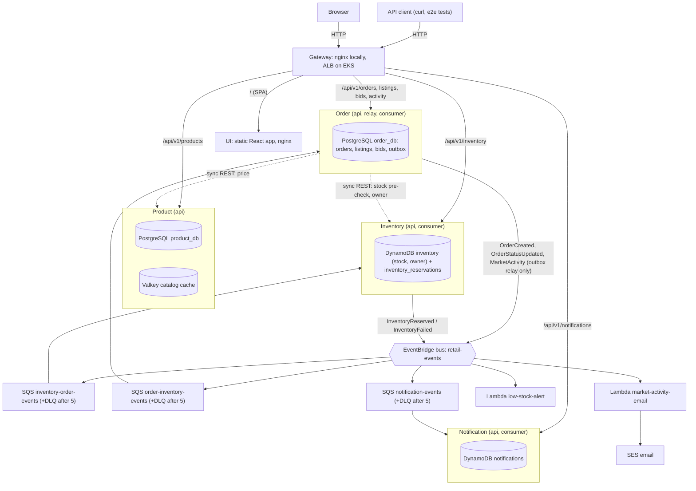
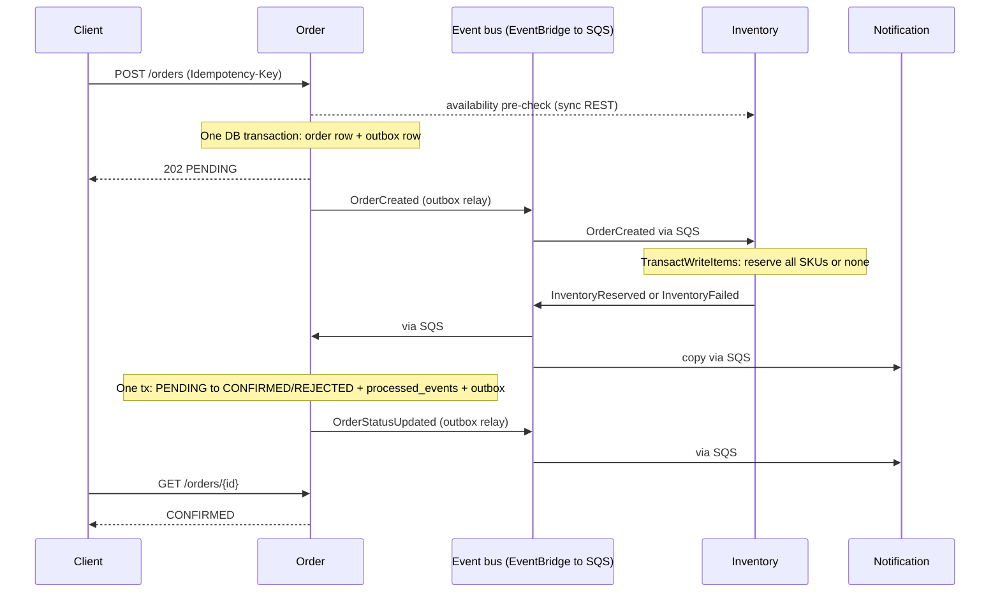
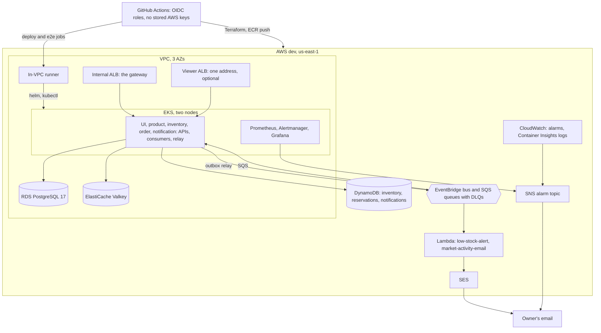
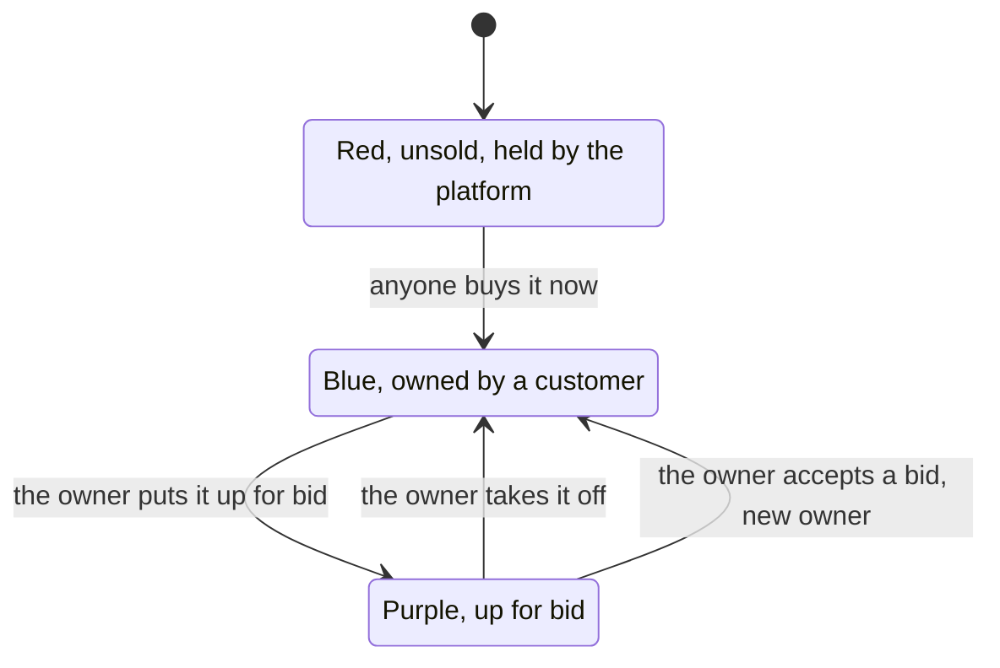

# CloudPunks: Retail Microservices Platform — Design

How the platform is built and why. How it got here, what went wrong and what was decided on the way: `docs/adr/README.md`. What to do when something breaks, and the local procedures: `docs/runbooks/README.md`.

## 1. Overview

An order platform with event driven microservices, and on top of it, a marketplace for one collection, **CloudPunks**: 100 one-of-a-kind pixel-art characters that customers buy from the platform and resell to each other through bids (section 16). It runs end to end on localhost (Docker Compose, then OrbStack Kubernetes) and on AWS EKS with no application code changes, only configuration: every AWS dependency is reached through an adapter whose endpoint is an environment variable, so LocalStack, PostgreSQL and Valkey containers stand in for EventBridge/SQS/DynamoDB, RDS and ElastiCache.

**Goals**

- A customer can browse the 100 CloudPunks, buy an unsold one, put one they own up for bid and accept a bid. Every sale is an order that moves `PENDING → CONFIRMED | REJECTED` through asynchronous events, and moves ownership.
- Correct under retries and duplicates: no double reservation, no lost events, no stuck orders.
- Observable: structured logs with correlation IDs, Prometheus metrics, health endpoints.
- Cloud-portable: the same container images and env-var contract run on Compose and EKS.
- The same journey works in a browser: a React SPA on the public API, served through the same gateway (sections 15 and 16.6).

**Non-goals**

- Payments, carts, login, cancellations, returns, multi-currency. The UI uses a demo customer id, and a bid reserves no funds.
- Blockchain, wallet, token, royalty.
- Service mesh, Kafka, GitOps (ArgoCD/Flux).
- SSR, PWA/offline, i18n, analytics.

**What is built**

| Layer | What exists |
| --- | --- |
| Local | Docker Compose on OrbStack: the four services, the UI and the gateway, with PostgreSQL, Valkey and LocalStack standing in for the cloud stores (`make up`, `make seed`) |
| Local Kubernetes | One Helm chart for every process, Traefik ingress, probes, HPA, PDBs and rollback on OrbStack Kubernetes (`make k8s-deploy`) |
| Cloud (dev) | Terraform stacks applied only from GitHub Actions: network, ECR, EKS with two nodes, RDS, ElastiCache, DynamoDB, EventBridge and SQS, the in-VPC runner. The same chart with dev values, behind an internal ALB, with HTTPS and a domain when one is set (section 13) |
| CI/CD | `pr.yml` with one required `ci` gate; the `app-*` workflows build, deploy, seed, reset, expose, roll back and destroy; `promote.yml` for stage and prod |
| Reliability | CloudWatch alarms and a budget alert, Container Insights logs, Prometheus, Alertmanager and a view-only Grafana, a runbook for every alarm |
| Marketplace | The 100 CloudPunks, ownership, listings, bids, activity, the marketplace UI and an email for every market event (section 16) |

What has never run, and what is not built, is in section 14.

## 2. Key architecture decisions

Each decision below is binding for Claude Code; changing one means updating this table first.

| # | Decision | Why | Rejected alternative |
| --- | --- | --- | --- |
| ADR-01 | Python 3.13 + FastAPI for all four services | Fastest path to working, typed APIs; one toolchain; small learning surface for the week | Go (smaller images, more boilerplate), Spring Boot (JVM memory/startup on small nodes) |
| ADR-02 | Monorepo, one image per service, shared `libs/common` package | Atomic changes to event schemas; one CI pipeline with path filters | Polyrepo (schema drift, 4× pipeline work) |
| ADR-03 | Database per service: `product_db` and `order_db` are separate PostgreSQL databases with separate roles | Services cannot join across boundaries; enables independent migration | Shared schema (hidden coupling) |
| ADR-04 | Transactional outbox for Order Service events | Order write and event publish must be atomic; `POST /orders` is not a retryable message | Publish after commit (lost events on crash), 2PC (unavailable) |
| ADR-05 | Inventory uses idempotent redelivery instead of an outbox | It is triggered by SQS; if publish fails, the message is not deleted and the retry re-emits from the stored reservation | DynamoDB Streams + EventBridge Pipes (better in cloud, weak local emulation) — a possible later option |
| ADR-06 | EventBridge custom bus → SQS queue per consumer → DLQ | Bus gives content routing and fan-out; SQS gives durability, backpressure, retries | SNS→SQS (no content filtering on detail), direct SQS (producer knows consumers) |
| ADR-07 | All consumers idempotent keyed on `event.id` | SQS standard is at-least-once and unordered | FIFO queues (throughput caps, still need idempotency across the bus) |
| ADR-08 | Synchronous inventory pre-check, asynchronous reservation | Fast feedback for obvious out-of-stock; reservation remains authoritative and race-safe | Sync reservation (tight coupling, distributed rollback) |
| ADR-09 | Cache-aside with TTL for catalog reads only | Catalog is read-heavy and tolerates 5 min staleness; stock never cached | Write-through (more code), caching inventory (oversell risk) |
| ADR-10 | AWS SDK endpoint via `AWS_ENDPOINT_URL`, no code branches for local | Identical code path local and cloud; boto3 honours the env var natively | `if ENV == local` branches (untested prod paths) |
| ADR-11 | Schema migrations run as a separate one-shot process, never at app startup | N replicas racing migrations; later maps to a Helm pre-upgrade Job | Migrate on boot (race, slow readiness) |
| ADR-12 | Valkey 9.0 locally and on ElastiCache | ElastiCache now offers Valkey at lower cost than Redis OSS; wire-compatible with `redis-py` | Redis OSS 7 (fine, pricier on ElastiCache) |
| ADR-13 | PostgreSQL 17 locally, Amazon RDS for PostgreSQL 17 in cloud (not Aurora: lower cost, fewer moving parts) | Transactional DDL (a failed migration rolls back cleanly), `JSONB` for the outbox, partial indexes, `INSERT … ON CONFLICT DO NOTHING` for dedupe, `SKIP LOCKED` | Aurora MySQL 3 (non-transactional DDL, weaker partial-index story) |
| ADR-14 | AWS is reached only from GitHub Actions through OIDC role assumption; no IAM users, access keys or local AWS credentials exist. The OIDC provider and the `cloudbatch818-loria-retail-bootstrap` role are created by hand once; all other roles are Terraform-managed | Removes long-lived credentials entirely; every cloud change is reviewed, logged and reproducible | Local `terraform apply` with SSO or keys (unreviewed changes, credentials on a laptop) |
| ADR-15 | Jobs that need the EKS API (helm, kubectl, e2e, drills) run on ephemeral self-hosted runners inside the VPC; all other jobs use GitHub-hosted runners | EKS endpoint stays private and the ALB can be internal; Terraform AWS-API calls need no VPC access | Public EKS endpoint with IAM auth (simpler, larger attack surface) |
| ADR-16 | The UI is a React + TypeScript single-page app built with Vite into static files, served by an unprivileged nginx container (`ui`), and reached through the same gateway/ALB as the API on the same origin (`/` goes to `ui`, `/api/v1/*` to the services) | No CORS and no per-environment API URL in the bundle (it calls relative `/api/v1`), so one image runs on Compose, local Kubernetes and EKS; static files need no Node runtime to operate | Next.js (a Node SSR runtime to run and patch for no benefit here); Create React App (deprecated); S3 + CloudFront (cloud-only, breaks "same image everywhere"; a possible later option); a separate UI origin with CORS |
| ADR-17 | The UI is a pure client of the public API: no new endpoints, no direct database or AWS access, a client-side basket (not a server cart; the CloudPunks UI has none, one purchase at a time, and its market endpoints came as an API change of their own, section 16.4), and a browser-generated demo customer id that is explicitly not authentication | Keeps the backend contracts as the only source of truth and the non-goals (auth, payments, carts) intact; anything the UI needs that the API cannot do is an API-contract question, not UI logic | Server-side carts and sessions (scope and state to operate); a login form that only pretends |
| ADR-18 | **Ownership lives in inventory.** Each `inventory` item gains `owner` (absent while the platform holds it). The reservation transaction (section 5) becomes the transfer: a purchase from the platform requires no owner and `available >= 1`; a resale requires `owner` = the seller. Either sets `owner` to the buyer in the same conditional write | The transfer must be atomic with "who owns it now", and the reservation is already the single conditional write that decides a race: two buyers of a red CloudPunk race on one item and exactly one wins | Ownership in order-service (two sources of truth for a sale); a new market service (a fifth service and store to run) |
| ADR-19 | **Listings ("up for bid"), bids and activity live in order-service** (`listings` and `bids` in `order_db`). Accepting a bid creates an ordinary order for the bidder at the bid amount, so it travels the existing outbox, saga, reservation and notification path | Putting up, bidding, accepting and taking off are transitions of one listing, so they are serialized by one row lock in one database: a bid can never be accepted twice, nor accepted after the listing was taken off. Reusing the order path means no new event type, queue, rule or consumer | Listings or bids in inventory (no transaction across a listing and its bids; listing bids by NFT needs a DynamoDB index, which is a Terraform change) |
| ADR-20 | **The art is generated, deterministic and committed.** `scripts/cloudpunks/generate.py` draws all 100 SVGs into `nft-collection/` from trait layers on the approved base head, with `0001.svg` kept exactly as approved. The UI bundles a copy (`ui/src/assets/cloudpunks/`) because the UI image is built from `ui/` only; `make ui-art` refreshes it and `make lint` fails if the copy drifts | One source of truth for the art, reviewable files in Git, no runtime image service, and the UI's CSP is unchanged | Images from the API (new endpoint and storage); art only inside `ui/` (the owner asked for `nft-collection/` at the root) |
| ADR-21 | **Additive event fields only.** `OrderCreated` gains `seller`; `InventoryFailed` gains an optional `detail`. The `reason` values stay `OUT_OF_STOCK` and `UNKNOWN_SKU` | Section 6: additive fields keep `schema_version` 1.x, and consumers ignore unknown fields. A new `reason` value would turn into poison messages in a consumer that has not been upgraded yet during a rolling deploy | New event types (new rules, queues and consumers for no gain) |
| ADR-22 | **Market activity is an event; an email is its only consumer.** order-service writes one `MarketActivity` event (kinds `LISTED`, `UNLISTED`, `BID_PLACED`, `BID_WITHDRAWN`, `SALE`) through the outbox in the transaction that makes the change; a Lambda turns each one on a CloudPunk into an SES email with its picture (section 16.11) | The owner wanted an email for every sale, bid and listing with the CloudPunk in it. Listings and bids produced no event, so the outbox is the only way to report them without a dual write; SNS email is text only, so the picture needs SES. `kind` is a plain string, so a kind added later is not poison (as ADR-21). The email is at least once: a retry can repeat one, which is harmless, so the function keeps no store |
| ADR-23 | **Network isolation is egress-restricted, not air-gapped.** The VPC keeps one controlled way out (a NAT, to become an allowlist of the hosts the platform needs: GitHub for the runners, the AWS endpoints, package and image sources) and the public ALB stays limited to one address. The furthest this design can go is a VPC with no internet path (section 13, "Network isolation"); it is documented, not built | The in-VPC runners must reach GitHub to take jobs (ADR-15), no laptop has AWS credentials, the CLI or CloudShell (ADR-14), and a browser needs a way in, so every route to a closed VPC is either a reversal of ADR-15 or a paid access service | An open NAT (today); a VPC with no internet path (needs CodeBuild in place of the runners, an ECR pull-through cache, endpoints for every AWS service and a private route for the viewer); a true air gap (not possible on AWS, whose control plane is reached over public APIs) |
| ADR-24 | **HTTPS ends at the two ALBs, with one public ACM certificate and names in Route 53.** The domain is registered by hand in the Route 53 console and only read by Terraform. Two stacks: `dns` (the certificate for `dev.<domain>` and `internal.dev.<domain>`, DNS-validated in the public zone, and a private zone for the internal name) and `alb-dns` (alias records to the ALBs, whose addresses the workflow passes in). The load balancer controller finds the certificate from the Ingress `tls` hosts, so there is no certificate ARN to carry and no host rule to break the ALB's own name. The domain is the `dev` environment variable `DEV_DOMAIN`; unset, everything serves HTTP as before | A public certificate is free and valid on an internal ALB, ACM Private CA is not; Terraform keeps the records in review like the rest of the cloud code (ADR-14); the domain stays out of the repository; leaving port 80 on the internal ALB keeps the deploy's readiness check and the acceptance suite, which reach it by its own name, unchanged. Both ALBs are created by the controller, so the records need their own stack, as the alarms do | external-dns (a new add-on that would also handle ALB recreation); ACM Private CA for the internal name; one stack with `data "aws_lb"` (fails once the ALB is gone, so destroy breaks); a host rule on the Ingress with an HTTP-to-HTTPS redirect on both ALBs (breaks every check that uses the ALB's own name) |

**Enterprise note:** ADR-04 and ADR-07 are the two that separate a demo from a system you would put your name on. Most event-driven outages in practice are lost or duplicated events, not slow ones.

## 3. System architecture

The customer path is synchronous only up to order acceptance; everything after `202 Accepted` happens through the event bus. Each service owns its store, and no service reads another's database.



*Orders enter through REST and settle through events. Dashed = synchronous REST; solid into the bus = events published; bus to queue to service = SQS delivery; the two Lambdas are invoked by the bus directly.*

Order is the only service with both sync dependencies (Product for price, Inventory for the pre-check and, for the market, who owns a CloudPunk) and an outbox; Notification only listens. Product has no events. In the marketplace the reservation is also the transfer of ownership, and accepting a bid is an ordinary order with a seller (section 16.5).

### Local to AWS mapping

| Concern | Local | AWS | What changes |
| --- | --- | --- | --- |
| Compute | Docker Compose containers, or OrbStack Kubernetes | EKS Deployments on managed node groups | Nothing in the image; Helm values |
| Ingress | nginx gateway on :8080; Traefik on OrbStack Kubernetes | ALB via AWS Load Balancer Controller | Same path rules in Ingress (`/api/v1/*` to the services, everything else to `ui`) |
| UI | `ui` container (nginx serving static files) behind the gateway | EKS Deployment behind the ALB's default rule, image from ECR | Helm values only |
| Relational | PostgreSQL 17 container | RDS for PostgreSQL 17 (dev Single-AZ, prod Multi-AZ) | `DB_HOST`, secret source |
| Key-value | LocalStack DynamoDB | DynamoDB on-demand | `AWS_ENDPOINT_URL` unset |
| Cache | Valkey 9.0 container | ElastiCache for Valkey (TLS) | `CACHE_URL` |
| Events | LocalStack EventBridge + SQS | EventBridge + SQS | `AWS_ENDPOINT_URL` unset; `QUEUE_NAME` resolved at startup |
| Function | LocalStack Lambda | Lambda (Terraform-deployed; the zip is built by `scripts/package_lambda.py`) | Packaging only |
| Secrets | `.env` (git-ignored) | Secrets Manager + KMS via External Secrets Operator | Same env var names |
| AWS credentials | `test`/`test` for LocalStack | EKS Pod Identity role per ServiceAccount | SDK default chain, no code change |
| Metrics and logs | Prometheus + Grafana profile; stdout | Prometheus/Grafana + CloudWatch Logs | Same `/metrics` and JSON logs |

## 4. Service specifications and API contracts

All services expose JSON over HTTP under `/api/v1`, plus `/health/live`, `/health/ready` and `/metrics` at the root. Each service also emits an OpenAPI spec at `/openapi.json`; that generated spec is the contract of record once built.

| Service | Owns | Port (local) | Stores | Publishes | Consumes |
| --- | --- | --- | --- | --- | --- |
| product-service | Catalog (the 100 CloudPunks), categories (their five types), mint prices | 8001 | PostgreSQL `product_db`, Valkey | — | — |
| inventory-service | Stock levels, reservations, who owns each CloudPunk | 8002 | DynamoDB `inventory`, `inventory_reservations` | InventoryReserved, InventoryFailed | OrderCreated |
| order-service | Orders, order items, status; listings (up for bid), bids, the activity feed | 8003 | PostgreSQL `order_db` (incl. outbox) | OrderCreated, OrderStatusUpdated | InventoryReserved, InventoryFailed |
| notification-service | Customer notifications (simulated) | 8004 | DynamoDB `notifications` | — | InventoryReserved, InventoryFailed, OrderStatusUpdated |
| ui | The React single-page app (static files, section 15) | 8005 | — | — | — |
| gateway (nginx) | Path routing, stands in for ALB | 8080 | — | — | — |

### Endpoints

| Service | Method + path | Purpose | Notes |
| --- | --- | --- | --- |
| product | `GET /api/v1/products?category=&page=&size=` | List products | Cached per query key, TTL 300 s |
| product | `GET /api/v1/products/{sku}` | Product detail | Cache-aside, TTL 300 s |
| product | `POST /api/v1/products` | Create product (admin) | Invalidates list cache keys |
| product | `PUT /api/v1/products/{sku}` | Update price/details (admin) | Deletes `product:{sku}` and list keys |
| product | `GET /api/v1/categories` | List categories | Cached, TTL 3600 s |
| inventory | `GET /api/v1/inventory/{sku}` | Stock and owner for one SKU | Never cached; strongly consistent read; `owner` null while the platform holds it |
| inventory | `POST /api/v1/inventory/availability` | Batch check; body and response in the OpenAPI spec | Advisory only; reservation is authoritative |
| inventory | `PUT /api/v1/inventory/{sku}` | Set stock (admin/seed) | — |
| order | `POST /api/v1/orders` | Create order | Requires `Idempotency-Key` header; returns 202 + order in `PENDING` |
| order | `GET /api/v1/orders/{order_id}` | Order with items and status | — |
| order | `GET /api/v1/orders?customer_id=` | Orders for a customer | Newest first, paginated |
| order | `POST`, `GET /api/v1/listings`; `DELETE /api/v1/listings/{sku}` | Put a CloudPunk up for bid, list, take it off | Owner only (section 16.4) |
| order | `POST`, `GET /api/v1/bids`; `DELETE /api/v1/bids/{bid_id}`; `POST /api/v1/bids/{bid_id}/accept` | Bid, list, withdraw, accept | `POST /bids` requires `Idempotency-Key`; accepting creates the bidder's order (section 16.4) |
| order | `GET /api/v1/activity?sku=` | Sales, listings and bids | Newest first, paginated |
| notification | `GET /api/v1/notifications?order_id=` | Notifications for an order | For demo and test assertions |

The generated OpenAPI specs (`docs/openapi/<service>.json`, written by `make openapi`) are the contract of record for fields, limits and error codes; narrative summaries as built are in `docs/adr/README.md`.

### Create-order contract

Request:

```json
POST /api/v1/orders
Idempotency-Key: 6f1c2b1e-4a7d-4c55-9a51-0b8e3f0d2c11
{
  "customer_id": "cust-1001",
  "items": [ { "sku": "CP-0042", "quantity": 1 } ]
}
```

Response `202 Accepted`:

```json
{
  "order_id": "01J9Z6Q4W8K3M2N1P0R7S5T4V3",
  "status": "PENDING",
  "total_amount": "19.99",
  "currency": "ETH",
  "items": [ { "sku": "CP-0042", "quantity": 1, "unit_price": "19.99", "seller": null } ],
  "created_at": "2026-10-05T14:03:11Z"
}
```

Rules:

- Order Service fetches price from Product Service and **snapshots `unit_price` into the order**. Later price changes never alter existing orders.
- Same `Idempotency-Key` + same body (no expiry; the key is unique per customer) → return the original order (200). Same key + different body → 422.
- Pre-check says unavailable → 409 `OUT_OF_STOCK`, no order row written.
- Product or Inventory unreachable → 503 with `Retry-After`; no partial order.
- Money is `NUMERIC(10,2)` in PostgreSQL, `Decimal` in Python and a string in JSON. Never floats.
- IDs are ULIDs (sortable, safe to expose).
- `items` holds 1–20 lines with distinct SKUs and `quantity` 1–100; anything else → 422 before any downstream call.
- Concurrent requests with the same key: the loser hits `uq_orders_customer_idem`. Catch that violation (no bare `except`), roll back, load the winner's row and apply the same-body/different-body rule above.

### Error shape (all services)

```json
{ "error": { "code": "OUT_OF_STOCK", "message": "CP-0042: requested 1, available 0", "correlation_id": "…" } }
```

## 5. Data model

Two PostgreSQL 17 databases (plain PostgreSQL features only, so RDS for PostgreSQL runs them unchanged), three DynamoDB tables, one cache namespace per service. Migrations use Alembic; every migration must be backward compatible with the previous app version (expand → migrate → contract), because a rollback rolls back code, not schema.

Each database has two roles: `<svc>_owner` owns the schema and runs migrations; `<svc>_app` gets `SELECT, INSERT, UPDATE, DELETE` through `ALTER DEFAULT PRIVILEGES`, so the running service cannot alter its own schema. Tables live in the `public` schema of each database.

### product_db (PostgreSQL)

```sql
CREATE TABLE categories (
  id    INTEGER GENERATED ALWAYS AS IDENTITY PRIMARY KEY,
  slug  VARCHAR(64)  NOT NULL UNIQUE,
  name  VARCHAR(128) NOT NULL
);

CREATE TABLE products (
  sku          VARCHAR(64)   PRIMARY KEY,
  name         VARCHAR(255)  NOT NULL,
  description  TEXT,
  category_id  INTEGER       NOT NULL REFERENCES categories (id),
  price        NUMERIC(10,2) NOT NULL CHECK (price >= 0),
  currency     CHAR(3)       NOT NULL DEFAULT 'USD',
  active       BOOLEAN       NOT NULL DEFAULT TRUE,
  created_at   TIMESTAMPTZ   NOT NULL DEFAULT now(),
  updated_at   TIMESTAMPTZ   NOT NULL DEFAULT now()   -- set by the app on update
);

-- PostgreSQL does not index foreign keys automatically
CREATE INDEX ix_products_category_active ON products (category_id) WHERE active;
```

### order_db (PostgreSQL)

The marketplace adds `listings`, `bids` and `order_items.seller` to this database: section 16.5.

```sql
CREATE TABLE orders (
  order_id         CHAR(26)      PRIMARY KEY,                 -- ULID
  customer_id      VARCHAR(64)   NOT NULL,
  status           VARCHAR(16)   NOT NULL
                   CHECK (status IN ('PENDING', 'CONFIRMED', 'REJECTED')),
  status_reason    VARCHAR(255),
  total_amount     NUMERIC(12,2) NOT NULL,
  currency         CHAR(3)       NOT NULL,
  idempotency_key  VARCHAR(64)   NOT NULL,
  request_hash     CHAR(64)      NOT NULL,                    -- sha256 of canonical body
  version          INTEGER       NOT NULL DEFAULT 1,          -- optimistic lock
  created_at       TIMESTAMPTZ   NOT NULL DEFAULT now(),
  updated_at       TIMESTAMPTZ   NOT NULL DEFAULT now(),
  CONSTRAINT uq_orders_customer_idem UNIQUE (customer_id, idempotency_key)
);
CREATE INDEX ix_orders_customer_created ON orders (customer_id, created_at DESC);
CREATE INDEX ix_orders_pending_created  ON orders (created_at) WHERE status = 'PENDING';  -- stuck-order sweeper

CREATE TABLE order_items (
  order_id    CHAR(26)      NOT NULL REFERENCES orders (order_id),
  sku         VARCHAR(64)   NOT NULL,
  quantity    INTEGER       NOT NULL CHECK (quantity BETWEEN 1 AND 100),
  unit_price  NUMERIC(10,2) NOT NULL,
  PRIMARY KEY (order_id, sku)
);

CREATE TABLE outbox (
  id            BIGINT GENERATED ALWAYS AS IDENTITY PRIMARY KEY,
  event_id      CHAR(26)     NOT NULL UNIQUE,
  detail_type   VARCHAR(64)  NOT NULL,
  payload       JSONB        NOT NULL,                        -- full envelope
  created_at    TIMESTAMPTZ  NOT NULL DEFAULT now(),
  published_at  TIMESTAMPTZ,
  attempts      INTEGER      NOT NULL DEFAULT 0,
  last_error    VARCHAR(512)
);
CREATE INDEX ix_outbox_unpublished ON outbox (id) WHERE published_at IS NULL;

CREATE TABLE processed_events (
  event_id      CHAR(26)    PRIMARY KEY,
  processed_at  TIMESTAMPTZ NOT NULL DEFAULT now()
);
```

PostgreSQL-specific rules:

- Status is a `CHECK` constraint, not a `CREATE TYPE … AS ENUM`: adding a value later is a plain constraint swap, which fits expand/contract better.
- Dedupe is `INSERT INTO processed_events (event_id) VALUES (:id) ON CONFLICT DO NOTHING`; `rowcount = 0` means duplicate. No exception-driven control flow, no aborted transaction.
- `updated_at` has no `ON UPDATE` equivalent; SQLAlchemy sets it via `onupdate=func.now()`. No triggers.
- Alembic migrations run inside a transaction; PostgreSQL DDL is transactional, so a failed migration leaves no half-applied schema. Exception: `CREATE INDEX CONCURRENTLY` cannot run in a transaction and needs its own migration with `autocommit_block()`.
- **Gotcha — outbox bloat:** every publish is an `UPDATE`, which leaves a dead tuple. The relay deletes rows published more than 7 days ago in batches of 1,000, and the partial index keeps the hot scan small. Without this, autovacuum falls behind and relay latency creeps up over weeks.

### DynamoDB tables (on-demand capacity)

| Table | PK | SK | Attributes | Access pattern |
| --- | --- | --- | --- | --- |
| `inventory` | `sku` (S) | — | `available` (N), `reserved` (N), `updated_at` (S), `owner` (S, absent while the platform holds it; aliased `#owner`, a reserved word) | Get by SKU; conditional decrement on reserve, which also moves `owner` (section 16.5) |
| `inventory_reservations` | `order_id` (S) | — | `items` (L), `status` (S: RESERVED/FAILED), `event_id` (S), `reason` (S), `failed_items` (L, FAILED only), `remaining` (M, RESERVED only), `created_at` (S), `ttl` (N), `buyer` (S), `seller` (S, a resale only), `detail` (S, FAILED only: `SOLD` or `OWNER_CHANGED`) | Idempotency record per order (TTL 35 days, at least 30, so it outlives SQS retention and any archive replay; otherwise a replayed OrderCreated reserves twice); replay source for re-emitting the outcome event |
| `notifications` | `order_id` (S) | `event_id` (S) | `type`, `channel`, `message`, `created_at`, `ttl` | Conditional put `attribute_not_exists(event_id)` = dedupe; query by order |

Reservation is one `TransactWriteItems` call: a `Put` on `inventory_reservations` with `attribute_not_exists(order_id)` plus one `Update` per SKU with `ConditionExpression: available >= :qty`, setting `available = available - :qty, reserved = reserved + :qty`. All succeed or none do. Limit: 100 items per transaction, well above the 20-line order cap.

**Gotcha:** On `TransactionCanceledException`, inspect `CancellationReasons`. `ConditionalCheckFailed` on the reservation item means a duplicate (re-emit stored outcome). On an inventory item it means insufficient stock (write a FAILED reservation, emit InventoryFailed). Treating both the same way is the classic oversell/double-fail bug.

**Unknown vs insufficient:** a missing `inventory` item and a stock shortfall both fail `available >= :qty`. Add `attribute_exists(sku)` to the condition and set `ReturnValuesOnConditionCheckFailure: ALL_OLD` on each `Update`; `CancellationReasons[i].Item` is then absent for an unknown SKU (`UNKNOWN_SKU`) and present, with `available`, for a shortfall (`OUT_OF_STOCK`, `failed_items[].available`). Use `ConsistentRead=True` for `GET /inventory/{sku}` and the availability check.

### Cache design (Valkey)

| Key | Value | TTL | Invalidation |
| --- | --- | --- | --- |
| `product:v1:{sku}` | Product JSON | 300 s | Delete on PUT |
| `products:v1:list:{category}:{page}:{size}` | Page JSON | 300 s | Delete pattern via a tracked key set `products:v1:listkeys` on any write |
| `categories:v1` | Categories JSON | 3600 s | Delete on category change |

Cache is optional at runtime: a Valkey error logs a warning, increments `cache_errors_total`, and falls through to PostgreSQL. The service must stay ready with the cache down. Never use `KEYS *` for invalidation; it blocks Valkey on large keyspaces.

## 6. Event design

One custom EventBridge bus `retail-events`, one SQS queue per consumer service, one DLQ per queue, and a versioned envelope shared through `retail_common.events` (`libs/common`).

### Envelope

EventBridge `PutEvents` entry: `Source = retail.<service>`, `DetailType = <EventName>`, `Detail = envelope JSON`. Consumers receive the full EventBridge event in the SQS body and read `detail`.

```json
{
  "event_id": "01J9Z6R0C4…",          
  "event_type": "OrderCreated",
  "schema_version": "1.0",
  "occurred_at": "2026-10-05T14:03:11.412Z",
  "producer": "order-service",
  "correlation_id": "b7e1…",           
  "causation_id": null,                
  "data": { }
}
```

- `event_id`: ULID, the idempotency key for every consumer.
- `correlation_id`: from the originating HTTP request; propagated unchanged through every event and log line.
- `causation_id`: `event_id` of the event that triggered this one.
- `occurred_at`: UTC with millisecond precision. The model truncates at construction so an envelope equals itself after a round trip over the wire.
- Versioning: additive fields keep the major version. A breaking change creates `schema_version: "2.0"` and the producer dual-publishes until all consumers migrate. Consumers ignore unknown fields.

### Catalog

| Event | Producer | Consumers | `data` payload |
| --- | --- | --- | --- |
| OrderCreated | order-service (via outbox) | inventory | `order_id, customer_id, items[{sku, quantity}], total_amount, currency, seller` (`seller` null for a purchase from the platform, set for an accepted bid; additive, section 16.5) |
| InventoryReserved | inventory-service | order, notification, low-stock Lambda | `order_id, items[{sku, quantity, remaining}]` |
| InventoryFailed | inventory-service | order, notification | `order_id, reason (OUT_OF_STOCK / UNKNOWN_SKU), failed_items[{sku, requested, available}], detail` (`detail` optional: `SOLD`, `OWNER_CHANGED`; additive) |
| OrderStatusUpdated | order-service (via outbox) | notification | `order_id, customer_id, old_status, new_status, reason` |
| MarketActivity | order-service (via outbox) | market-activity-email Lambda | `kind, sku, customer_id, counterparty, amount, currency, listing_id, bid_id, order_id`: `kind` is `LISTED`, `UNLISTED`, `BID_PLACED`, `BID_WITHDRAWN` or `SALE` (a plain string, ADR-22); `customer_id` is who did it (the seller, the bidder, the buyer); `counterparty` is a sale's seller, null when bought from CloudPunks; the rest are set where they apply (section 16.11) |

### Routing

| Rule | Event pattern | Target |
| --- | --- | --- |
| `to-inventory` | `detail-type: [OrderCreated]` | SQS `inventory-order-events` |
| `to-order` | `detail-type: [InventoryReserved, InventoryFailed]` | SQS `order-inventory-events` |
| `to-notification` | `detail-type: [InventoryReserved, InventoryFailed, OrderStatusUpdated]` | SQS `notification-events` |
| `to-low-stock` | `detail-type: [InventoryReserved]` | Lambda `low-stock-alert` (async invoke, on-failure DLQ) |
| `to-market-activity-email` | `detail-type: [MarketActivity]`, `detail.data.sku: [{prefix: "CP-"}]` | Lambda `market-activity-email` (async invoke, on-failure DLQ; cloud only when the dev secret `ALARM_EMAIL` is set) |
| `archive-all` | `source: [{prefix: "retail."}]` | EventBridge archive, 7-day retention (cloud only; enables replay) |

Queue settings (all three):

- `VisibilityTimeout` = 60 s (≥ 6× p99 handler time; handlers target < 5 s).
- Redrive: `maxReceiveCount = 5` → `<queue>-dlq`, `MessageRetentionPeriod` 14 days on DLQ.
- Long polling: `WaitTimeSeconds = 20`, batch size 10.
- Delete a message only after the handler's DB transaction commits.

**Gotcha:** EventBridge→SQS needs a queue resource policy allowing `events.amazonaws.com` with `aws:SourceArn` = the rule ARN. Missing it fails silently — the rule matches, nothing arrives. Watch the rule's `FailedInvocations` metric.

### Consumer contract (every handler)

1. Parse envelope; unknown `event_type` → log and delete (not an error).
2. Validate `data` against the Pydantic model for that `schema_version`; invalid → raise `PoisonMessage`, never retried in-process, lands in DLQ after `maxReceiveCount`.
3. Dedupe on `event_id` inside the same transaction as the business write.
4. Apply business change guarded by current state (state machine in section 7).
5. Commit, then delete the SQS message. Transient errors → do not delete; SQS redelivers after visibility timeout.

### Order Service outbox relay

- `POST /orders` writes `orders`, `order_items` and an `outbox` row in one PostgreSQL transaction.
- A relay process (same image, command `relay`) loops: `SELECT … FROM outbox WHERE published_at IS NULL ORDER BY id LIMIT 50 FOR UPDATE SKIP LOCKED`, calls `PutEvents` (max 10 entries per call), sets `published_at` for entries with no `ErrorCode`, increments `attempts` for failures.
- `SKIP LOCKED` lets multiple relay replicas run safely. Poll interval 500 ms when idle.
- `PutEvents` returns HTTP 200 with partial failures in `FailedEntryCount`; check per entry.
- Consequence: events can be published more than once (crash between PutEvents and UPDATE). That is why ADR-07 exists.

### Lambda: low-stock-alert

Python 3.13 function triggered directly by EventBridge (not SQS) to show a second integration pattern. For each item with `remaining < LOW_STOCK_THRESHOLD` (default 5), log a structured `low_stock` record and put a `LowStockDetected` CloudWatch metric (EMF log format, so no extra API call). Idempotency is not required: the effect is a log and a metric.

### Lambda: market-activity-email

Python 3.13 function triggered by the `to-market-activity-email` rule for every `MarketActivity` event on a CloudPunk. It sends one email through SES (section 16.11).

## 7. Order saga and state machine

An order is accepted in one PostgreSQL transaction and reaches a terminal status only through events; local target is p50 under 2 s from `202` to `CONFIRMED`, SLO 99% within 30 s.



*Happy path shown; InventoryFailed takes the same route and ends in REJECTED.*

The three boxed steps are the only places state changes, and each is a single local transaction. Nothing ever spans two services' stores.

### Order status transitions

| Current status | Event received | Action | Emits (via outbox) |
| --- | --- | --- | --- |
| PENDING | InventoryReserved | Set CONFIRMED | OrderStatusUpdated |
| PENDING | InventoryFailed | Set REJECTED, `status_reason` = event reason | OrderStatusUpdated |
| CONFIRMED or REJECTED | Any inventory outcome | Ignore; log `stale_event`; count `outcome=duplicate` | — |
| Any | `event_id` already in `processed_events` | Acknowledge and skip | — |

Implementation rule: the transition is `UPDATE orders SET status = :new, version = version + 1 WHERE order_id = :id AND status = 'PENDING'`, followed in the same transaction by the `processed_events` insert and the outbox insert. `rowcount = 0` means the order is already terminal: commit only the `processed_events` row and delete the message. This guard, not message ordering, is what keeps out-of-order and duplicate deliveries harmless.

## 8. Cross-cutting concerns

Every service implements the same config, health, logging, metrics and resilience contract via `libs/common`, so the Kubernetes manifests are one template.

### Configuration (12-factor, Pydantic Settings)

| Variable | Example (local) | Cloud source |
| --- | --- | --- |
| `SERVICE_NAME` | `order-service` | Helm values |
| `ENVIRONMENT` | `local` | Helm values (`dev` / `prod`) |
| `LOG_LEVEL` | `INFO` | ConfigMap |
| `AWS_REGION` | `us-east-1` | ConfigMap |
| `AWS_ENDPOINT_URL` | `http://localstack:4566` | **Unset** in cloud |
| `DB_HOST` / `DB_PORT` / `DB_NAME` | `postgres` / `5432` / `order_db` | ConfigMap (RDS instance endpoint, or RDS Proxy if kept) |
| `DB_USER` / `DB_PASSWORD` | from `.env` (`order_app`; migrate job uses `order_owner`) | Secrets Manager → Kubernetes Secret (External Secrets Operator) |
| `DB_SSLMODE` | `disable` | `require` in dev (RDS enforces TLS; `require` encrypts but does not check the certificate). `verify-full` needs the RDS CA bundle in the images: an open gap (section 14) |
| `CACHE_URL` | `redis://valkey:6379/0` | ConfigMap (`rediss://` with TLS) |
| `EVENT_BUS_NAME` | `retail-events` | ConfigMap |
| `QUEUE_NAME` | `inventory-order-events` | ConfigMap. Consumers call `GetQueueUrl` at startup, so no LocalStack-specific URL format leaks into config |
| `INVENTORY_TABLE` / `RESERVATIONS_TABLE` / `NOTIFICATIONS_TABLE` | `inventory` / `inventory_reservations` / `notifications` (the defaults) | ConfigMap: the Terraform table names, prefixed `loria-` (for example `loria-inventory`) |
| `PRODUCT_SERVICE_URL` / `INVENTORY_SERVICE_URL` | `http://product-service:8001` | ClusterIP DNS |
| `HTTP_TIMEOUT_CONNECT_S` / `HTTP_TIMEOUT_READ_S` | `1.0` / `2.0` | ConfigMap |

No credentials in code, images, or Git. Locally, `AWS_ACCESS_KEY_ID=test` / `AWS_SECRET_ACCESS_KEY=test` for LocalStack only. In cloud the SDK uses EKS Pod Identity credentials; no keys exist.

### Health endpoints

- `GET /health/live` → 200 if the process event loop responds. **Checks no dependencies.** A DB outage must not trigger restart storms across every pod.
- `GET /health/ready` → 200 only if required dependencies respond within 500 ms: PostgreSQL `SELECT 1` or DynamoDB `DescribeTable` (cached 10 s). Cache is **not** required. Returns JSON with per-dependency status.
- Consumers/relay expose the same endpoints on a small side HTTP server (port 9000) so Kubernetes probes them the same way.

### Logging

- JSON to stdout via `structlog`, one line per event: `timestamp, level, service, environment, message, correlation_id, event_id?, order_id?, trace_id?`.
- `X-Correlation-ID` accepted on inbound HTTP or generated; forwarded on outbound HTTP; placed in every event envelope.
- Never log request bodies with customer data, secrets, or full SQL parameters.

### Metrics (Prometheus, `/metrics`)

| Metric | Type | Labels |
| --- | --- | --- |
| `http_requests_total` | counter | `method, route, status` |
| `http_request_duration_seconds` | histogram | `method, route` |
| `events_published_total` / `events_publish_failures_total` | counter | `event_type` |
| `events_consumed_total` | counter | `event_type, outcome` (`processed / duplicate / poison / error`) |
| `event_handler_duration_seconds` | histogram | `event_type` |
| `outbox_unpublished` | gauge | — |
| `outbox_oldest_unpublished_age_seconds` | gauge | — |
| `orders_stuck` | gauge | — (orders PENDING over 5 min; order-relay; `NaN` if the database cannot be read) |
| `queue_messages` | gauge | `queue, state` (`visible` / `in_flight`; each consumer reports its queue and its DLQ) |
| `orders_total` | counter | `final_status` |
| `order_time_to_terminal_seconds` | histogram | — (PENDING→CONFIRMED/REJECTED) |
| `cache_hits_total` / `cache_misses_total` / `cache_errors_total` | counter | `keyspace` |

Use the `route` template (`/api/v1/orders/{order_id}`), never the raw path — raw IDs explode label cardinality and cost real money on Datadog/AMP.

### Resilience

- Outbound HTTP: `httpx2` with connect 1 s / read 2 s timeouts; retry only GETs plus the read-only `POST /inventory/availability` (the single allowed POST retry), max 2 retries, exponential backoff with jitter (`tenacity`). Never retry any other POST.
- DB pool: SQLAlchemy with psycopg 3, `pool_size=5, max_overflow=5, pool_pre_ping=True, pool_recycle=1800`. Each PostgreSQL connection is a backend process, so keep `replicas × (pool_size + max_overflow)` well under the instance `max_connections`; in cloud put RDS Proxy in front so HPA scale-out cannot exhaust connections.
- Set `statement_timeout = 5s` and `idle_in_transaction_session_timeout = 30s` on the `<svc>_app` roles. A stuck transaction holding the outbox lock is the failure you want killed, not waited on.
- Stuck-order sweeper (order-service, runs in the relay process every 60 s): orders `PENDING` longer than 5 min are logged and counted in `orders_stuck` gauge (`SWEEP_INTERVAL_S`, default 60). No auto-reject; this is the alarm source for the stuck-queue runbook.
- Graceful shutdown: on SIGTERM, stop accepting HTTP, finish in-flight requests, consumers stop polling and finish the current batch within 25 s (Kubernetes `terminationGracePeriodSeconds: 30`).

## 9. Repository layout and tech stack

One monorepo, `uv` workspaces, one Dockerfile per service built from the repo root so `libs/common` is included.

```text
retail-platform/
├── CLAUDE.md                     # working rules for the coding agent; git-ignored, kept locally
├── docs/
│   ├── DESIGN.md                 # this document
│   ├── adr/                      # change history, as-built notes, decisions (README.md)
│   ├── openapi/                  # generated OpenAPI snapshots (make openapi)
│   └── runbooks/                 # runbooks and an index of every alarm and alert
├── libs/common/                  # installable package: retail_common
│   └── retail_common/
│       ├── config.py             # BaseServiceSettings, AwsSettings
│       ├── service.py            # create_service_app(): wires logging, correlation, metrics, errors, health
│       ├── logging.py            # structlog setup, correlation-id middleware
│       ├── metrics.py            # Prometheus middleware + shared metrics
│       ├── health.py             # live/ready router with pluggable checks
│       ├── http_client.py        # httpx2 client w/ timeouts, retries, header propagation
│       ├── events/
│       │   ├── envelope.py       # Envelope model, ULID ids
│       │   ├── schemas.py        # OrderCreated, InventoryReserved, … (v1)
│       │   ├── publisher.py      # EventBridgePublisher (PutEvents, partial-failure handling)
│       │   └── consumer.py       # SqsConsumer loop, dedupe hook, poison handling
│       └── errors.py             # error model + exception handlers
├── services/
│   ├── product-service/
│   │   ├── app/  (main.py, config.py, api/, domain/, repo/, cache.py)
│   │   ├── migrations/           # Alembic
│   │   ├── tests/  (unit/, integration/)
│   │   ├── Dockerfile
│   │   └── pyproject.toml
│   ├── inventory-service/        # app/ + consumer entrypoint
│   ├── order-service/            # app/ + relay entrypoint + migrations/
│   └── notification-service/     # consumer + small read API
├── functions/                    # low-stock-alert, market-activity-email: Lambda handlers + tests
├── nft-collection/               # the 100 CloudPunk SVGs, generated by scripts/cloudpunks (section 16.3)
├── ui/                           # React SPA, the marketplace; an npm project outside the uv workspace (sections 15, 16.6)
├── gateway/nginx.conf            # path routing, mirrors ALB Ingress rules (/ goes to ui)
├── local/
│   ├── docker-compose.yml
│   ├── localstack/init/ready.d/10-bootstrap.sh
│   ├── postgres/init/01-databases.sh
│   ├── seed/                     # catalog.py + cloudpunks.json (generated) + seed.py; shipped in the product image
│   └── observability/ (prometheus.yml, grafana/)
├── tests/e2e/                    # acceptance (test_acceptance.py) + failure drills (test_drills.py)
├── scripts/                      # cloudpunks/ (the art generator), export_openapi.py, dlq.py, db_init.py, k8s_compose.py, viewer_cidr.py, package_lambda.py (tests in scripts/tests)
├── README.md                     # run instructions
├── deploy/helm/                  # retail-service, secret-store and monitoring charts, values/ (per release, per env), third-party/ (Traefik)
├── infra/terraform/              # bootstrap/, modules/, envs/dev/{platform,cluster-addons,alb-alarms}; applied only from workflows (README.md)
├── .github/workflows/            # bootstrap-*, platform-*, addons-*, alarms-*, app-*, cluster-capacity, drills, pr, promote (README.md)
├── Makefile
├── .env.example                  # committed; .env is git-ignored
└── pyproject.toml                # uv workspace root, ruff, mypy, pytest config
```

Inside each service: `api/` (FastAPI routers, request/response models) → `domain/` (pure logic, no I/O) → `repo/` (SQLAlchemy / boto3 adapters). Domain code never imports boto3, SQLAlchemy or httpx2; that is what makes unit tests fast and the cloud swap config-only.

Every service's top-level package is named `app`, so two services cannot share one Python environment. Services are therefore uv workspace members with `package = false` (run from their own directory or image, never installed), and `make lint` / `make test` run mypy and pytest once per service in separate processes with separate caches.

### Stack (pin exact versions in `uv.lock`)

| Concern | Choice |
| --- | --- |
| Runtime | Python 3.13, FastAPI, Uvicorn |
| Validation / config | Pydantic v2, pydantic-settings |
| SQL | SQLAlchemy 2.x (sync), psycopg 3 (binary), Alembic |
| AWS | boto3 (EventBridge, SQS, DynamoDB); `moto` for unit tests |
| Cache | redis-py against Valkey 9.0 |
| HTTP client | httpx2 + tenacity |
| IDs | `python-ulid` |
| Logging / metrics | structlog, prometheus-client |
| Tooling | uv, ruff (lint + format), mypy (strict on `libs/common` and `domain/`), pytest, pytest-cov |
| Frontend | TypeScript (strict), React 19.x, Vite 8, React Router, TanStack Query, CSS Modules; Node 24 LTS, npm + `package-lock.json` (section 15) |
| Frontend tooling | Vitest, Testing Library, MSW, Playwright (Chromium), openapi-typescript, ESLint (typescript-eslint, react-hooks, jsx-a11y), Prettier |
| Containers | OrbStack (Docker engine + single-node Kubernetes), Docker Compose v2, docker buildx (multi-arch); base image `python:3.13-slim`, non-root user, multi-stage |

`httpx2` is the Pydantic team's successor to `httpx` (same API for what we use). Starlette's `TestClient` requires it and deprecates `httpx`, so using it for both our outbound client and the tests avoids shipping two HTTP libraries.

The Dockerfile is production-shaped: multi-stage, `uv sync --frozen --no-dev`, non-root UID 10001, no shell tools in the final stage beyond what the base provides, `HEALTHCHECK` omitted (Kubernetes probes own that).

## 10. Local environment

`make up` brings the whole platform up with Docker Compose in under 2 minutes; `make e2e` runs the acceptance test against `http://localhost:8080`. Each service image runs several processes by command, mirroring the Deployments it becomes on EKS.

### Process inventory

| Compose service | Image | Command | Port | Becomes on EKS |
| --- | --- | --- | --- | --- |
| postgres | `postgres:17` | — | 5432 | RDS for PostgreSQL 17 (RDS Proxy optional) |
| valkey | `valkey/valkey:9.0` | — | 6379 | ElastiCache for Valkey |
| localstack | `localstack/localstack` at a pinned CalVer tag (2026.03.0 or later), auth token required | — | 4566 | EventBridge, SQS, DynamoDB, Lambda |
| product-migrate / order-migrate | service image | `migrate` | — | Helm pre-install/pre-upgrade Job |
| seed | product image | `seed` | — | `app-seed.yml` on the runner (dev only): the same `local/seed/seed.py`, run from the checkout, as the `db` role |
| product-service | product | `api` | 8001 | Deployment + HPA |
| inventory-service | inventory | `api` | 8002 | Deployment + HPA |
| inventory-consumer | inventory | `consumer` | 9000 | Deployment (scale on queue depth, KEDA later) |
| order-service | order | `api` | 8003 | Deployment + HPA |
| order-relay | order | `relay` | 9000 | Deployment, 1–2 replicas |
| order-consumer | order | `consumer` | 9000 | Deployment |
| notification-service | notification | `api` | 8004 | Deployment |
| notification-consumer | notification | `consumer` | 9000 | Deployment |
| ui | `ui` (nginx-unprivileged, static files) | — | 8005 | Deployment (2 replicas, PDB) |
| gateway | `nginx:1.27-alpine` | — | 8080 | ALB via AWS Load Balancer Controller Ingress |
| prometheus / grafana | official images | profile `observability` | 9090 / 3000 | the `monitoring` chart: Prometheus, Alertmanager and a view-only Grafana (section 13) |

Container ports 9000 on consumers are internal only (health + metrics).

### LocalStack bootstrap (`local/localstack/init/ready.d/10-bootstrap.sh`)

Creates the resources Terraform creates in the cloud, with the same names, plus SES for the activity emails (LocalStack keeps the mail instead of sending it: `curl localhost:4566/_aws/ses`). Keep the two in sync.

LocalStack state is in memory: the script runs on every start, and DynamoDB data (seeded stock) does not survive a restart while PostgreSQL data does. Run `make seed` after `make up`.

**LocalStack needs an auth token.** Since release 2026.03.0, `localstack/localstack` is a single image that will not start without `LOCALSTACK_AUTH_TOKEN`, and tags use calendar versioning. The free Hobby plan covers the services used here but is for non-commercial use; for employer work, use a paid or CI token. Put the token in `.env` (git-ignored) and pin a CalVer tag in `LOCALSTACK_TAG`. If a token is not an option, fall back to `amazon/dynamodb-local` + ElasticMQ for SQS + an in-process `LocalEventBus` adapter that applies the routing table above; the publisher port in `retail_common.events` makes that a config switch, not a rewrite.

LocalStack does not enforce IAM, SQS queue policies or Lambda invoke permissions. Terraform must still create `aws_lambda_permission` for EventBridge and the queue policies from section 6, or the cloud flow fails silently where the local one worked.

**Compose gotchas.** The Makefile always runs `docker compose --env-file .env -f local/docker-compose.yml`. Without `--env-file`, `${VAR}` interpolation reads `local/.env`, not the repo-root `.env`, and passwords silently become empty. The Postgres healthcheck uses `-h 127.0.0.1` because the image's init phase runs a socket-only temporary server; a socket-based `pg_isready` reports ready before the init script has created the databases and roles.

### Makefile targets

`up`, `down`, `reset` (drop volumes), `logs s=<svc>`, `seed`, `test` (unit), `itest` (integration), `e2e` (acceptance, the market steps and all drills), `cloudpunks` and `ui-art` (the art, section 16.3), `drills`, `drill-consumer-down`, `drill-poison`, `drill-duplicate`, `drill-bus-down`, `drill-cache-down`, `drill-db-down`, `lint`, `fmt`, `dlq-peek q=<queue>-dlq`, `dlq-redrive q=<queue>-dlq`, `obs-up`, `obs-down`, `openapi`, `ui-*` (including `ui-fmt`); plus `lock` and `sync` for the uv environment.

### OrbStack and local Kubernetes

OrbStack is the local runtime for both local stages: its Docker engine runs Compose, and its built-in single-node Kubernetes cluster runs the Helm chart before anything touches EKS. That makes Helm, probes, HPA and rollback free to rehearse, which is where most first EKS deployments fail.

| Stage | Apps run in | Backing services run in | Ingress | Purpose |
| --- | --- | --- | --- | --- |
| Compose | Compose containers | Compose | nginx gateway :8080 | Fast inner loop |
| Local Kubernetes | OrbStack Kubernetes, namespace `retail` | Compose, outside the cluster | Traefik | Rehearse Helm, probes, HPA, rollback |
| EKS | EKS, namespace `retail` | RDS, ElastiCache, DynamoDB, EventBridge/SQS | ALB | Production shape |

PostgreSQL, Valkey and LocalStack stay outside the cluster on purpose. That matches EKS, where data lives in managed services, and keeps stateful workloads out of Kubernetes.

Notes on host access from pods, ingress, architecture and resources: `docs/adr/README.md`. Every `k8s-*` Make target passes `--context orbstack` explicitly.

Additional Make targets: `k8s-lint`, `k8s-build`, `k8s-build-multiarch`, `k8s-secrets`, `k8s-ingress` (Traefik, metrics-server), `k8s-deploy` (`helm upgrade --install --rollback-on-failure` with local values), `k8s-e2e` (acceptance steps and UI journeys through the local ingress), `k8s-resilience` (delete each workload's pod under load), `k8s-rollback`, `k8s-down`; `k8s-monitoring` and `k8s-monitoring-open` (the monitoring chart on the local cluster) and `rules-test` (promtool unit tests of the alert rules, part of `lint`). How it was built: `docs/adr/README.md`. Procedures for the clean start, the drills and the local cluster: `docs/runbooks/local-environment.md`.

## 11. Testing strategy

Four layers, each runnable alone; `pr.yml` runs the unit layer on every pull request. Integration, the drills and the browser journeys need LocalStack and its token, so they stay local; the end-to-end layer runs against real AWS in `app-deploy.yml` after a deploy.

| Layer | Scope | Tools | Target runtime | Gate |
| --- | --- | --- | --- | --- |
| Unit | `domain/`, envelope, handlers with fakes | pytest, moto, fakeredis | < 30 s total | ≥ 80% line coverage on `domain/` and `libs/common` |
| Integration | One service + its real stores | pytest against Compose PostgreSQL/Valkey/LocalStack | < 3 min | All green |
| End-to-end | Whole platform via gateway | `tests/e2e`, httpx2, polling with timeout | < 2 min | Acceptance + drills below |
| UI | Components, `ui/src/lib` logic, browser journeys | Vitest + Testing Library + MSW; Playwright (headless Chromium) | < 1 min unit; < 3 min journeys | ≥ 80% lines on `ui/src/lib`; journeys green; axe clean on every screen |

Unit tests that must exist (these catch the real bugs):

- Reservation: sufficient stock; insufficient on one of several SKUs (nothing decremented); duplicate `OrderCreated` (no second decrement, same outcome event re-emitted); unknown SKU.
- Order consumer: `InventoryReserved` on PENDING → CONFIRMED + OrderStatusUpdated in outbox; same event twice → one transition; `InventoryFailed` after CONFIRMED → ignored and logged (out-of-order guard).
- Create order: idempotent replay returns same order; same key different body → 422; price snapshot stored.
- Outbox relay: partial `PutEvents` failure marks only successful rows published.
- Cache: Valkey down → product read still succeeds from PostgreSQL.

### Integration tests

Each service's integration suite runs the app in-process against the real Compose stores. Unit tests are hermetic (no AWS, no LocalStack); integration tests force LocalStack with dummy credentials, use a private bus and queue, and clean up only rows they created. Rules learned while building them: `docs/adr/README.md`.

### Acceptance test (steps 1–10)

The same suite runs against three targets: Compose (`make e2e`), the local cluster (`make k8s-e2e`) and dev on EKS (the last step of `app-deploy.yml`, `E2E_CLOUD=1`). In the cloud the low-stock Lambda test reads the real CloudWatch log group (`E2E_LAMBDA_LOG_GROUP`), and the dead-letter-queue count inside step 9 is skipped (the deploy role may not read the queues).

1. `GET /api/v1/products` returns seeded products; second call of `GET /api/v1/products/{sku}` is a cache hit (`cache_hits_total` increments).
2. Record stock for SKU A (`GET /api/v1/inventory/A`).
3. `POST /api/v1/orders` with 2 × A → 202, `PENDING`.
4. Poll `GET /api/v1/orders/{id}` every 250 ms, max 15 s → `CONFIRMED`.
5. Stock for A decreased by exactly 2.
6. `GET /api/v1/notifications?order_id=` shows InventoryReserved and OrderStatusUpdated notifications.
7. Async rejection: stop inventory-consumer, POST an order for SKU B (pre-check passes), set B's stock to 0, start the consumer → `REJECTED` with reason `OUT_OF_STOCK`.
8. Replay step 3 with the same `Idempotency-Key` → same `order_id`, stock unchanged.
9. All `/health/ready` return 200; all DLQs empty.
10. Every log line for the order shares one `correlation_id` across all four services.

The market steps (section 16.8) run in the same suite on the one-of-a-kind fixture `E2E-N`: bought from the platform, the owner changes; put up for bid, two bids, one withdrawn, the other accepted, ownership moves and the listing, bids and activity settle; taking it off closes its bids; four buyers race for one unsold item and exactly one owns it. The suite works on its own products (`E2E-A`, `E2E-B`, `E2E-N`, created if missing and deactivated afterwards) and never on the 100 CloudPunks.

### Failure drills

Run locally by `make e2e` and the `make drill-*` targets. On EKS `drills.yml` has `consumer-down` and `bus-down`; neither has been run, and the other four are not built (section 14).

| Drill | How | Expected detection | Expected recovery |
| --- | --- | --- | --- |
| Consumer down | `docker compose stop inventory-consumer`, place 5 orders | Orders stay PENDING; queue depth 5; `orders_stuck` rises after 5 min | Start consumer → queue drains, all CONFIRMED, no duplicates |
| Poison message | Publish malformed `OrderCreated` directly to the bus | `events_consumed_total{outcome="poison"}`; message in DLQ after 5 receives | Inspect via `make dlq-peek`; fix; `make dlq-redrive` |
| Duplicate delivery | Send the same `OrderCreated` envelope twice | `outcome="duplicate"` increments | Stock decremented once |
| Bus unavailable | Make EventBridge unreachable **for the relay only**: run it with `AWS_ENDPOINT_URL_EVENTBRIDGE` pointing at a dead address, then place orders | `POST /orders` still returns 202 (outbox); `outbox_unpublished` > 0, `last_error` set, `events_publish_failures_total` rising; relay stays ready | Relay with a working endpoint → drains the outbox, nothing lost or duplicated, order CONFIRMED |
| Cache down | Stop Valkey | `cache_errors_total` rises; latency up | Reads still 200; readiness unaffected |
| DB down | Stop PostgreSQL | order/product `/health/ready` → 503; `/health/live` stays 200 | PostgreSQL back → ready without restarts |

The "Bus unavailable" drill is the one that proves ADR-04. If it fails, the outbox is not actually transactional.

## 12. Build order

The platform was built in eleven local milestones (M0 to M10: scaffold, shared library, local infrastructure, the four services, the asynchronous flow, the UI, hardening, local Kubernetes), then the cloud, CI/CD and reliability work, then the CloudPunks milestones (N1 to N7). Each milestone left `make lint test` green and the stack runnable, and the next one started only after a review. The milestone list and what each one verified is in `docs/adr/README.md`.

## 13. Cloud, CI/CD and reliability

The repo deploys the dev environment only; `stage` and `prod` exist as branches and GitHub Environments with no cluster behind them. This section is the design of the stacks, the workflows and the chart. How to run them: `.github/workflows/README.md` and `infra/terraform/README.md`.

### Cloud (dev)



*Everything is reached through workflows. The viewer ALB and the activity emails are optional; the emails need the address in the `dev` secret `ALARM_EMAIL`.*

**AWS access model (ADR-14, ADR-15).** No AWS credential exists outside GitHub Actions. Every workflow assumes a role by ARN through OIDC (`aws-actions/configure-aws-credentials`, pinned by SHA, `permissions: id-token: write, contents: read`). Role ARNs are GitHub Actions *variables* per Environment (an ARN is not a secret). Claude Code can therefore write and statically check the cloud code (`terraform fmt/validate` with `init -backend=false`, tflint, checkov, `helm lint`, kubeconform) but can never run `plan`, `apply`, `aws` or `kubectl` against AWS; those happen only in workflows, so workflows must print diagnostics on failure (`terraform show`, `helm status`, `kubectl describe`/events).

The OIDC provider and the `cloudbatch818-loria-retail-bootstrap` role are created by hand once (the setup is in `infra/terraform/README.md`); every other role is Terraform-managed. Because the bootstrap role can mint roles it is effectively admin: the pinned `sub`, the reviewer gate and a `workflow_dispatch`-only trigger are its controls.

| Role | Trust `sub` | Permissions | Used by |
| --- | --- | --- | --- |
| `cloudbatch818-loria-retail-bootstrap` (manual) | `environment:bootstrap` | State bucket S3; IAM on `cloudbatch818-loria-*` | `bootstrap-state-bucket.yml`, `bootstrap-ci-roles.yml` |
| `cloudbatch818-loria-retail-tf-<env>` | `environment:<env>` | One role for plan, apply and destroy. Broad service access (an accepted least-privilege gap in dev); IAM limited to `cloudbatch818-loria-retail-<env>-*` so it cannot edit the CI roles; state limited to `<env>/*`. There is no `pull_request` role: a PR run would use broad credentials without the environment's approval, so Terraform runs only in the `platform-*`, `addons-*` and `alarms-*` workflows, behind the reviewer | `platform-*`, `addons-*`, `alarms-*` workflows |
| `cloudbatch818-loria-retail-db-<env>` | `environment:<env>` | Read the RDS master secret (and decrypt it through Secrets Manager); create and read secrets under `loria-retail-<env>/*`; describe the one RDS instance. Nothing else | `app-database.yml` (runner) |
| `cloudbatch818-loria-retail-deploy-<env>` | `environment:<env>` | ECR push/pull, `eks:DescribeCluster`; EKS access entry with `AmazonEKSEditPolicy` scoped to namespace `retail` | `app-deploy.yml`, `app-rollback.yml`, `promote.yml`, drills (runners) |

Terraform references the OIDC provider with a `data` source (an account can hold one provider per URL) and never manages `cloudbatch818-loria-retail-bootstrap`. Tear-down is `platform-destroy.yml` (manual, environment-gated); `bootstrap` resources are never destroyed by it.

**In-VPC runners (`modules/runners`).** One ephemeral arm64 EC2 runner (label `retail-vpc`) in an Auto Scaling group of one, in a private-app subnet. A systemd loop registers it with `--ephemeral`, runs one job, deregisters and repeats. The registration credential is a fine-grained PAT held in Secrets Manager and read only by the loop, as root; job processes run as another user, and iptables blocks that user's traffic to the instance metadata service, so jobs cannot borrow the instance role. The instance profile grants nothing beyond SSM; jobs get AWS access only through OIDC. **The repo is public, so** self-hosted jobs run only for `workflow_dispatch`, `push` to `dev`, tags and approved environments, never `pull_request`; fork PRs never reach these runners.

**Network and names (ADR-24).** The domain is registered by hand in the Route 53 console, which also creates its public hosted zone; the stacks only read it. The `dns` stack issues one public ACM certificate for `dev.<domain>` (the viewer ALB) and `internal.dev.<domain>` (the internal ALB), validated by CNAMEs in the public zone, and creates a private hosted zone named `internal.dev.<domain>` attached to the VPC, so the internal name resolves only inside it. The `alb-dns` stack creates the alias records: the public name to the viewer ALB in the public zone, the internal name to the internal ALB in the private zone. It is separate because the controller creates the ALBs after the platform stack; the workflow looks up each ALB's DNS name and zone id and an ALB that does not exist gets no record, so the stack is applied again after an ALB is recreated. Each Ingress lists its name under `spec.tls`; the controller attaches the issued certificate to the 443 listener. The viewer ALB redirects 80 to 443 and keeps its address allow-list (`DEV_VIEWER_CIDR`); the internal ALB keeps port 80 too, because the deploy and the acceptance suite reach it by its own name, which the certificate does not cover. TLS ends at the ALB: the hop to the pods and the calls between services stay plain HTTP inside the VPC. Policy is `ELBSecurityPolicy-TLS13-1-2-2021-06`. `app-deploy` reports whether `https://internal.dev.<domain>/` answers with a valid certificate. Steps, order and troubleshooting: `docs/runbooks/https-and-domain.md`.

**Network isolation (current state and the limit).** Nothing outside the VPC can reach a pod, a database or the EKS API: the nodes sit in private subnets, RDS and ElastiCache in the data subnets behind security groups, the EKS endpoint is private, and the internal ALB admits only `10.20.0.0/16`. The one door in is the viewer ALB (`app-expose.yml`), open to a single address. The ways out are open: a single NAT gives every private subnet unrestricted outbound HTTPS, and the runners reach GitHub through it. So this is a private network, not an air-gapped one. The next step is to turn the open NAT egress into an allowlist; it is not built, and its mechanism is undecided. The limit of the design is a VPC with no internet path, and it is not planned, because it needs: CodeBuild in the VPC in place of the self-hosted runners (a hosted runner would hand it the chart and values through S3 and read its logs back, reversing ADR-15); an ECR pull-through cache for the add-on images; VPC endpoints for every AWS service the pods and nodes call; and a private route for a person's browser (a Client VPN, SSM port forwarding or a managed secure browser), where the first two need a client or CLI that ADR-14 rules out on the laptop. A true air gap is not possible on AWS: Terraform and the deploy tooling reach the control plane over public APIs. Reasoning and the full list: `docs/adr/README.md`, "Network isolation: the extent".

**Terraform layout:** `infra/terraform/{bootstrap,modules/{network,eks,data,events,ecr,github-oidc,runners,monitoring,pod-identity-role},envs/dev/{platform,cluster-addons,alb-alarms,dns,alb-dns}}`; there is no `prod` environment yet. Remote state in the bootstrap bucket with native locking (`use_lockfile = true`, Terraform ≥ 1.11, where S3 locking is GA); DynamoDB state locking is deprecated. Pin provider versions; one state per env and stack.

| Area | Decision | Enterprise note |
| --- | --- | --- |
| Network | VPC across 3 AZs: public (ALB, NAT), private-app (nodes), private-data (RDS, ElastiCache; an RDS subnet group needs two AZs even for a Single-AZ instance) | Single NAT in dev, one per AZ in prod. Add VPC endpoints (S3 + DynamoDB gateway; ECR api/dkr, SQS, STS, Secrets Manager, EventBridge, Logs interface) — NAT data processing is the #1 surprise bill on EKS |
| EKS | Managed node group, AL2023 AMIs, **two nodes**: 2 × m7g.large Graviton/arm64 (2 vCPU, 8 GiB; about 29 pods each), matching Apple Silicon builds and cheaper per vCPU, access entries instead of `aws-auth` ConfigMap | Two nodes give node-level availability, so zone spread, PDBs and HPA maxima (about 4) have room to work. Kubernetes 1.36; pin it in Terraform. AL2023 or Bottlerocket only (no Amazon Linux 2 AMIs after 1.32). Why two and not one, and the alternatives: `docs/adr/README.md`, "Cluster sizing notes" |
| Add-ons | vpc-cni, coredns, kube-proxy, eks-pod-identity-agent, metrics-server; Helm: AWS Load Balancer Controller, External Secrets Operator | Installed with Terraform `aws_eks_addon` / `helm_release`; the Helm charts are pinned, the EKS add-ons take EKS's default version (section 14) |
| Workload IAM | EKS Pod Identity, one IAM role per ServiceAccount | Least privilege per process: relay = `events:PutEvents` on the bus only; each consumer = receive/delete on its own queue only |
| RDS | RDS for PostgreSQL 17 (major 17 to match local PostgreSQL 17, the minor is AWS's choice), dev a single `db.t4g` instance, Single-AZ; prod Multi-AZ; KMS CMK; 7-day backups; deletion protection in prod (off in dev so it can be destroyed); RDS-managed master secret. RDS Proxy is optional: with one node and about 15 pods at `pool_size 5 + max_overflow 5` the instance's `max_connections` is not at risk, so the default is to leave it out and add it with a second node group or HPA headroom | The application databases and roles are created by `scripts/db_init.py` (workflow `app-database.yml`, on the runner, as a dedicated `db` role); each password is generated there and stored in Secrets Manager, never in Terraform state or outputs |
| ElastiCache | Valkey 9.0, TLS in transit and a security-group limit (no AUTH token, section 14), prod 1 replica Multi-AZ | ElastiCache Serverless is simpler but has a minimum hourly cost |
| DynamoDB | On-demand, PITR on, SSE with KMS, TTL on `ttl` | — |
| Events | Same names as bootstrap script, prefixed `loria-` in cloud (bus, queues, rules, Lambda; the table names come from config); SQS SSE; queue policies scoped by `aws:SourceArn`; EventBridge archive | — |
| ECR | One repo per service (including `ui`), tag immutability, scan on push (basic scan; Inspector enhanced is a gap, section 14), lifecycle keep 30 | Tags `sha-<git sha>`; deploy by digest in prod |

**Helm:** one chart installed once per process, the same for every environment with a values file each, `deploy/helm/retail-service` + `values-<service>-<env>.yaml`. The chart renders, per process: Deployment (rolling, `maxUnavailable: 0`, `maxSurge: 25%`), ServiceAccount, Service (APIs only), PodDisruptionBudget (`minAvailable: 1`), HPA (APIs: CPU 70%, min 2, max 4; the cluster has two nodes, so a scale-up has room), zone `topologySpreadConstraints`, probes on `/health/live` and `/health/ready`, `securityContext` (`runAsNonRoot`, `readOnlyRootFilesystem`, drop ALL, plus an `emptyDir` mounted at `/tmp`), ExternalSecret, and the migration Job as a `pre-install,pre-upgrade` hook. The UI is one more release of the same chart (`values-ui-<env>.yaml`: port 8005, probes on `/healthz`, a writable `emptyDir` for nginx's temp and cache paths). One shared Ingress (ALB, `scheme: internal` so e2e runs from the in-VPC runners, HTTPS via ACM, `group.name: retail`) mirrors `gateway/nginx.conf` paths, with `/` as the default rule to `ui`. Both ALBs also serve HTTPS when the `dev` environment variable `DEV_DOMAIN` is set ("Network and names" below); without it dev serves HTTP, as it did before it had a domain. Because no laptop has AWS access (ADR-14), a person who wants a browser view of dev runs `app-expose.yml`, which adds a second, internet-facing ALB (release `gateway-public`) allowed from one address held in the `DEV_VIEWER_CIDR` environment secret; the internal ALB and the e2e test are unchanged. Once it exists, `app-deploy` refreshes its routes on every deploy (keeping its stored address), so both ALBs carry the same paths. Dev only.

### CI/CD (GitHub Actions)

| Workflow | Trigger | Steps |
| --- | --- | --- |
| `bootstrap-state-bucket.yml`, `bootstrap-ci-roles.yml` | `workflow_dispatch`, environment `bootstrap` (two independent workflows, run in that order) | The state bucket (AWS CLI), then the `bootstrap/` Terraform stack that creates the `cloudbatch818-loria-*` roles. Hosted runner, `cloudbatch818-loria-retail-bootstrap` |
| `pr.yml` | Pull request into `dev`, `stage` or `prod` (hosted runners, read-only token, no secrets, no AWS) | `detect` picks checks from the changed files; `code` (`make lint test`: ruff, mypy, unit tests, OpenAPI and UI checks, `helm lint` + kubeconform); `images` (builds the five images, Trivy fails on fixable HIGH/CRITICAL); `terraform` (`fmt -check`, `validate`, tflint, Checkov with inline reasoned skips); `config-scan` (Trivy over Dockerfiles, Helm, Terraform); `workflows` (actionlint); `ci`, the one required check, which fails if any job failed or was cancelled. No `terraform plan` on PRs (it runs in `platform-create.yml` behind the `dev` approval) and no LocalStack in CI |
| `app-prepare.yml`, `app-deploy.yml` | `workflow_dispatch` only (decided: no push trigger) | Build once (hosted arm64) → push `sha-<sha>` to ECR → on `retail-vpc` runners: OIDC assume `cloudbatch818-loria-retail-deploy-dev` → `helm upgrade --install --rollback-on-failure --wait --timeout 10m` → e2e acceptance against dev |
| `promote.yml` | `workflow_dispatch` from the `stage` or `prod` branch | The branch names the Environment. `check` (hosted): the image's commit is in the branch's history, the Environment has a deploy role and its Helm values; then the **same image digest** (never a rebuild) is deployed by `image.digest` on a `retail-vpc` runner → smoke test. **Built, not run:** stage and prod are not deployed |
| `app-rollback.yml` | `workflow_dispatch`, runner, `dev` approval | `helm rollback` of one release (to the previous or a named revision) or all nine, `--wait`, then the storefront must answer. Does not undo migrations |
| `platform-create.yml` | `workflow_dispatch` (action `plan` or `apply`; no PR plan) | Plan, then apply after a second approval: the `platform` stack on hosted runners |
| `addons-create.yml` | `workflow_dispatch` (action `plan` or `apply`) | The same two approvals for the `cluster-addons` stack, on the `retail-vpc` runner (the cluster API is private) |
| `addons-destroy.yml`, `platform-destroy.yml` | `workflow_dispatch`, environment-gated | Destroy an env in two steps, addons first (on the runner), then platform, which refuses to start while the addons state still has resources. Never touch `bootstrap`. Support the idle-cost rule in §14. Each is a saved `plan -destroy`, then a second approval to apply it |
| `alarms-create.yml`, `alarms-destroy.yml` | `workflow_dispatch` (create: action `plan` or `apply`), hosted runner | The `dev/alb-alarms` stack: the ALB's 5xx-rate and p95 alarms. Run after `app-deploy`, because the ALB is created by the load balancer controller; the same two approvals as the other stacks. Destroy first: `platform-destroy` refuses while the stack has resources |
| `dns-create.yml`, `dns-destroy.yml`, `alb-dns-create.yml`, `alb-dns-destroy.yml` | `workflow_dispatch` (create: action `plan` or `apply`), hosted runner | The `dev/dns` stack (certificate, validation, private zone) and the `dev/alb-dns` stack (alias records to the ALBs). They need the `dev` environment variable `DEV_DOMAIN` and stop without it. `dns-create` goes before `app-deploy` (the certificate must be issued), `alb-dns-create` after it and after `app-expose`; destroy `alb-dns`, then `dns`, before `platform-destroy`, which refuses while they have resources |
| `cluster-capacity.yml`, `drills.yml`, `app-prepare.yml` (test, build, verify), `app-database.yml`, `app-seed.yml`, `app-reset.yml`, `app-expose.yml`, `app-destroy.yml` | `workflow_dispatch`, runner or hosted, `dev` approval | Operational workflows: what each does, its role and its place in the run order are in `.github/workflows/README.md`. `app-prepare` runs every `pr.yml` check, then pushes `sha-<sha>` to ECR and checks that what runs is what ECR holds, before `app-deploy` |

Non-negotiables: each OIDC trust policy is pinned to an exact `sub` (`environment:<env>`; never a wildcard or `ref:*`); third-party actions pinned by commit SHA; branch protection: `stage` and `prod` accept only a pull request with one approving review (stale approvals dismissed, the last pusher cannot approve) and a passing, up-to-date `ci`, for admins too, with no force push or deletion; `dev` blocks force pushes and deletion only, so the owner pushes to it directly and the `dev` Environment gate is the control on what reaches AWS (the `stage` and `prod` Environments accept only their own branch and need a reviewer); no long-lived AWS keys in GitHub; self-hosted runners never serve `pull_request` or fork code (public repo). Rollback = `app-rollback.yml` (`helm rollback <release> <revision>`) or redeploy the previous digest; works only because migrations are expand/contract (section 5).

### Reliability

| SLI | SLO (28-day) | Source |
| --- | --- | --- |
| Availability: non-5xx share of `/api/*` requests | 99.5% | ALB metrics + `http_requests_total` |
| Read latency p95 (`GET` products/orders) | < 300 ms | `http_request_duration_seconds` |
| Create-order latency p95 | < 500 ms | same |
| Order processing: orders reaching a terminal state within 30 s | 99% | `order_time_to_terminal_seconds` |

Alarms: SQS `ApproximateAgeOfOldestMessage` > 120 s; any DLQ `ApproximateNumberOfMessagesVisible` > 0; `outbox_oldest_unpublished_age_seconds` > 60; ALB 5xx rate and p95 `TargetResponseTime`; RDS CPU, `DatabaseConnections`, `FreeableMemory`, `FreeStorageSpace`; MaximumUsedTransactionIDs > 1 billion (wraparound risk); replica lag if a replica exists; pod restarts > 3 in 10 min; EventBridge rule `FailedInvocations` > 0. Logs via Fluent Bit (Container Insights) to CloudWatch with 7-day retention; application metrics through the in-cluster Prometheus below.

The failure drills in section 11 are designed to run on EKS as `workflow_dispatch` jobs on the `retail-vpc` runners using `cloudbatch818-loria-retail-deploy-<env>` (for example `kubectl scale deploy/inventory-consumer --replicas=0`); there is no laptop access to the cluster.

Runbooks (`docs/runbooks/`), each tied to an alarm or alert: failed deployment and rollback, unhealthy pods, database connectivity, stuck queue and DLQ redrive, outbox lag. The index maps every alarm and alert to one, and `scripts/tests/test_runbooks.py` keeps them in step.

Decisions:

- **Alarms and notifications.** CloudWatch alarms (queues, dead letters, EventBridge rules, the Lambda, RDS, the ALB) and an AWS Budgets alert at $350 a month publish to one SNS topic with its own KMS key and one email subscription (the address is a `dev` environment secret, never in the repo). The ALB alarms are a separate stack because the ALB does not exist when the platform stack is planned.
- **Metrics, dashboards and alerts: one in-cluster Prometheus, one Alertmanager and one Grafana**, as the small plain-manifest chart `deploy/helm/monitoring`, installed by `app-deploy.yml` as its last release. Not kube-prometheus-stack (the node's pod limit makes it too heavy) and not Amazon Managed Prometheus and Grafana (they need IAM Identity Center and add a monthly cost). Prometheus discovers the application's pods itself (label `service` is the release name, so the dashboard is the same locally and in AWS) and keeps 2 days in an emptyDir. Grafana is view only (anonymous Viewer, no login, no admin user, no plugin downloads) at `/grafana` on the one-address viewer ALB, and carries the four SLIs as headline panels.
- **Four alert rules** in `deploy/helm/monitoring/rules/retail.yml`: `OutboxLag`, `OrdersStuck`, `PodRestartingRepeatedly`, `TargetDown`. Alertmanager publishes to the same SNS topic with its own Pod Identity role, so alerts and alarms arrive together. The rules are unit-tested with promtool (`make rules-test`, part of `make lint`), and each names its runbook.
- **Drills change configuration, never AWS resources.** Consumer down scales the consumer to 0; bus down, cache down and DB down point the process at a dead bus, host or address with `helm --set`, and `helm rollback` undoes them; poison and duplicate publish to the real bus. They use real timings and assert through Prometheus, because the deploy role cannot read alarms or queues. `drills.yml` has `consumer-down` and `bus-down`; the other four are not built.
- **Capacity.** Dev has two nodes (about $360 a month 24/7, over the $350 alert), so destroying dev when idle is the saving.
- **SLOs are defined and their current values shown;** a 28-day result is not claimed.
- **Out of scope:** HTTPS and a domain, a Valkey AUTH token, `verify-full` database TLS, Inspector enhanced scanning, and a first run of the teardown workflows, `app-rollback` and a promotion.

What was built, what it proved and what it did not: `docs/adr/README.md`, "Observability and reliability as built".

## 14. Working rules and known gaps

The working rules for the coding agent are in `CLAUDE.md` (kept locally, not committed); a copy as it stood is in `docs/adr/README.md`. The rules the design depends on are stated where they apply: domain code has no I/O, consumers are idempotent on `event_id`, order events go through the outbox, money is a `Decimal` string, AWS is reached only through OIDC roles, and the UI rules are in section 15.

**Never run**

- The failure drills on EKS. `drills.yml` has `consumer-down` and `bus-down`; poison, duplicate, cache-down and DB-down are not built. No alarm or alert has fired in dev, so the path from a failure to an email (CloudWatch alarm or Alertmanager, then SNS, then the inbox) is configured and subscribed but unproven, and the runbooks are written from the design and the code, not from a drill.
- `app-destroy`, `addons-destroy`, `platform-destroy`, `alarms-destroy`, the viewer's `remove`, `app-rollback` and `promote`. A first promotion also needs a second reviewer, because the owner cannot approve their own pull request into `stage` or `prod`.
- HTTPS and the domain: the `dns` and `alb-dns` stacks, their four workflows, the HTTPS values and the `DEV_DOMAIN` handling are built and statically checked, but none has been applied. A first run needs a registered domain, `DEV_DOMAIN`, and `bootstrap-ci-roles` so the Terraform role may manage Route 53. Until then dev serves HTTP.

**Not built**

- Egress allowlisting: private subnets reach the whole internet through the NAT. A VPC with no internet path is the limit of the design and is not planned (section 13, "Network isolation").
- Database `verify-full` TLS (needs the RDS CA bundle in the images), a Valkey AUTH token, pinned EKS add-on and PostgreSQL minor versions, Inspector enhanced scanning (ECR uses basic scan on push).
- Releasing or committing `reserved` stock: this design never releases it, because there are no cancellations. It is needed before adding them.
- Serving the static UI from S3 and CloudFront instead of a container.
- Node is pinned to 24 LTS; revisit when Node 26 is LTS.

Closed questions and the original risk list: `docs/adr/README.md`.

## 15. Frontend UI (React)

Binding decisions are ADR-16 and ADR-17 in section 2. The screens are in section 16.6; this section holds the stack, the rules, the build and the tests.

### 15.1 Scope

A customer can browse the 100 CloudPunks, buy an unsold one (one at a time: there is no basket), put one they own up for bid, bid on others and accept a bid, and watch each order move `PENDING → CONFIRMED | REJECTED`, entirely in a browser. It is a pure client of the public API (ADR-17): the market endpoints were added as an API change of their own (section 16.4), not for the UI's convenience, and the UI adds no backend behavior.

Still out of scope, even with a UI: login or any notion of identity beyond a demo customer id, payments (the confirm step says so), carts of any kind, cancellations and returns, multi-currency, server-side rendering, PWA/offline, i18n, analytics and RUM.

### 15.2 Stack

Versions are pinned exactly in `package-lock.json`.

| Concern | Choice |
| --- | --- |
| Language / UI | TypeScript (`strict`), React 19.x |
| Build / dev server | Vite 8 (needs Node 20.19+ or 22.12+); built with Node 24 LTS (revisit when Node 26 is LTS) pinned in `.nvmrc` and the Dockerfile |
| Packages | npm with `package-lock.json`; scripts and CI use `npm ci`, never `npm install` |
| Routing | React Router, declarative routes |
| Server state | TanStack Query (fetching, polling, retries); no Redux or other global store |
| Styling | CSS Modules and CSS variables, one dark theme with the three market-state colours (section 16.1); no UI kit |
| API types | openapi-typescript, generated from committed OpenAPI snapshots of each service (`make ui-types`; a stale snapshot fails the build) |
| Tests | Vitest, Testing Library, MSW (component tests); Playwright with Chromium and axe (journeys) |
| Lint / format | ESLint with typescript-eslint, react-hooks and jsx-a11y; Prettier |

This list is the approved set. Anything else is a "new dependency" and needs asking first (CLAUDE.md).

### 15.3 Screens and the API behind them

The screens are listed in section 16.6: the collection (Items and Activity tabs), a CloudPunk's page, My CloudPunks, the order page and, in local builds only, the demo page that switches the customer id (the header's customer menu does the same in every build).

### 15.4 Behavior rules

- **Money is never a JS `number`.** API decimal strings are parsed into integer minor units (`BigInt`) for arithmetic and formatted by string handling. Totals computed in the browser are estimates; the order response is authoritative and is what the order screen shows.
- **Idempotency.** Each action gets a UUID `Idempotency-Key`, stored per scope with a fingerprint of what it asks for: `buy:<sku>` (the customer) for a purchase and `bid:<sku>` (the customer and the amount) for a bid. It is reused on retry, refresh, network error and 503, so a double-submit creates one order or bid; a `200` replay is treated as success. A changed request gets a new key (reusing the old one would be 422 `IDEMPOTENCY_KEY_REUSED`). Accepting a bid needs no key: accepting the same bid again returns the same order.
- **Errors.** One mapping of the shared error shape `{error: {code, message, correlation_id}}`. 409 `OUT_OF_STOCK` shows the server's message (someone bought it first); the market's 409s (`NOT_OWNER`, `NOT_LISTED`, `SALE_PENDING`, `BID_NOT_OPEN`) show theirs; 503 retries automatically (at most 3 times, honoring `Retry-After`) with the same key, then offers a button. A network failure is shown differently from an API error. Every error panel shows the `correlation_id` with a copy button. No stack traces, no raw server text beyond `message`.
- **Correlation.** Every request carries `X-Correlation-ID` (one UUID per user action), so a click can be followed through the gateway, all four services and the events.
- **Order tracking.** `GET /orders/{id}` every 1 s for the first 10 s, then every 2 s, stopping at a terminal status or after 60 s ("still processing, refresh"). Polling pauses while the tab is hidden. The SLO is 30 s (section 7).
- **Stock is never cached,** nor anything that decides a tile's colour: inventory (stock and owner), listings, bids and activity use `staleTime: 0` and `gcTime: 0`, refetch on mount and on focus, and are never written to storage. The collection refreshes every 10 s while visible, a CloudPunk's page every 3 s. Catalog data may be cached for up to 60 s in memory only, never persisted, consistent with the server's 5-minute tolerance.
- **Customer identity.** `cust-` plus 8 random hex characters, generated once and kept in `localStorage`; shown as a wallet-style pill that opens the customer menu, validated against the API's pattern. It is a label, not a credential or a wallet, and the UI says so. The menu lists the customers this browser has acted as (up to 20, oldest dropped first), switches between them in place, creates a new one (the name typed, or a generated id when blank) and forgets one (never the current one; their CloudPunks stay theirs). It exists in every build, so one person can play buyer, seller and bidder in dev; it adds no login and no API call, since the API already takes any valid customer id. Idempotency fingerprints include the customer, so a switch never replays someone else's purchase or bid.
- **Storage.** The customer id lives under `retail.customer.v1`, the customers this browser has acted as under `cloudpunks.customers.v1`, and pending idempotency keys under `cloudpunks.attempt.v1.<scope>`. Every `localStorage` access is wrapped in try/catch (it can be blocked, full or corrupt) and the app keeps working without it.
- **Accessibility.** Semantic landmarks, labelled controls, keyboard operable, focus moved on route changes and errors, status changes announced through `aria-live="polite"`, AA contrast, usable from 360 px wide.
- **No external requests and no inline script or style.** The CloudPunk pictures are local SVG files bundled with the app (`ui/src/assets/cloudpunks`, a copy of `nft-collection/` kept current by `make ui-art`, matched by SKU and drawn with `image-rendering: pixelated`), fonts are system fonts, and React's escaping is the only HTML escaping: no `dangerouslySetInnerHTML`. Tile colours come from `data-state` attributes and CSS, never a `style` attribute.

### 15.5 Build, serve, run

- **Image.** `ui/Dockerfile`, built from `ui/` only (it needs nothing from `libs/`): a Node 24 stage runs `npm ci` and `npm run build`; the final stage is `nginxinc/nginx-unprivileged` at a pinned tag, non-root, listening on 8005, compatible with a read-only root filesystem (writable `emptyDir` for nginx's temp and cache paths in Kubernetes). No `:latest`, tags `dev-<git sha>`. There are no runtime environment variables: the UI is same-origin and calls relative `/api/v1`. The only build-time switch is `VITE_DEMO_TOOLS`.
- **nginx in the image.** Hashed assets under `/assets/` get `Cache-Control: public, max-age=31536000, immutable`; `index.html` is `no-cache`. Extension-less paths fall back to `index.html` (client-side routing); a missing file with an extension is a real 404. `/healthz` returns 200 and checks nothing external (liveness and readiness are the same: it is static files). Headers: `Content-Security-Policy: default-src 'self'; script-src 'self'; style-src 'self'; img-src 'self' data:; connect-src 'self'; frame-ancestors 'none'; base-uri 'self'; form-action 'self'`, `X-Content-Type-Options: nosniff`, `Referrer-Policy: no-referrer`. The UI exposes no `/metrics`: it is the one process without the Prometheus contract, and the gateway's access log is its request telemetry.
- **Gateway.** `gateway/nginx.conf` keeps every `/api/v1/...` rule and gains `location / { proxy_pass ui:8005 }` resolved per request like the others; an unknown `/api/...` path stays the gateway's JSON 404. At the gateway, `/health/live` and `/metrics` return the SPA's `index.html` (never a service's health or metrics); `/openapi.json` has an extension and still 404s.
- **Local development.** `make ui-dev` runs Vite on `:5173` with `/api` proxied to `http://localhost:8080`, so the SPA talks to the Compose stack with hot reload.
- **Compose and Kubernetes.** `ui` is one more service in `local/docker-compose.yml`; the gateway depends on it. On Kubernetes it is one more release of the generic chart; on EKS the ALB's default rule sends `/` to it (section 13).
- **Budgets.** Initial JavaScript at most 200 kB gzipped; the production build fails above it.

### 15.6 Testing

| Layer | Scope | Gate |
| --- | --- | --- |
| Unit | `ui/src/lib`: money (parsing, formatting, ETH, exact comparison), the collection (state, traits, filters, sort, rarity, stats), idempotency-key scopes, polling schedule, relative time, storage fallbacks, correlation ids | at least 80% lines on `ui/src/lib` |
| Component | Each screen against an in-memory market behind MSW (`src/test/market.ts`): colours, filters, buy, bid, accept, withdraw, put up and take off, what is sent (keys, correlation ids, amounts as strings), error panels with the reference, and stock re-read on every visit | green |
| Journeys | Playwright (headless Chromium, one worker) against the Compose stack after `make reset && make up && make seed` | green, axe reports no serious or critical violations on any screen |

Journeys (`make ui-e2e`, also run by `make k8s-e2e`): browse and filter the 100; search jumps to a CloudPunk; buy one and its tile turns blue; a full resale between two customers through the header menu; a double-click creates one order; losing a race shows the error with a reference; My CloudPunks; a stopped service shows a retryable error with a correlation id and recovers; an unreachable gateway and an API path answered with HTML read as errors; no horizontal scroll at 360 px; the tab title and icon; the customer menu and the banner fit at every width from 360 to 1280 px. The journeys use CloudPunks #0091 to #0096 and hand them back to the platform afterwards.

### 15.7 Make targets

`ui-install` (`npm ci`), `ui-dev`, `ui-types`, `ui-lint`, `ui-typecheck`, `ui-test`, `ui-build`, `ui-e2e`, `ui-fmt` (Prettier), `ui-art` and `ui-art-check` (the CloudPunk art), plus `openapi` (writes `docs/openapi/<service>.json` from each app) and `openapi-check` / `ui-types-check` (fail on a stale snapshot, run by `make lint`). Once `ui/` exists, `make lint` and `make test` also run the UI's lint, type check, unit and component tests and the production build, so one command still gates everything. Node is a prerequisite.

### 15.8 Layout

```text
ui/
├── package.json, package-lock.json, .nvmrc
├── tsconfig.json, vite.config.ts, eslint config, index.html
├── Dockerfile, nginx.conf
├── src/
│   ├── main.tsx, App.tsx
│   ├── routes/        # Collection (items, activity), Item, Account, Order, Demo, NotFound
│   ├── components/    # Layout, PunkCard, PunkImage, StatePill, ActivityTable, Who, ErrorPanel, ...
│   ├── api/           # client.ts (fetch wrapper, headers, error mapping), endpoints, hooks, generated/ (types)
│   ├── lib/           # money, collection, idempotency, polling, storage, correlation, customer, time
│   ├── assets/        # cloudpunks/ (the 100 SVGs, copied by make ui-art), cloudpunkArt.ts
│   ├── test/          # MSW server, the in-memory market, render helper
│   └── styles/
├── e2e/               # Playwright journeys
└── README.md
```

OpenAPI snapshots live in `docs/openapi/<service>.json`, produced by `make openapi` (each app's spec is generated from the code, so it cannot be hand-edited out of sync).

## 16. The CloudPunks marketplace

The platform is a marketplace for one collection, **CloudPunks**: 100 one-of-a-kind 24×24 pixel-art characters in the style of the owner's references, bought from the platform and then resold between customers through bids, in **ETH**. It is a proof of concept on the UI and the existing API shape. There is no blockchain, wallet, token or real payment: a sale is an order, the money mechanics stay exactly as in sections 4 and 5 (two-decimal strings, `Decimal`, `NUMERIC`), and the demo customer id plays the part of a wallet address.

**What it reuses:** the four services and their stores, the gateway, the event bus and the outbox and its relay, idempotency keys, the saga and its state machine, the Helm chart and every workflow. The marketplace needed no new AWS resource until the activity email (16.11): DynamoDB is schemaless and the new PostgreSQL tables come from an Alembic migration. Non-goals are unchanged: no auth (the customer id is a label), no payments (a bid reserves no funds), no royalties, no server-side carts.

### 16.1 How the market works

| Colour | State | Who can do what |
| --- | --- | --- |
| **Red** `#855a53` | Unsold: the platform still holds it | Anyone can **Buy now** at its mint price (the product price). The first buyer wins; it turns blue |
| **Blue** `#6f8392` | Bought: a customer owns it and it is not on the market | Only the owner can act: **Put up for bid** turns it purple |
| **Purple** `#8571ad` | Up for bid: the owner has put it on the market | Anyone but the owner can **Place a bid**, and withdraw their own. The owner can **Accept** any open bid: the bidder buys it at that amount and it turns blue for the new owner. The owner can **Take it off** the market: it turns blue and the open bids close |



There is no fixed resale price and no buy-now on purple: a resale happens only by the owner accepting a bid. The seed puts all 100 up as red, so a fresh collection is all red. While an accepted bid's order is being confirmed (a second or two) the tile stays purple.

### 16.2 Decisions

ADR-18 to ADR-22 in section 2: ownership in inventory, with the reservation as the transfer; listings, bids and activity in order-service; generated, committed art; additive event fields only; market activity as an event.

### 16.3 Collection and art

- **Ids and names:** SKU `CP-0001` to `CP-0100`; name `CloudPunk #0001`; file `nft-collection/0001.svg`. Category = type, the five categories becoming `male`, `female`, `zombie`, `ape`, `alien` (rarity roughly 60 / 30 / 6 / 3 / 1).
- **Attributes** are the product `description` (for example `Male · Mohawk Thin, Classic Shades, Earring, Cigarette`), so the UI reads traits from the public API and no product field changes.
- **Art rules:** 24×24 cells, black outlines, flat colours, `shape-rendering="crispEdges"`, no background in the file (the page colours the tile by state). Five base heads (male, female, zombie, ape, alien; four skin tones for the human heads) measured from the owner's references, and 58 trait layers in nine slots (26 hair and hats, 11 eyewear and eye shadow, 10 beards, 3 lipsticks, 3 mouth items, 2 chains, earring, clown nose, mole), painted in a fixed order. A trait pixel can be the wearer's own skin, brow or eye colour (skin between curls, the shade of a beard), resolved per CloudPunk. Every CloudPunk has at least three traits, and the committed roster was chosen so that each one differs by at least 12 pixels from every reference tile it was measured from: no file reproduces a specific CryptoPunk.
- **Files:** `scripts/cloudpunks/traits.json` (the layers), `roster.json` (each CloudPunk's type, skin, traits and price; seed 7), `generate.py` (renders `nft-collection/*.svg` and `local/seed/cloudpunks.json`; standard library only). `make cloudpunks` renders, `make lint` fails when the files are stale (`cloudpunks-check`) or the UI's copy differs (`ui-art-check`), and `scripts/tests/test_cloudpunks.py` checks that `0001.svg` is byte-identical to the approved file.
- **Mint prices** in ETH by rarity: about 15 to 40 for male and female, 60 to 90 zombie, 120 to 200 ape and alien. Two decimals, currency `ETH` (the product API already accepts any `^[A-Z]{3}$`). The mint price is the product price, so a purchase from the platform is priced exactly as an order is today.

### 16.4 API contract changes

All additive: no existing field, path or status changes meaning. Recorded in the OpenAPI snapshots (`make openapi`). The gateway (`gateway/nginx.conf`) and the three Ingress values files route `/api/v1/listings`, `/api/v1/bids` and `/api/v1/activity` to order-service.

**Inventory**

| Method + path | Change |
| --- | --- |
| `GET /api/v1/inventory/{sku}`, `POST /api/v1/inventory/availability` | Responses gain `owner` (a customer id, or `null` while the platform holds it). Still `ConsistentRead`, still `Cache-Control: no-store` |
| `PUT /api/v1/inventory/{sku}` (admin, seed) | Body gains optional `reset_owner` (true removes `owner`), so the seed and the e2e suite can (re)create an item the platform holds |

**Orders**

| Method + path | Change |
| --- | --- |
| `POST /api/v1/orders` | Unchanged: buy now from the platform, at the product price. A CloudPunk someone owns has `available = 0`, so it is refused by the existing pre-check (409 `OUT_OF_STOCK`) and written nowhere |
| Order items | Gain `seller` (null for a purchase from the platform, else the customer it was bought from), stored in `order_items.seller` |
| `POST /api/v1/listings` (new) | Body `{customer_id, sku}`: the owner puts it up for bid. Checks ownership with a consistent inventory read. 201 with the listing; 200 with the existing one if it is already up. 409 `NOT_OWNER` (includes the platform's red ones, which are bought, not bid on); 404 `ITEM_NOT_FOUND` (inventory has no such SKU). An open listing left by a former owner is cancelled and replaced |
| `DELETE /api/v1/listings/{sku}?customer_id=` (new) | The owner takes it off: the listing becomes `CANCELLED` and its open bids `CLOSED`, in one transaction. 409 `NOT_OWNER`, 409 `NOT_LISTED`, 409 `SALE_PENDING` while an accepted bid is being confirmed |
| `GET /api/v1/listings?sku=&status=&page=&size=` (new) | `status` is `ACTIVE` (the default: open or sale pending, the purple set for the gallery), `OPEN`, `SALE_PENDING`, `SOLD`, `CANCELLED` or `ALL`. `size` 1 to 100. A listing is `{listing_id, sku, seller, status, created_at, updated_at}` |
| `POST /api/v1/bids` (new) | Header `Idempotency-Key` (as for orders), body `{customer_id, sku, amount}`. Needs an open listing for that CloudPunk: 201 with an `OPEN` bid `{bid_id, listing_id, sku, bidder, amount, currency, status, order_id, created_at, updated_at}`, in the product's currency. 409 `NOT_LISTED`, 409 `SALE_PENDING` (an accepted bid is being confirmed), 422 `OWN_ITEM` (the owner cannot bid), 422 `UNKNOWN_PRODUCT` / `PRODUCT_INACTIVE`, amount rules as for prices (a JSON string, at most two decimals, above 0, below 10^8). A customer may hold several open bids on one listing; the UI shows the highest |
| `GET /api/v1/bids?sku=&customer_id=&status=&page=&size=` (new) | At least one of `sku` or `customer_id`. Newest first, `{items, page, size, total}` |
| `DELETE /api/v1/bids/{bid_id}?customer_id=` (new) | The bidder withdraws an `OPEN` bid: `WITHDRAWN`. 409 `BID_NOT_OPEN`; 409 `NOT_BIDDER` (there is no auth, so no 403); 404 `BID_NOT_FOUND` |
| `POST /api/v1/bids/{bid_id}/accept` (new) | Body `{customer_id}`, the owner. In one transaction, with the listing row locked: listing `OPEN` → `SALE_PENDING`, bid `OPEN` → `ACCEPTED`, an order for the bidder at the bid amount with `seller` = owner (idempotency key `bid-<bid_id>`), and the `OrderCreated` outbox row. 202 with the order and a `Location` header; accepting the same bid again returns the same order (200). 409 `BID_NOT_OPEN`, `NOT_LISTED`, `NOT_OWNER`, `SALE_PENDING` (another bid on it is being confirmed); 404 `BID_NOT_FOUND` |
| `GET /api/v1/activity?sku=&page=&size=` (new) | Newest first, all from `order_db`: `SALE` (a `CONFIRMED` order: price, `from` seller or `null` for the platform, `to` buyer), `LISTED` and `UNLISTED` (`from` the owner), `BID` and `BID_WITHDRAWN` (`to` the bidder, with the amount). Each entry is `{kind, sku, at, amount, currency, from, to, order_id, bid_id}` |

**After the accepted bid's order settles** (in the order consumer, in the same transaction as the order's status change): `CONFIRMED` → the bid `FILLED`, the listing `SOLD`, its other open bids `CLOSED`; `REJECTED` (the owner changed first, which only an admin reset can cause) → the bid `FAILED` and the listing back to `OPEN`.

### 16.5 Data and events

```sql
-- order_db, migration 0002 (expand only)
ALTER TABLE order_items ADD COLUMN seller VARCHAR(64);

CREATE TABLE listings (
  listing_id  CHAR(26)     PRIMARY KEY,                       -- ULID
  sku         VARCHAR(64)  NOT NULL,
  seller_id   VARCHAR(64)  NOT NULL,
  status      VARCHAR(16)  NOT NULL
              CHECK (status IN ('OPEN', 'SALE_PENDING', 'SOLD', 'CANCELLED')),
  created_at  TIMESTAMPTZ  NOT NULL DEFAULT now(),
  updated_at  TIMESTAMPTZ  NOT NULL DEFAULT now()
);
-- at most one active listing per CloudPunk
CREATE UNIQUE INDEX uq_listings_active_sku ON listings (sku) WHERE status IN ('OPEN', 'SALE_PENDING');

CREATE TABLE bids (
  bid_id           CHAR(26)      PRIMARY KEY,                  -- ULID
  listing_id       CHAR(26)      NOT NULL REFERENCES listings (listing_id),
  sku              VARCHAR(64)   NOT NULL,
  bidder_id        VARCHAR(64)   NOT NULL,
  amount           NUMERIC(10,2) NOT NULL CHECK (amount > 0),
  currency         CHAR(3)       NOT NULL,
  status           VARCHAR(16)   NOT NULL
                   CHECK (status IN ('OPEN', 'WITHDRAWN', 'ACCEPTED', 'FILLED', 'FAILED', 'CLOSED')),
  order_id         CHAR(26)      REFERENCES orders (order_id),
  idempotency_key  VARCHAR(64)   NOT NULL,
  request_hash     CHAR(64)      NOT NULL,                    -- sha256 of bidder, sku, amount
  created_at       TIMESTAMPTZ   NOT NULL DEFAULT now(),
  updated_at       TIMESTAMPTZ   NOT NULL DEFAULT now(),
  CONSTRAINT uq_bids_bidder_idem UNIQUE (bidder_id, idempotency_key)
);
CREATE INDEX ix_bids_listing_open ON bids (listing_id) WHERE status = 'OPEN';
CREATE INDEX ix_bids_sku_created  ON bids (sku, created_at DESC);
CREATE INDEX ix_bids_bidder       ON bids (bidder_id, created_at DESC);
CREATE INDEX ix_bids_order        ON bids (order_id) WHERE order_id IS NOT NULL;  -- settling
CREATE INDEX ix_listings_sku_created ON listings (sku, created_at DESC);
```

`request_hash` makes a bid's Idempotency-Key behave like an order's: the same key and body return the original bid (200), a different body is 422 `IDEMPOTENCY_KEY_REUSED`. Every market write locks the CloudPunk's listing row first and its bid second, in the API and in the order consumer alike, so the writers cannot deadlock.

`inventory` items gain `owner` (S, absent while the platform holds it). The reservation stays one `TransactWriteItems` with one `Update` per line, now in one of two modes chosen by `OrderCreated.data.seller`:

| Order | Condition on the inventory item | Update |
| --- | --- | --- |
| Purchase from the platform (`seller` null) | `attribute_exists(sku) AND available >= :q` | `available - :q`, `reserved + :q`, `owner = :buyer` |
| Resale (accepted bid, `seller` set) | `attribute_exists(sku) AND owner = :seller` | `reserved + :q`, `owner = :buyer` (`available` stays 0) |

A sold CloudPunk has `available = 0`, so the stock condition alone decides a race between two buyers of a red one; the purchase needs no owner condition (for counted stock, `owner` is simply the latest buyer). `owner` is a DynamoDB reserved word and is aliased `#owner`. A failed condition is `InventoryFailed` with `reason: OUT_OF_STOCK` and `detail` = `SOLD` (a purchase from the platform of something a customer owns) or `OWNER_CHANGED` (a resale whose seller no longer owns it), from `ReturnValuesOnConditionCheckFailure: ALL_OLD`; an unknown SKU stays `UNKNOWN_SKU`, and a plain shortfall in counted stock has no detail. The reservation record also stores `buyer`, `seller` and `detail`, so a redelivery re-emits exactly the same outcome. The unknown-versus-insufficient and duplicate-versus-failure rules of section 5 are unchanged. Deploy inventory before order-service, so no `OrderCreated` with a `seller` meets a consumer that ignores it.

The low-stock Lambda is unchanged; every purchase from the platform leaves `remaining = 0`, so it logs one `low_stock` record per first sale ("sold out").

### 16.6 UI

Same stack and rules as section 15 (TypeScript strict, BigInt money, an `Idempotency-Key` on every purchase and bid, `X-Correlation-ID` on every request, stock and market state never cached, CSS Modules only, no external requests, axe clean). The layout follows a marketplace collection page in the manner of OpenSea's CryptoPunks page: one dark theme, a collection header, tabs, a filter sidebar and a card grid, with CloudPunks' own name and mark (no marketplace branding). The pixel art is scaled with `image-rendering: pixelated` on a tile coloured by state (16.1). The UI is a pure client: trait filters and rarity come from each product's `description`, and nothing new was added to the API for it.

| Screen | Route | Calls | Notes |
| --- | --- | --- | --- |
| Collection: Items | `/` | `GET /categories`; `GET /products?size=100`; `POST /inventory/availability` in five batches of 20; `GET /listings?status=ACTIVE&size=100`; `GET /activity?size=100` (last sales) | Banner of tiles in their live colours, avatar, name, description, stats (floor price = cheapest unsold, items, owners, unsold, up for bid). Filter sidebar: status (Buy now, Up for bid, Owned), type, accessories and attribute count, each with counts; within a group any value, across groups all. Toolbar: search by number or trait, result count, sort (price low to high, high to low, number, rarest). Cards: art on the state colour, name, price or "Up for bid" / "Not for sale", last sale, a "Buy now" button on unsold ones. Filters live in the URL. Refreshes every 10 s while visible |
| Collection: Activity | `/activity` | `GET /activity` | A table of sales, listings, unlistings, bids and withdrawals (event, item, price, from, to, time), paginated; CloudPunks only |
| CloudPunk | `/cloudpunks/:id` | `GET /products/{sku}`; `GET /inventory/{sku}`; `GET /listings?sku=`; `GET /bids?sku=`; `GET /activity?sku=`; the catalog (for rarity) | Large art on the state colour, traits with "N% have this", owner and state. Price panel: unsold, the price and **Buy now** with a confirm step, then the order screen; up for bid, the top bid and **Make offer** (or **Take off the market** for the owner); owned, **Put up for bid** for the owner. Offers table with **Accept** (owner) and **Withdraw** (bidder). Item activity. Refreshes every 3 s |
| My CloudPunks | `/account` | the collection calls; `GET /bids?customer_id=`; `GET /orders?customer_id=` | Tabs: Collected (cards), Bids (withdraw an open one), Orders |
| Order | `/orders/:id` | `GET /orders/{id}` (polled); `GET /notifications?order_id=` | The CloudPunk, who bought it from whom, the status to `CONFIRMED` ("You now own …") or `REJECTED` with the reason in plain words |
| Demo tools | `/demo` | none | Local builds only (`VITE_DEMO_TOOLS`): switch the customer id (presets and a new one). The header's customer menu does this in every build |

The header holds the CloudPunks mark, a search box (a number opens that CloudPunk, anything else filters the collection), the navigation and the customer id as a wallet-style pill that opens the customer menu (My CloudPunks, switch, create, forget); the footer holds the colour legend. CloudPunk #0023 stands for the collection: the header mark, the collection avatar and the tab icon (on its unsold tile, `ui/src/assets/favicon.svg`); the tab is titled CloudPunks. The collection refreshes in the background without showing it: the result count changes only when the count does. Idempotency keys are kept per action: `buy:<sku>` (fingerprint: the customer) and `bid:<sku>` (the customer and the amount).

### 16.7 Seed

`make seed` loads the five types and the 100 products from `local/seed/` (data generated with the art), and for each CloudPunk that has no inventory item yet creates one held by the platform (`available = 1`, no `owner`). It never resets an existing item, so re-running it (or `app-seed` in the cloud) cannot undo sales. LocalStack loses DynamoDB on restart anyway; after that, `make seed` recreates a fresh, all-red collection while PostgreSQL keeps the old orders and listings (`make reset` clears both). To start the market over without losing the catalog, `local/seed/reset.py` deletes every order, listing and bid in `order_db` (one transaction; the consumers' `processed_events` stays) and puts each CloudPunk's stock item back with the platform; `app-reset.yml` runs it in dev (local and dev only; it refuses any other `ENVIRONMENT`).

### 16.8 Tests

- **Unit:** both reservation modes and each failure `detail`; the listing and bid lifecycles, including settling after `CONFIRMED` and `REJECTED`; `OWN_ITEM`, `NOT_OWNER`, `NOT_LISTED`; the colour rules and BigInt ETH formatting in the UI; the generator is deterministic and keeps `0001.svg` byte-identical.
- **Guards shown able to fail** (CLAUDE.md): dropping the stock condition lets two buyers both get a red CloudPunk; dropping the owner condition lets a resale go through after the owner changed; dropping the listing row lock (or the `OPEN` guard) accepts two bids on one listing (integration tests where they race).
- **End-to-end:** the acceptance suite covers the market (buy from the platform and the owner changes; put up for bid, a second customer bids, the owner accepts and ownership moves; two buyers race for one red CloudPunk and one wins; withdraw a bid; take a listing off and its bids close), keeping steps 1, 6, 9 and 10 (cache hit, notifications, readiness and empty DLQs, one correlation id). It creates its own `E2E-…` products and inventory and deactivates them afterwards, so the 100 CloudPunks are never touched and the gallery shows only `CP-` SKUs. The failure drills keep their meaning on these fixtures. Browser journeys cover the screens. The same suites run on Compose, the local cluster and dev in the cloud.

### 16.9 Build

The marketplace was built in seven milestones (N1 to N7: the art, the catalog, ownership, listings and bids, the UI, the local cluster and cloud, the docs), each reviewed before the next. The list and what each verified is in `docs/adr/README.md`.

### 16.10 Decisions settled with the owner

1. Purple has no fixed price: a resale happens only when the owner accepts a bid (no buy-now on purple, no minimum bid).
2. The e2e suite works on its own `E2E-` products, never on the 100.
3. The seed never resets an existing CloudPunk; `make reset` is the clean start.

### 16.11 Market activity emails

The owner gets an email for every sale, bid and listing: the CloudPunk's picture, what happened, the price and who (ADR-22).

- **Event.** order-service writes `MarketActivity` to the outbox in the same transaction as the change, and only when something changed (a replay or a refusal writes nothing): `LISTED` when an owner puts one up, `UNLISTED` when they take it off, `BID_PLACED` and `BID_WITHDRAWN`, and `SALE` when an order confirms (one per line, from the order consumer's transition, with `counterparty` the seller or null for CloudPunks, and `causation_id` the inventory event). The repositories take the event factory when they are built (`app/events.py`), because some facts (a withdrawn bid's amount, a sale's lines) are only known inside the transaction. Bids closed by a sale or a take-off are not reported.
- **Routing.** One rule, `to-market-activity-email`, matches `MarketActivity` on SKUs starting `CP-` (the cloud suite's `E2E-` items are left out) and invokes the Lambda asynchronously. No queue receives it.
- **Lambda.** `functions/market-activity-email`: standard library plus the runtime's boto3. It draws the CloudPunk from its SVG (packaged under `art/` from `nft-collection/` by `scripts/package_lambda.py`) as a 240 x 240 PNG on the colour of its state after the activity (purple up for bid, blue-grey owned), because mail clients show an inline PNG and not an SVG, and sends one HTML email with a plain-text part through SES `SendRawEmail`. Subjects: "CloudPunk #0023 is up for bid", "… was taken off the market", "New bid on … : 12.50 ETH", "Bid withdrawn on …", "… sold for 30.00 ETH". Customer ids are escaped; the address is never logged. A malformed event, an unknown kind or a SKU without art is dropped; an SES error is raised, so the invoke retries and then dead-letters. At least once: a retry after a send that reached SES repeats the email.
- **AWS.** `infra/terraform/modules/events/market_email.tf`, all conditional on the address: the SES email identity for `ALARM_EMAIL` (sender and recipient, so the SES sandbox is enough; AWS emails a verification link once, and nothing is delivered until it is clicked), the function, its log group, its DLQ, a role that may write its logs, send to its DLQ and `ses:SendRawEmail` as that identity only, the rule and the permission. The platform apply role gains `ses:*` (bootstrap). With no domain of our own the sender is the owner's address, so the first emails may land in spam.
- **Local.** LocalStack runs SES and the same function and rule; it keeps the mail instead of delivering it (`curl localhost:4566/_aws/ses`). The function's `STOREFRONT_URL` adds a link to the CloudPunk's page (local: `http://localhost:8080`; in the cloud the viewer address is not known to Terraform, so there is no link).
- **Tests.** Schema tests (libs/common), the event builder (unit), each change writing exactly one event and replays none, a resale and a purchase from CloudPunks writing their `SALE` and a rejection none (integration, against PostgreSQL), the picture, the message for each kind, escaping and the handler with a fake SES (`functions/market-activity-email/tests`), and the package (both zips, reproducible, the handler finding its art inside).
