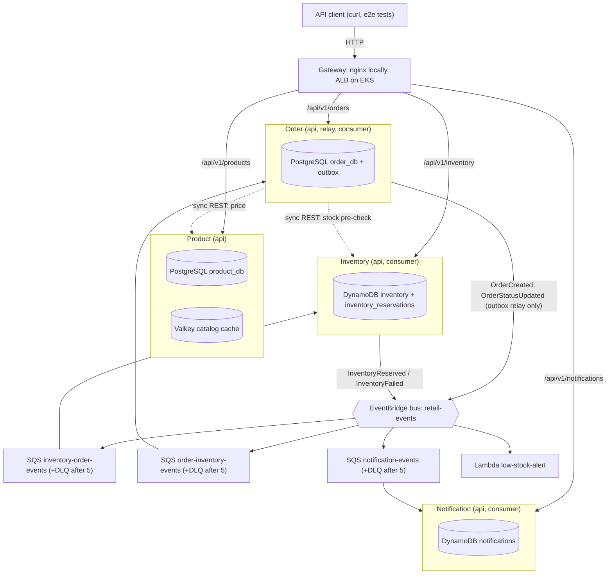
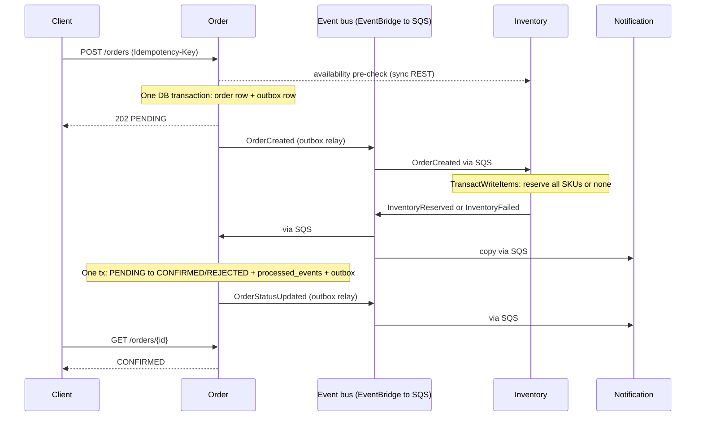

# Retail Microservices Platform — Design Doc

Author: M.L. · 30 Sep 2026 · Status: v1.0, ready for build

## 1. Overview

We build a four-service retail order platform that runs end-to-end on localhost first, then moves to AWS EKS with no application code changes — only configuration. Every AWS dependency is reached through an adapter whose endpoint is an environment variable, so LocalStack, PostgreSQL and Valkey containers stand in for EventBridge/SQS/DynamoDB, Aurora and ElastiCache.

**Goals**

- A customer can browse products, place an order, and see it move `PENDING → CONFIRMED | REJECTED` via asynchronous events.
- Correct under retries and duplicates: no double reservation, no lost events, no stuck orders.
- Observable from day one: structured logs with correlation IDs, Prometheus metrics, health endpoints.
- Cloud-portable: the same container images and env-var contract run on Docker Compose and EKS.

**Non-goals (this week)**

- Payments, carts, auth/login, cancellations, returns, multi-currency.
- Service mesh, Kafka, GitOps (ArgoCD/Flux) — documented as extensions only.
- A UI. The API plus an acceptance-test script is the demo surface.

**Build strategy**

| Phase | Scope | Plan day | Exit criterion |
| --- | --- | --- | --- |
| 1a — Local (Compose on OrbStack) | Services, data layer, events, tests | Day 1–2 | Acceptance test passes on `make up` |
| 1b — Local Kubernetes (OrbStack) | Helm chart, probes, HPA, ingress, rollback on the local cluster | Day 3 (morning) | Same test passes via local ingress; `helm rollback` demonstrated |
| 2 — Cloud infra | Terraform, ECR, EKS; the 1b chart with dev values | Day 3 | Same test passes against EKS ingress |
| 3 — CI/CD | GitHub Actions, OIDC, scans, promotion, rollback | Day 4 | PR-to-prod pipeline with a demonstrated rollback |
| 4 — Reliability | Dashboards, SLOs, alarms, failure drills, runbooks | Day 5 | Each drill in section 11 detected and recovered |

This document is detailed for Phase 1 and gives forward-compatible contracts for Phases 2–4 so nothing built locally has to be rewritten.

## 2. Key architecture decisions

Each decision below is binding for Claude Code; changing one means updating this table first.

| # | Decision | Why | Rejected alternative |
| --- | --- | --- | --- |
| ADR-01 | Python 3.13 + FastAPI for all four services | Fastest path to working, typed APIs; one toolchain; small learning surface for the week | Go (smaller images, more boilerplate), Spring Boot (JVM memory/startup on small nodes) |
| ADR-02 | Monorepo, one image per service, shared `libs/common` package | Atomic changes to event schemas; one CI pipeline with path filters | Polyrepo (schema drift, 4× pipeline work) |
| ADR-03 | Database per service: `product_db` and `order_db` are separate PostgreSQL databases with separate roles | Services cannot join across boundaries; enables independent migration | Shared schema (hidden coupling) |
| ADR-04 | Transactional outbox for Order Service events | Order write and event publish must be atomic; `POST /orders` is not a retryable message | Publish after commit (lost events on crash), 2PC (unavailable) |
| ADR-05 | Inventory uses idempotent redelivery instead of an outbox | It is triggered by SQS; if publish fails, the message is not deleted and the retry re-emits from the stored reservation | DynamoDB Streams + EventBridge Pipes (better in cloud, weak local emulation) — Phase 4 option |
| ADR-06 | EventBridge custom bus → SQS queue per consumer → DLQ | Bus gives content routing and fan-out; SQS gives durability, backpressure, retries | SNS→SQS (no content filtering on detail), direct SQS (producer knows consumers) |
| ADR-07 | All consumers idempotent keyed on `event.id` | SQS standard is at-least-once and unordered | FIFO queues (throughput caps, still need idempotency across the bus) |
| ADR-08 | Synchronous inventory pre-check, asynchronous reservation | Fast feedback for obvious out-of-stock; reservation remains authoritative and race-safe | Sync reservation (tight coupling, distributed rollback) |
| ADR-09 | Cache-aside with TTL for catalog reads only | Catalog is read-heavy and tolerates 5 min staleness; stock never cached | Write-through (more code), caching inventory (oversell risk) |
| ADR-10 | AWS SDK endpoint via `AWS_ENDPOINT_URL`, no code branches for local | Identical code path local and cloud; boto3 honours the env var natively | `if ENV == local` branches (untested prod paths) |
| ADR-11 | Schema migrations run as a separate one-shot process, never at app startup | N replicas racing migrations; later maps to a Helm pre-upgrade Job | Migrate on boot (race, slow readiness) |
| ADR-12 | Valkey 9.0 locally and on ElastiCache | ElastiCache now offers Valkey at lower cost than Redis OSS; wire-compatible with `redis-py` | Redis OSS 7 (fine, pricier on ElastiCache) |
| ADR-13 | PostgreSQL 17 locally, Aurora PostgreSQL in cloud (deviates from the plan's Aurora/RDS MySQL) | Transactional DDL (a failed migration rolls back cleanly), `JSONB` for the outbox, partial indexes, `INSERT … ON CONFLICT DO NOTHING` for dedupe, `SKIP LOCKED` | Aurora MySQL 3 (the plan's default; non-transactional DDL, weaker partial-index story) |

**Enterprise note:** ADR-04 and ADR-07 are the two that separate a demo from a system you would put your name on. Most event-driven outages in practice are lost or duplicated events, not slow ones.

## 3. System architecture

The customer path is synchronous only up to order acceptance; everything after `202 Accepted` happens through the event bus. Each service owns its store, and no service reads another's database.



*Orders enter through REST and settle through events. Dashed = synchronous REST; solid into the bus = events published; bus to queue to service = SQS delivery.*

Order is the only service with both sync dependencies (Product for price, Inventory for the pre-check) and an outbox; Notification only listens. Product has no events this week.

### Local to AWS mapping

| Concern | Local (Phase 1) | AWS (Phase 2+) | What changes |
| --- | --- | --- | --- |
| Compute | Docker Compose containers (M0–M8), then OrbStack Kubernetes (M9) | EKS Deployments on managed node groups | Nothing in the image; Helm values |
| Ingress | nginx gateway on :8080; Traefik in M9 | ALB via AWS Load Balancer Controller | Same path rules in Ingress |
| Relational | PostgreSQL 17 container | Aurora PostgreSQL 17, Multi-AZ | `DB_HOST`, secret source |
| Key-value | LocalStack DynamoDB | DynamoDB on-demand | `AWS_ENDPOINT_URL` unset |
| Cache | Valkey 9.0 container | ElastiCache for Valkey (TLS) | `CACHE_URL` |
| Events | LocalStack EventBridge + SQS | EventBridge + SQS | `AWS_ENDPOINT_URL` unset; `QUEUE_NAME` resolved at startup |
| Function | LocalStack Lambda | Lambda (Terraform-deployed) | Packaging only |
| Secrets | `.env` (git-ignored) | Secrets Manager + KMS via External Secrets Operator | Same env var names |
| AWS credentials | `test`/`test` for LocalStack | EKS Pod Identity role per ServiceAccount | SDK default chain, no code change |
| Metrics and logs | Prometheus + Grafana profile; stdout | Prometheus/Grafana + CloudWatch Logs | Same `/metrics` and JSON logs |

## 4. Service specifications and API contracts

All services expose JSON over HTTP under `/api/v1`, plus `/health/live`, `/health/ready` and `/metrics` at the root. Each service also emits an OpenAPI spec at `/openapi.json`; that generated spec is the contract of record once built.

| Service | Owns | Port (local) | Stores | Publishes | Consumes |
| --- | --- | --- | --- | --- | --- |
| product-service | Catalog, categories, prices | 8001 | PostgreSQL `product_db`, Valkey | — | — |
| inventory-service | Stock levels, reservations | 8002 | DynamoDB `inventory`, `inventory_reservations` | InventoryReserved, InventoryFailed | OrderCreated |
| order-service | Orders, order items, status | 8003 | PostgreSQL `order_db` (incl. outbox) | OrderCreated, OrderStatusUpdated | InventoryReserved, InventoryFailed |
| notification-service | Customer notifications (simulated) | 8004 | DynamoDB `notifications` | — | InventoryReserved, InventoryFailed, OrderStatusUpdated |
| gateway (nginx) | Path routing, stands in for ALB | 8080 | — | — | — |

### Endpoints

| Service | Method + path | Purpose | Notes |
| --- | --- | --- | --- |
| product | `GET /api/v1/products?category=&page=&size=` | List products | Cached per query key, TTL 300 s |
| product | `GET /api/v1/products/{sku}` | Product detail | Cache-aside, TTL 300 s |
| product | `POST /api/v1/products` | Create product (admin) | Invalidates list cache keys |
| product | `PUT /api/v1/products/{sku}` | Update price/details (admin) | Deletes `product:{sku}` and list keys |
| product | `GET /api/v1/categories` | List categories | Cached, TTL 3600 s |
| inventory | `GET /api/v1/inventory/{sku}` | Stock for one SKU | Never cached; strongly consistent read |
| inventory | `POST /api/v1/inventory/availability` | Batch check `[{sku, qty}]` → `{available: bool, items:[…]}` | Advisory only; reservation is authoritative |
| inventory | `PUT /api/v1/inventory/{sku}` | Set stock (admin/seed) | — |
| order | `POST /api/v1/orders` | Create order | Requires `Idempotency-Key` header; returns 202 + order in `PENDING` |
| order | `GET /api/v1/orders/{order_id}` | Order with items and status | — |
| order | `GET /api/v1/orders?customer_id=` | Orders for a customer | Newest first, paginated |
| notification | `GET /api/v1/notifications?order_id=` | Notifications for an order | For demo and test assertions |

### Create-order contract

Request:

```json
POST /api/v1/orders
Idempotency-Key: 6f1c2b1e-4a7d-4c55-9a51-0b8e3f0d2c11
{
  "customer_id": "cust-1001",
  "items": [ { "sku": "SKU-TSHIRT-BLK-M", "quantity": 2 } ]
}
```

Response `202 Accepted`:

```json
{
  "order_id": "01J9Z6Q4W8K3M2N1P0R7S5T4V3",
  "status": "PENDING",
  "total_amount": "39.98",
  "currency": "USD",
  "items": [ { "sku": "SKU-TSHIRT-BLK-M", "quantity": 2, "unit_price": "19.99" } ],
  "created_at": "2026-10-05T14:03:11Z"
}
```

Rules:

- Order Service fetches price from Product Service and **snapshots `unit_price` into the order**. Later price changes never alter existing orders.
- Same `Idempotency-Key` + same body (no expiry; the key is unique per customer) → return the original order (200). Same key + different body → 422.
- Pre-check says unavailable → 409 `OUT_OF_STOCK`, no order row written.
- Product or Inventory unreachable → 503 with `Retry-After`; no partial order.
- Money is `NUMERIC(10,2)` in PostgreSQL, `Decimal` in Python and a string in JSON. Never floats.
- IDs are ULIDs (sortable, safe to expose).

### Error shape (all services)

```json
{ "error": { "code": "OUT_OF_STOCK", "message": "SKU-TSHIRT-BLK-M: requested 2, available 1", "correlation_id": "…" } }
```

## 5. Data model

Two PostgreSQL 17 databases (Aurora PostgreSQL compatible), three DynamoDB tables, one cache namespace per service. Migrations use Alembic; every migration must be backward compatible with the previous app version (expand → migrate → contract), because Phase 3 rollbacks roll back code, not schema.

Each database has two roles: `<svc>_owner` owns the schema and runs migrations; `<svc>_app` gets `SELECT, INSERT, UPDATE, DELETE` through `ALTER DEFAULT PRIVILEGES`, so the running service cannot alter its own schema. Tables live in the `public` schema of each database.

### product_db (PostgreSQL)

```sql
CREATE TABLE categories (
  id    INTEGER GENERATED ALWAYS AS IDENTITY PRIMARY KEY,
  slug  VARCHAR(64)  NOT NULL UNIQUE,
  name  VARCHAR(128) NOT NULL
);

CREATE TABLE products (
  sku          VARCHAR(64)   PRIMARY KEY,
  name         VARCHAR(255)  NOT NULL,
  description  TEXT,
  category_id  INTEGER       NOT NULL REFERENCES categories (id),
  price        NUMERIC(10,2) NOT NULL CHECK (price >= 0),
  currency     CHAR(3)       NOT NULL DEFAULT 'USD',
  active       BOOLEAN       NOT NULL DEFAULT TRUE,
  created_at   TIMESTAMPTZ   NOT NULL DEFAULT now(),
  updated_at   TIMESTAMPTZ   NOT NULL DEFAULT now()   -- set by the app on update
);

-- PostgreSQL does not index foreign keys automatically
CREATE INDEX ix_products_category_active ON products (category_id) WHERE active;
```

### order_db (PostgreSQL)

```sql
CREATE TABLE orders (
  order_id         CHAR(26)      PRIMARY KEY,                 -- ULID
  customer_id      VARCHAR(64)   NOT NULL,
  status           VARCHAR(16)   NOT NULL
                   CHECK (status IN ('PENDING', 'CONFIRMED', 'REJECTED')),
  status_reason    VARCHAR(255),
  total_amount     NUMERIC(12,2) NOT NULL,
  currency         CHAR(3)       NOT NULL,
  idempotency_key  VARCHAR(64)   NOT NULL,
  request_hash     CHAR(64)      NOT NULL,                    -- sha256 of canonical body
  version          INTEGER       NOT NULL DEFAULT 1,          -- optimistic lock
  created_at       TIMESTAMPTZ   NOT NULL DEFAULT now(),
  updated_at       TIMESTAMPTZ   NOT NULL DEFAULT now(),
  CONSTRAINT uq_orders_customer_idem UNIQUE (customer_id, idempotency_key)
);
CREATE INDEX ix_orders_customer_created ON orders (customer_id, created_at DESC);
CREATE INDEX ix_orders_pending_created  ON orders (created_at) WHERE status = 'PENDING';  -- stuck-order sweeper

CREATE TABLE order_items (
  order_id    CHAR(26)      NOT NULL REFERENCES orders (order_id),
  sku         VARCHAR(64)   NOT NULL,
  quantity    INTEGER       NOT NULL CHECK (quantity BETWEEN 1 AND 100),
  unit_price  NUMERIC(10,2) NOT NULL,
  PRIMARY KEY (order_id, sku)
);

CREATE TABLE outbox (
  id            BIGINT GENERATED ALWAYS AS IDENTITY PRIMARY KEY,
  event_id      CHAR(26)     NOT NULL UNIQUE,
  detail_type   VARCHAR(64)  NOT NULL,
  payload       JSONB        NOT NULL,                        -- full envelope
  created_at    TIMESTAMPTZ  NOT NULL DEFAULT now(),
  published_at  TIMESTAMPTZ,
  attempts      INTEGER      NOT NULL DEFAULT 0,
  last_error    VARCHAR(512)
);
CREATE INDEX ix_outbox_unpublished ON outbox (id) WHERE published_at IS NULL;

CREATE TABLE processed_events (
  event_id      CHAR(26)    PRIMARY KEY,
  processed_at  TIMESTAMPTZ NOT NULL DEFAULT now()
);
```

PostgreSQL-specific rules:

- Status is a `CHECK` constraint, not a `CREATE TYPE … AS ENUM`: adding a value later is a plain constraint swap, which fits expand/contract better.
- Dedupe is `INSERT INTO processed_events (event_id) VALUES (:id) ON CONFLICT DO NOTHING`; `rowcount = 0` means duplicate. No exception-driven control flow, no aborted transaction.
- `updated_at` has no `ON UPDATE` equivalent; SQLAlchemy sets it via `onupdate=func.now()`. No triggers.
- Alembic migrations run inside a transaction; PostgreSQL DDL is transactional, so a failed migration leaves no half-applied schema. Exception: `CREATE INDEX CONCURRENTLY` cannot run in a transaction and needs its own migration with `autocommit_block()`.
- **Gotcha — outbox bloat:** every publish is an `UPDATE`, which leaves a dead tuple. The relay deletes rows published more than 7 days ago in batches of 1,000, and the partial index keeps the hot scan small. Without this, autovacuum falls behind and relay latency creeps up over weeks.

### DynamoDB tables (on-demand capacity)

| Table | PK | SK | Attributes | Access pattern |
| --- | --- | --- | --- | --- |
| `inventory` | `sku` (S) | — | `available` (N), `reserved` (N), `updated_at` (S) | Get by SKU; conditional decrement on reserve |
| `inventory_reservations` | `order_id` (S) | — | `items` (L), `status` (S: RESERVED/FAILED), `event_id` (S), `reason` (S), `created_at` (S), `ttl` (N) | Idempotency record per order (TTL at least 30 days so it outlives SQS retention and any archive replay; otherwise a replayed OrderCreated reserves twice); replay source for re-emitting the outcome event |
| `notifications` | `order_id` (S) | `event_id` (S) | `type`, `channel`, `message`, `created_at`, `ttl` | Conditional put `attribute_not_exists(event_id)` = dedupe; query by order |

Reservation is one `TransactWriteItems` call: a `Put` on `inventory_reservations` with `attribute_not_exists(order_id)` plus one `Update` per SKU with `ConditionExpression: available >= :qty`, setting `available = available - :qty, reserved = reserved + :qty`. All succeed or none do. Limit: 100 items per transaction, well above the 20-line order cap.

**Gotcha:** On `TransactionCanceledException`, inspect `CancellationReasons`. `ConditionalCheckFailed` on the reservation item means a duplicate (re-emit stored outcome). On an inventory item it means insufficient stock (write a FAILED reservation, emit InventoryFailed). Treating both the same way is the classic oversell/double-fail bug.

### Cache design (Valkey)

| Key | Value | TTL | Invalidation |
| --- | --- | --- | --- |
| `product:v1:{sku}` | Product JSON | 300 s | Delete on PUT |
| `products:v1:list:{category}:{page}:{size}` | Page JSON | 300 s | Delete pattern via a tracked key set `products:v1:listkeys` on any write |
| `categories:v1` | Categories JSON | 3600 s | Delete on category change |

Cache is optional at runtime: a Valkey error logs a warning, increments `cache_errors_total`, and falls through to PostgreSQL. The service must stay ready with the cache down. Never use `KEYS *` for invalidation; it blocks Valkey on large keyspaces.

## 6. Event design

One custom EventBridge bus `retail-events`, one SQS queue per consumer service, one DLQ per queue, and a versioned envelope shared through `libs/common/events`.

### Envelope

EventBridge `PutEvents` entry: `Source = retail.<service>`, `DetailType = <EventName>`, `Detail = envelope JSON`. Consumers receive the full EventBridge event in the SQS body and read `detail`.

```json
{
  "event_id": "01J9Z6R0C4…",          
  "event_type": "OrderCreated",
  "schema_version": "1.0",
  "occurred_at": "2026-10-05T14:03:11.412Z",
  "producer": "order-service",
  "correlation_id": "b7e1…",           
  "causation_id": null,                
  "data": { }
}
```

- `event_id`: ULID, the idempotency key for every consumer.
- `correlation_id`: from the originating HTTP request; propagated unchanged through every event and log line.
- `causation_id`: `event_id` of the event that triggered this one.
- Versioning: additive fields keep the major version. A breaking change creates `schema_version: "2.0"` and the producer dual-publishes until all consumers migrate. Consumers ignore unknown fields.

### Catalog

| Event | Producer | Consumers | `data` payload |
| --- | --- | --- | --- |
| OrderCreated | order-service (via outbox) | inventory | `order_id, customer_id, items[{sku, quantity}], total_amount, currency` |
| InventoryReserved | inventory-service | order, notification, low-stock Lambda | `order_id, items[{sku, quantity, remaining}]` |
| InventoryFailed | inventory-service | order, notification | `order_id, reason (OUT_OF_STOCK / UNKNOWN_SKU), failed_items[{sku, requested, available}]` |
| OrderStatusUpdated | order-service (via outbox) | notification | `order_id, customer_id, old_status, new_status, reason` |

### Routing

| Rule | Event pattern | Target |
| --- | --- | --- |
| `to-inventory` | `detail-type: [OrderCreated]` | SQS `inventory-order-events` |
| `to-order` | `detail-type: [InventoryReserved, InventoryFailed]` | SQS `order-inventory-events` |
| `to-notification` | `detail-type: [InventoryReserved, InventoryFailed, OrderStatusUpdated]` | SQS `notification-events` |
| `to-low-stock` | `detail-type: [InventoryReserved]` | Lambda `low-stock-alert` (async invoke, on-failure DLQ) |
| `archive-all` | `source: [{prefix: "retail."}]` | EventBridge archive, 7-day retention (cloud only; enables replay) |

Queue settings (all three):

- `VisibilityTimeout` = 60 s (≥ 6× p99 handler time; handlers target < 5 s).
- Redrive: `maxReceiveCount = 5` → `<queue>-dlq`, `MessageRetentionPeriod` 14 days on DLQ.
- Long polling: `WaitTimeSeconds = 20`, batch size 10.
- Delete a message only after the handler's DB transaction commits.

**Gotcha:** EventBridge→SQS needs a queue resource policy allowing `events.amazonaws.com` with `aws:SourceArn` = the rule ARN. Missing it fails silently — the rule matches, nothing arrives. Watch the rule's `FailedInvocations` metric.

### Consumer contract (every handler)

1. Parse envelope; unknown `event_type` → log and delete (not an error).
2. Validate `data` against the Pydantic model for that `schema_version`; invalid → raise `PoisonMessage`, never retried in-process, lands in DLQ after `maxReceiveCount`.
3. Dedupe on `event_id` inside the same transaction as the business write.
4. Apply business change guarded by current state (state machine in section 7).
5. Commit, then delete the SQS message. Transient errors → do not delete; SQS redelivers after visibility timeout.

### Order Service outbox relay

- `POST /orders` writes `orders`, `order_items` and an `outbox` row in one PostgreSQL transaction.
- A relay process (same image, command `relay`) loops: `SELECT … FROM outbox WHERE published_at IS NULL ORDER BY id LIMIT 50 FOR UPDATE SKIP LOCKED`, calls `PutEvents` (max 10 entries per call), sets `published_at` for entries with no `ErrorCode`, increments `attempts` for failures.
- `SKIP LOCKED` lets multiple relay replicas run safely. Poll interval 500 ms when idle.
- `PutEvents` returns HTTP 200 with partial failures in `FailedEntryCount`; check per entry.
- Consequence: events can be published more than once (crash between PutEvents and UPDATE). That is why ADR-07 exists.

### Lambda: low-stock-alert

Python 3.13 function triggered directly by EventBridge (not SQS) to show a second integration pattern. For each item with `remaining < LOW_STOCK_THRESHOLD` (default 5), log a structured `low_stock` record and put a `LowStockDetected` CloudWatch metric (EMF log format, so no extra API call). Idempotency is not required: the effect is a log and a metric.

## 7. Order saga and state machine

An order is accepted in one PostgreSQL transaction and reaches a terminal status only through events; local target is p50 under 2 s from `202` to `CONFIRMED`, SLO 99% within 30 s.



*Happy path shown; InventoryFailed takes the same route and ends in REJECTED.*

The three boxed steps are the only places state changes, and each is a single local transaction. Nothing ever spans two services' stores.

### Order status transitions

| Current status | Event received | Action | Emits (via outbox) |
| --- | --- | --- | --- |
| PENDING | InventoryReserved | Set CONFIRMED | OrderStatusUpdated |
| PENDING | InventoryFailed | Set REJECTED, `status_reason` = event reason | OrderStatusUpdated |
| CONFIRMED or REJECTED | Any inventory outcome | Ignore; log `stale_event`; count `outcome=duplicate` | — |
| Any | `event_id` already in `processed_events` | Acknowledge and skip | — |

Implementation rule: the transition is `UPDATE orders SET status = :new, version = version + 1 WHERE order_id = :id AND status = 'PENDING'`, followed in the same transaction by the `processed_events` insert and the outbox insert. `rowcount = 0` means the order is already terminal: commit only the `processed_events` row and delete the message. This guard, not message ordering, is what keeps out-of-order and duplicate deliveries harmless.

## 8. Cross-cutting concerns

Every service implements the same config, health, logging, metrics and resilience contract via `libs/common`, so Kubernetes manifests in Phase 2 are one template.

### Configuration (12-factor, Pydantic Settings)

| Variable | Example (local) | Cloud source |
| --- | --- | --- |
| `SERVICE_NAME` | `order-service` | Helm values |
| `ENVIRONMENT` | `local` | Helm values (`dev` / `prod`) |
| `LOG_LEVEL` | `INFO` | ConfigMap |
| `AWS_REGION` | `us-east-1` | ConfigMap |
| `AWS_ENDPOINT_URL` | `http://localstack:4566` | **Unset** in cloud |
| `DB_HOST` / `DB_PORT` / `DB_NAME` | `postgres` / `5432` / `order_db` | ConfigMap (RDS Proxy or Aurora writer endpoint) |
| `DB_USER` / `DB_PASSWORD` | from `.env` (`order_app`; migrate job uses `order_owner`) | Secrets Manager → Kubernetes Secret (External Secrets Operator) |
| `DB_SSLMODE` | `disable` | `verify-full` with the RDS CA bundle |
| `CACHE_URL` | `redis://valkey:6379/0` | ConfigMap (`rediss://` with TLS) |
| `EVENT_BUS_NAME` | `retail-events` | ConfigMap |
| `QUEUE_``NAME` | `inventory-order-events` | ConfigMap. Consumers call `GetQueueUrl` at startup, so no LocalStack-specific URL format leaks into config |
| `PRODUCT_SERVICE_URL` / `INVENTORY_SERVICE_URL` | `http://product-service:8001` | ClusterIP DNS |
| `HTTP_TIMEOUT_CONNECT_S` / `HTTP_TIMEOUT_READ_S` | `1.0` / `2.0` | ConfigMap |

No credentials in code, images, or Git. Locally, `AWS_ACCESS_KEY_ID=test` / `AWS_SECRET_ACCESS_KEY=test` for LocalStack only. In cloud the SDK uses EKS Pod Identity credentials; no keys exist.

### Health endpoints

- `GET /health/live` → 200 if the process event loop responds. **Checks no dependencies.** A DB outage must not trigger restart storms across every pod.
- `GET /health/ready` → 200 only if required dependencies respond within 500 ms: PostgreSQL `SELECT 1` or DynamoDB `DescribeTable` (cached 10 s). Cache is **not** required. Returns JSON with per-dependency status.
- Consumers/relay expose the same endpoints on a small side HTTP server (port 9000) so Kubernetes probes them the same way.

### Logging

- JSON to stdout via `structlog`, one line per event: `timestamp, level, service, environment, message, correlation_id, event_id?, order_id?, trace_id?`.
- `X-Correlation-ID` accepted on inbound HTTP or generated; forwarded on outbound HTTP; placed in every event envelope.
- Never log request bodies with customer data, secrets, or full SQL parameters.

### Metrics (Prometheus, `/metrics`)

| Metric | Type | Labels |
| --- | --- | --- |
| `http_requests_total` | counter | `method, route, status` |
| `http_request_duration_seconds` | histogram | `method, route` |
| `events_published_total` / `events_publish_failures_total` | counter | `event_type` |
| `events_consumed_total` | counter | `event_type, outcome` (`processed / duplicate / poison / error`) |
| `event_handler_duration_seconds` | histogram | `event_type` |
| `outbox_unpublished` | gauge | — |
| `outbox_oldest_unpublished_age_seconds` | gauge | — |
| `orders_total` | counter | `final_status` |
| `order_time_to_terminal_seconds` | histogram | — (PENDING→CONFIRMED/REJECTED) |
| `cache_hits_total` / `cache_misses_total` / `cache_errors_total` | counter | `keyspace` |

Use the `route` template (`/api/v1/orders/{order_id}`), never the raw path — raw IDs explode label cardinality and cost real money on Datadog/AMP.

### Resilience

- Outbound HTTP: `httpx` with connect 1 s / read 2 s timeouts; retry only idempotent GETs, max 2 retries, exponential backoff with jitter (`tenacity`). The availability pre-check POST is read-only and retry-safe.
- DB pool: SQLAlchemy with psycopg 3, `pool_size=5, max_overflow=5, pool_pre_ping=True, pool_recycle=1800`. Each PostgreSQL connection is a backend process, so keep `replicas × (pool_size + max_overflow)` well under the instance `max_connections`; in cloud put RDS Proxy in front so HPA scale-out cannot exhaust connections.
- Set `statement_timeout = 5s` and `idle_in_transaction_session_timeout = 30s` on the `<svc>_app` roles. A stuck transaction holding the outbox lock is the failure you want killed, not waited on.
- Stuck-order sweeper (order-service, runs in the relay process every 60 s): orders `PENDING` longer than 5 min are logged and counted in `orders_stuck` gauge. No auto-reject this week; this is the alarm source for the stuck-queue runbook.
- Graceful shutdown: on SIGTERM, stop accepting HTTP, finish in-flight requests, consumers stop polling and finish the current batch within 25 s (Kubernetes `terminationGracePeriodSeconds: 30`).

## 9. Repository layout and tech stack

One monorepo, `uv` workspaces, one Dockerfile per service built from the repo root so `libs/common` is included. Folders for Phases 2–4 are created now as empty placeholders with a README, so paths never move.

```text
retail-platform/
├── CLAUDE.md                     # short pointer to this doc + working rules (section 14)
├── docs/
│   ├── DESIGN.md                 # this document
│   ├── adr/                      # one file per ADR when decisions change
│   └── runbooks/                 # Phase 4
├── libs/common/                  # installable package: retail_common
│   └── retail_common/
│       ├── config.py             # BaseServiceSettings
│       ├── logging.py            # structlog setup, correlation-id middleware
│       ├── metrics.py            # Prometheus middleware + shared metrics
│       ├── health.py             # live/ready router with pluggable checks
│       ├── http_client.py        # httpx client w/ timeouts, retries, header propagation
│       ├── events/
│       │   ├── envelope.py       # Envelope model, ULID ids
│       │   ├── schemas.py        # OrderCreated, InventoryReserved, … (v1)
│       │   ├── publisher.py      # EventBridgePublisher (PutEvents, partial-failure handling)
│       │   └── consumer.py       # SqsConsumer loop, dedupe hook, poison handling
│       └── errors.py             # error model + exception handlers
├── services/
│   ├── product-service/
│   │   ├── app/  (main.py, api/, domain/, repo/, cache.py)
│   │   ├── migrations/           # Alembic
│   │   ├── tests/  (unit/, integration/)
│   │   ├── Dockerfile
│   │   └── pyproject.toml
│   ├── inventory-service/        # app/ + consumer entrypoint
│   ├── order-service/            # app/ + relay entrypoint + migrations/
│   └── notification-service/     # consumer + small read API
├── functions/low-stock-alert/    # Lambda handler + tests
├── gateway/nginx.conf            # path routing, mirrors ALB Ingress rules
├── local/
│   ├── docker-compose.yml
│   ├── localstack/init/ready.d/10-bootstrap.sh
│   ├── postgres/init/01-databases.sh
│   ├── seed/seed.py              # categories, 20 products, stock levels
│   └── observability/ (prometheus.yml, grafana/)
├── tests/e2e/                    # acceptance + failure drills (pytest)
├── deploy/helm/                  # M9 (placeholder until then)
├── infra/terraform/              # Phase 2 (placeholder)
├── .github/workflows/            # Phase 3 (placeholder)
├── Makefile
├── .env.example                  # committed; .env is git-ignored
└── pyproject.toml                # uv workspace root, ruff, mypy, pytest config
```

Inside each service: `api/` (FastAPI routers, request/response models) → `domain/` (pure logic, no I/O) → `repo/` (SQLAlchemy / boto3 adapters). Domain code never imports boto3, SQLAlchemy or httpx; that is what makes unit tests fast and the cloud swap config-only.

### Stack (pin exact versions in `uv.lock`)

| Concern | Choice |
| --- | --- |
| Runtime | Python 3.13, FastAPI, Uvicorn |
| Validation / config | Pydantic v2, pydantic-settings |
| SQL | SQLAlchemy 2.x (sync), psycopg 3 (binary), Alembic |
| AWS | boto3 (EventBridge, SQS, DynamoDB); `moto` for unit tests |
| Cache | redis-py against Valkey 9.0 |
| HTTP client | httpx + tenacity |
| IDs | `python-ulid` |
| Logging / metrics | structlog, prometheus-client |
| Tooling | uv, ruff (lint + format), mypy (strict on `libs/common` and `domain/`), pytest, pytest-cov |
| Containers | OrbStack (Docker engine + single-node Kubernetes), Docker Compose v2, docker buildx (multi-arch); base image `python:3.1``3``-slim`, non-root user, multi-stage |

The Dockerfile is production-shaped from day one: multi-stage, `uv sync --frozen --no-dev`, non-root UID 10001, no shell tools in the final stage beyond what the base provides, `HEALTHCHECK` omitted (Kubernetes probes own that).

## 10. Local environment

`make up` brings the whole platform up with Docker Compose in under 2 minutes; `make e2e` runs the acceptance test against `http://localhost:8080`. Each service image runs several processes by command, mirroring the Deployments it becomes on EKS.

### Process inventory

| Compose service | Image | Command | Port | Becomes on EKS |
| --- | --- | --- | --- | --- |
| postgres | `postgres:17` | — | 5432 | Aurora PostgreSQL 17 (behind RDS Proxy) |
| valkey | `valkey/valkey:``9.0` | — | 6379 | ElastiCache for Valkey |
| localstack | `localstack/localstack` at a pinned CalVer tag (2026.03.0 or later), auth token required | — | 4566 | EventBridge, SQS, DynamoDB, Lambda |
| product-migrate / order-migrate | service image | `migrate` | — | Helm pre-install/pre-upgrade Job |
| seed | product image | `seed` | — | Manual/CI job (dev only) |
| product-service | product | `api` | 8001 | Deployment + HPA |
| inventory-service | inventory | `api` | 8002 | Deployment + HPA |
| inventory-consumer | inventory | `consumer` | 9000 | Deployment (scale on queue depth, KEDA later) |
| order-service | order | `api` | 8003 | Deployment + HPA |
| order-relay | order | `relay` | 9000 | Deployment, 1–2 replicas |
| order-consumer | order | `consumer` | 9000 | Deployment |
| notification-service | notification | `api` | 8004 | Deployment |
| notification-consumer | notification | `consumer` | 9000 | Deployment |
| gateway | `nginx:1.27-alpine` | — | 8080 | ALB via AWS Load Balancer Controller Ingress |
| prometheus / grafana | official images | profile `observability` | 9090 / 3000 | kube-prometheus-stack or AMP/AMG |

Container ports 9000 on consumers are internal only (health + metrics).

### Compose skeleton

```yaml
name: retail
x-svc: &svc
  env_file: ../.env
  restart: unless-stopped
  environment: &env
    AWS_REGION: us-east-1
    AWS_ENDPOINT_URL: http://localstack:4566
    AWS_ACCESS_KEY_ID: test
    AWS_SECRET_ACCESS_KEY: test
    EVENT_BUS_NAME: retail-events
    CACHE_URL: redis://valkey:6379/0
    DB_PORT: "5432"
    DB_SSLMODE: disable
    LOG_LEVEL: INFO
    ENVIRONMENT: local

services:
  postgres:
    image: postgres:17
    environment:
      POSTGRES_PASSWORD: ${POSTGRES_PASSWORD}
      # read by init/01-databases.sh to create <svc>_owner / <svc>_app roles
      PRODUCT_OWNER_PASSWORD: ${PRODUCT_OWNER_PASSWORD}
      PRODUCT_APP_PASSWORD: ${PRODUCT_APP_PASSWORD}
      ORDER_OWNER_PASSWORD: ${ORDER_OWNER_PASSWORD}
      ORDER_APP_PASSWORD: ${ORDER_APP_PASSWORD}
    volumes: ["./postgres/init:/docker-entrypoint-initdb.d:ro", "pg-data:/var/lib/postgresql/data"]
    ports: ["5432:5432"]
    healthcheck: { test: ["CMD-SHELL", "pg_isready -h 127.0.0.1 -U postgres"], interval: 5s, retries: 20 }

  valkey:
    image: valkey/valkey:9.0
    ports: ["6379:6379"]

  localstack:
    image: localstack/localstack:${LOCALSTACK_TAG}
    environment:
      SERVICES: events,sqs,dynamodb,lambda,logs,iam,sts
      LOCALSTACK_AUTH_TOKEN: ${LOCALSTACK_AUTH_TOKEN:?set it in .env}
      LAMBDA_DOCKER_NETWORK: retail_default   # Lambda containers join the Compose network
    volumes:
      - "./localstack/init/ready.d:/etc/localstack/init/ready.d:ro"
      - "../functions:/opt/functions:ro"
      - "/var/run/docker.sock:/var/run/docker.sock"   # required for Lambda execution
    ports: ["4566:4566"]
    healthcheck:
      test: ["CMD-SHELL", "test -f /tmp/bootstrap.done"]
      interval: 5s
      retries: 30

  order-migrate:
    build: { context: .., dockerfile: services/order-service/Dockerfile }
    command: ["migrate"]
    environment:
      DB_HOST: postgres
      DB_PORT: "5432"
      DB_NAME: order_db
      DB_USER: order_owner
      DB_PASSWORD: ${ORDER_OWNER_PASSWORD}
    depends_on: { postgres: { condition: service_healthy } }

  order-service:
    <<: *svc
    build: { context: .., dockerfile: services/order-service/Dockerfile }
    command: ["api"]
    environment:
      <<: *env
      SERVICE_NAME: order-service
      DB_HOST: postgres
      DB_NAME: order_db
      DB_USER: order_app
      DB_PASSWORD: ${ORDER_APP_PASSWORD}
      PRODUCT_SERVICE_URL: http://product-service:8001
      INVENTORY_SERVICE_URL: http://inventory-service:8002
    depends_on:
      order-migrate: { condition: service_completed_successfully }
      localstack: { condition: service_healthy }
  # order-relay / order-consumer: same build, command ["relay"] / ["consumer"], QUEUE_NAME set
  # product-*, inventory-*, notification-*: same pattern

volumes:
  pg-data: {}
```

### LocalStack bootstrap (`local/localstack/init/ready.d/10-bootstrap.sh`)

Creates exactly the resources Terraform will create in Phase 2, with the same names. Keep the two in sync; a stretch goal is to replace this script with the Phase 2 Terraform module applied via `tflocal`.

```bash
#!/usr/bin/env bash
set -euo pipefail
REGION=us-east-1
ACCT=000000000000
BUS=retail-events

awslocal events create-event-bus --name "$BUS"

mk_queue() {  # $1 = queue name
  local dlq_url dlq_arn url arn
  dlq_url=$(awslocal sqs create-queue --queue-name "$1-dlq" \
    --attributes MessageRetentionPeriod=1209600 --query QueueUrl --output text)
  dlq_arn=$(awslocal sqs get-queue-attributes --queue-url "$dlq_url" \
    --attribute-names QueueArn --query Attributes.QueueArn --output text)
  url=$(awslocal sqs create-queue --queue-name "$1" --attributes \
    "{\"VisibilityTimeout\":\"60\",\"ReceiveMessageWaitTimeSeconds\":\"20\",\"RedrivePolicy\":\"{\\\"deadLetterTargetArn\\\":\\\"$dlq_arn\\\",\\\"maxReceiveCount\\\":\\\"5\\\"}\"}" \
    --query QueueUrl --output text)
  echo "$url"
}

route() {  # $1 rule, $2 queue, $3 JSON array of detail-types
  local url arn
  url=$(mk_queue "$2")
  arn="arn:aws:sqs:$REGION:$ACCT:$2"
  awslocal events put-rule --event-bus-name "$BUS" --name "$1" \
    --event-pattern "{\"detail-type\":$3}"
  awslocal events put-targets --event-bus-name "$BUS" --rule "$1" \
    --targets "Id=1,Arn=$arn"
}

route to-inventory    inventory-order-events '["OrderCreated"]'
route to-order        order-inventory-events '["InventoryReserved","InventoryFailed"]'
route to-notification notification-events    '["InventoryReserved","InventoryFailed","OrderStatusUpdated"]'

awslocal dynamodb create-table --table-name inventory \
  --attribute-definitions AttributeName=sku,AttributeType=S \
  --key-schema AttributeName=sku,KeyType=HASH --billing-mode PAY_PER_REQUEST
awslocal dynamodb create-table --table-name inventory_reservations \
  --attribute-definitions AttributeName=order_id,AttributeType=S \
  --key-schema AttributeName=order_id,KeyType=HASH --billing-mode PAY_PER_REQUEST
awslocal dynamodb create-table --table-name notifications \
  --attribute-definitions AttributeName=order_id,AttributeType=S AttributeName=event_id,AttributeType=S \
  --key-schema AttributeName=order_id,KeyType=HASH AttributeName=event_id,KeyType=RANGE \
  --billing-mode PAY_PER_REQUEST

# Lambda: package from mounted source without needing `zip` in the image
cd /tmp && python3 -m zipfile -c low-stock.zip /opt/functions/low-stock-alert/handler.py
awslocal lambda create-function --function-name low-stock-alert --runtime python3.13 \
  --handler handler.lambda_handler --zip-file fileb:///tmp/low-stock.zip \
  --role "arn:aws:iam::$ACCT:role/lambda-role" --environment Variables={LOW_STOCK_THRESHOLD=5}
awslocal events put-rule --event-bus-name "$BUS" --name to-low-stock \
  --event-pattern '{"detail-type":["InventoryReserved"]}'
awslocal events put-targets --event-bus-name "$BUS" --rule to-low-stock \
  --targets "Id=1,Arn=arn:aws:lambda:$REGION:$ACCT:function:low-stock-alert"

touch /tmp/bootstrap.done
```

The script is a spec, not a guarantee: Claude Code must run it and fix quoting or API differences against the pinned LocalStack version.

**LocalStack needs an auth token (verified).** Since release 2026.03.0, `localstack/localstack` is a single image that will not start without `LOCALSTACK_AUTH_TOKEN`, and tags use calendar versioning. The free Hobby plan covers the services used here but is for non-commercial use; for employer work, use a paid or CI token. Put the token in `.env` (git-ignored) and pin a CalVer tag in `LOCALSTACK_TAG`. If a token is not an option, fall back to `amazon/dynamodb-local` + ElasticMQ for SQS + an in-process `LocalEventBus` adapter that applies the routing table above; the publisher port in `retail_common.events` makes that a config switch, not a rewrite.

LocalStack does not enforce IAM, SQS queue policies or Lambda invoke permissions. Terraform must still create `aws_lambda_permission` for EventBridge and the queue policies from section 6, or the cloud flow fails silently where the local one worked.

**Compose gotchas.** The Makefile always runs `docker compose --env-file .env -f local/docker-compose.yml`. Without `--env-file`, `${VAR}` interpolation reads `local/.env`, not the repo-root `.env`, and passwords silently become empty. The Postgres healthcheck uses `-h 127.0.0.1` because the image's init phase runs a socket-only temporary server; a socket-based `pg_isready` reports ready before the init script has created the databases and roles.

### Makefile targets

`up`, `down`, `reset` (drop volumes), `logs s=<svc>`, `seed`, `test` (unit), `itest` (integration), `e2e`, `drill-consumer-down`, `drill-poison`, `lint`, `fmt`, `dlq-peek q=<queue>`, `dlq-redrive q=<queue>`.

### OrbStack and local Kubernetes

OrbStack is the local runtime for both local stages: its Docker engine runs Compose (M0–M8), and its built-in single-node Kubernetes cluster runs the Helm chart (M9) before anything touches EKS. That makes Helm, probes, HPA and rollback free to rehearse, which is where most first EKS deployments fail.

| Stage | Apps run in | Backing services run in | Ingress | Purpose |
| --- | --- | --- | --- | --- |
| Compose (M0–M8) | Compose containers | Compose | nginx gateway :8080 | Fast inner loop |
| Local Kubernetes (M9) | OrbStack Kubernetes, namespace `retail` | Compose, outside the cluster | Traefik | Rehearse Helm, probes, HPA, rollback |
| EKS (Phase 2) | EKS, namespace `retail` | Aurora, ElastiCache, DynamoDB, EventBridge/SQS | ALB | Production shape |

PostgreSQL, Valkey and LocalStack stay outside the cluster in M9 on purpose. That matches EKS, where data lives in managed services, and keeps stateful workloads out of Kubernetes.

Rules and gotchas:

- **No registry needed locally (verified).** OrbStack's Kubernetes uses the same container engine as Docker, so images from `docker build` are available to pods without a push. Tag `dev-<git sha>` and set `imagePullPolicy: IfNotPresent` in local values; `:latest` makes Kubernetes always try to pull.
- **Pods reach Compose through the host.** Compose publishes 5432, 6379 and 4566 on the Mac. `host.docker.internal` is documented for Docker containers; confirm it also resolves from pods before building on it: `kubectl --context orbstack run nettest --rm -it --restart=Never --image=busybox:1.37 -- nc -z -w 2 host.docker.internal 5432`. Then create `ExternalName` Services `postgres`, `valkey` and `localstack` in namespace `retail` pointing at that host, so pods keep the same `DB_HOST=postgres` as Compose.
- **Ingress (verified).** OrbStack installs no ingress controller; LoadBalancer services are reachable from the Mac at `*.k8s.orb.local`. Install Traefik with Helm and route host `retail.k8s.orb.local`. `ingressClassName` and annotations are per-env values (`traefik` locally, `alb` on EKS), and paths mirror `gateway/nginx.conf`. Do not use ingress-nginx: it was retired in March 2026 and receives no security fixes.
- **No cloud identity locally.** No Pod Identity or External Secrets in M9. `values-local.yaml` renders a plain Secret from `.env` with LocalStack `test` credentials; the chart toggles `externalSecret.enabled` and the ServiceAccount role per env.
- **CPU architecture.** On Apple Silicon, local images are `linux/arm64`. EKS nodes are therefore Graviton (arm64) in this design, and CI builds `linux/arm64,linux/amd64` with `docker buildx`. An amd64-only image on arm64 nodes fails at start with `exec format error`.
- **Resources.** Give the OrbStack VM at least 8 GB RAM. Local values request 50m CPU / 128Mi per pod so 13 processes plus Traefik fit. HPA needs metrics-server: install it if `kubectl --context orbstack top nodes` fails.
- **Context safety.** Every `k8s-*` Make target passes `--kube-context orbstack` / `--context orbstack` explicitly, so a local command can never land on an EKS cluster that happens to be the current context.

Additional Make targets: `k8s-build`, `k8s-deploy` (`helm upgrade --install --atomic` with local values), `k8s-e2e` (acceptance test through the local ingress), `k8s-rollback`, `k8s-down`.

## 11. Testing strategy

Three layers, each runnable alone; Phase 3 CI runs the first two on every PR and the third against dev after deploy.

| Layer | Scope | Tools | Target runtime | Gate |
| --- | --- | --- | --- | --- |
| Unit | `domain/`, envelope, handlers with fakes | pytest, moto, fakeredis | < 30 s total | ≥ 80% line coverage on `domain/` and `libs/common` |
| Integration | One service + its real stores | pytest against Compose PostgreSQL/Valkey/LocalStack | < 3 min | All green |
| End-to-end | Whole platform via gateway | `tests/e2e`, httpx, polling with timeout | < 2 min | Acceptance + drills below |

Unit tests that must exist (these catch the real bugs):

- Reservation: sufficient stock; insufficient on one of several SKUs (nothing decremented); duplicate `OrderCreated` (no second decrement, same outcome event re-emitted); unknown SKU.
- Order consumer: `InventoryReserved` on PENDING → CONFIRMED + OrderStatusUpdated in outbox; same event twice → one transition; `InventoryFailed` after CONFIRMED → ignored and logged (out-of-order guard).
- Create order: idempotent replay returns same order; same key different body → 422; price snapshot stored.
- Outbox relay: partial `PutEvents` failure marks only successful rows published.
- Cache: Valkey down → product read still succeeds from PostgreSQL.

### Acceptance test (maps to plan section 13, steps 1–10)

1. `GET /api/v1/products` returns seeded products; second call of `GET /api/v1/products/{sku}` is a cache hit (`cache_hits_total` increments).
2. Record stock for SKU A (`GET /api/v1/inventory/A`).
3. `POST /api/v1/orders` with 2 × A → 202, `PENDING`.
4. Poll `GET /api/v1/orders/{id}` every 250 ms, max 15 s → `CONFIRMED`.
5. Stock for A decreased by exactly 2.
6. `GET /api/v1/notifications?order_id=` shows InventoryReserved and OrderStatusUpdated notifications.
7. Async rejection: stop inventory-consumer, POST an order for SKU B (pre-check passes), set B's stock to 0, start the consumer → `REJECTED` with reason `OUT_OF_STOCK`.
8. Replay step 3 with the same `Idempotency-Key` → same `order_id`, stock unchanged.
9. All `/health/ready` return 200; all DLQs empty.
10. Every log line for the order shares one `correlation_id` across all four services.

### Failure drills (local now, EKS in Phase 4)

| Drill | How | Expected detection | Expected recovery |
| --- | --- | --- | --- |
| Consumer down | `docker compose stop inventory-consumer`, place 5 orders | Orders stay PENDING; queue depth 5; `orders_stuck` rises after 5 min | Start consumer → queue drains, all CONFIRMED, no duplicates |
| Poison message | Publish malformed `OrderCreated` directly to the bus | `events_consumed_total{outcome="poison"}`; message in DLQ after 5 receives | Inspect via `make dlq-peek`; fix; `make dlq-redrive` |
| Duplicate delivery | Send the same `OrderCreated` envelope twice | `outcome="duplicate"` increments | Stock decremented once |
| Bus unavailable | Stop LocalStack for 60 s, place an order | `POST /orders` still returns 202 (outbox); `outbox_unpublished` > 0 | LocalStack back → relay drains outbox, order CONFIRMED |
| Cache down | Stop Valkey | `cache_errors_total` rises; latency up | Reads still 200; readiness unaffected |
| DB down | Stop PostgreSQL | order/product `/health/ready` → 503; `/health/live` stays 200 | PostgreSQL back → ready without restarts |

The "Bus unavailable" drill is the one that proves ADR-04. If it fails, the outbox is not actually transactional.

## 12. Phase 1 milestones (Claude Code work plan)

Ten milestones, each a separate PR-sized unit that leaves `make up` working. Claude Code finishes one, runs its checks, and stops for review before the next.

- [ ] **M0 — Scaffold.** Repo tree from section 9, uv workspace, ruff/mypy/pytest config, Makefile, `.env.example`, `CLAUDE.md`, empty service apps returning `/health/live`. *Done when:* `make lint test` passes; `make up` starts four services with 200 on `/health/live`.
- [ ] **M1 — `libs/common`.** Settings, structlog + correlation middleware, metrics middleware, health router, error model, httpx client, envelope + v1 schemas, EventBridge publisher, SQS consumer loop. *Done when:* unit tests cover partial `PutEvents` failure, poison vs transient handling, correlation propagation.
- [ ] **M2 — Local infrastructure.** Compose with PostgreSQL, Valkey, LocalStack (auth token in .env), gateway; PostgreSQL init (two DBs; per service an owner role for migrations and an app role with DML only); LocalStack bootstrap; seed script (5 categories, 20 products, stock 10–50 each). *Done when:* `awslocal events list-rules --event-bus-name retail-events` shows 4 rules; tables and queues exist; seed is idempotent.
- [ ] **M3 — Product Service.** Alembic migration, CRUD, cache-aside + invalidation, readiness on PostgreSQL. *Done when:* integration tests pass with Valkey up and down.
- [ ] **M4 — Inventory Service API.** Get stock, batch availability, admin set-stock. *Done when:* strongly consistent reads verified in integration test.
- [ ] **M5 — Order Service (sync path + outbox).** Migration, create order with price snapshot, idempotency key, pre-check, outbox write in the same transaction, relay process. *Done when:* `POST /orders` → row in `orders` + `outbox`; relay publishes; the "Bus unavailable" drill passes.
- [ ] **M6 — Async flow.** Inventory consumer (transactional reservation, duplicate re-emit), Order consumer (state machine, `processed_events`), outcome → `OrderStatusUpdated` via outbox. *Done when:* acceptance steps 1–8 pass.
- [ ] **M7 — Notification + Lambda.** Notification consumer + read API; low-stock Lambda with unit test and LocalStack invocation. *Done when:* acceptance steps 1–10 pass; low-stock log visible in LocalStack logs.
- [ ] **M8 — Hardening.** All failure drills scripted as Make targets and pytest e2e cases; stuck-order sweeper; Prometheus + Grafana profile with one dashboard (RED per service, queue depth, outbox lag); README with run instructions. *Done when:* `make e2e` runs acceptance + all drills green from a clean `make reset && make up`.
- [ ] **M9 — Local Kubernetes on OrbStack.** Helm library chart `deploy/helm/retail-service` built to the section 13 spec, `values-<svc>-local.yaml`, Traefik ingress mirroring the gateway paths, migration Jobs as `pre-install,pre-upgrade` hooks, HPA on the API services, PDBs, multi-arch `docker buildx` build. *Done when:* `make k8s-deploy k8s-e2e` passes; `kubectl delete pod` on any service recovers with no failed orders; a deliberately broken release (bad readiness path) fails `--atomic`, and `helm rollback` restores a passing e2e.

Phase 1 is complete when M9 is done. Only then start Phase 2 (Terraform, ECR, EKS).

## 13. Phases 2–4: cloud, CI/CD, reliability

These are contracts Phase 1 must not violate, not a full spec; each phase gets its own design pass before build. Items marked **verify** depend on current AWS versions or pricing.

### Phase 2 — Terraform, ECR, EKS, Helm (Day 3)

**Terraform layout:** `infra/terraform/modules/{network,eks,data,events,ecr,github-oidc,observability}` composed by `envs/{dev,prod}`. Remote state in S3 with native locking (`use_lockfile = true`, Terraform ≥ 1.10); DynamoDB state locking is deprecated. Pin provider versions; one state per env.

| Area | Decision | Enterprise note |
| --- | --- | --- |
| Network | VPC across 3 AZs: public (ALB, NAT), private-app (nodes), private-data (Aurora, ElastiCache) | Single NAT in dev, one per AZ in prod. Add VPC endpoints (S3 + DynamoDB gateway; ECR api/dkr, SQS, STS, Secrets Manager, EventBridge, Logs interface) — NAT data processing is the #1 surprise bill on EKS |
| EKS | Managed node group, AL2023 AMIs, 3 × m7g.large Graviton/arm64 (dev: 2), matching Apple Silicon builds and cheaper per vCPU, access entries instead of `aws-auth` ConfigMap | Kubernetes 1.36, the newest EKS version in standard support (until 2 Aug 2027); pin it in Terraform. EKS publishes no Amazon Linux 2 AMIs after 1.32, so AL2023 or Bottlerocket only. EKS Auto Mode is a valid simpler alternative with less learning value |
| Add-ons | vpc-cni, coredns, kube-proxy, eks-pod-identity-agent, metrics-server; Helm: AWS Load Balancer Controller, External Secrets Operator | Install add-ons via Terraform `aws_eks_addon` / `helm_release`, versions pinned |
| Workload IAM | EKS Pod Identity, one IAM role per ServiceAccount | Least privilege per process: relay = `events:PutEvents` on the bus only; each consumer = receive/delete on its own queue only |
| Aurora | Aurora PostgreSQL 17.10 (18.x is GA on Aurora; stay on 17 until RDS Proxy support for 18 is confirmed), dev 1 instance, prod writer + reader in 2 AZs; KMS CMK; 7-day backups; deletion protection; RDS-managed master secret; RDS Proxy in front for connection pooling | App users created by a bootstrap migration, secrets in Secrets Manager, never Terraform outputs |
| ElastiCache | Valkey 9.0, TLS in transit, AUTH, prod 1 replica Multi-AZ | ElastiCache Serverless is simpler but has a minimum hourly cost — **verify** pricing |
| DynamoDB | On-demand, PITR on, SSE with KMS, TTL on `ttl` | — |
| Events | Same names as bootstrap script; SQS SSE; queue policies scoped by `aws:SourceArn`; EventBridge archive | — |
| ECR | One repo per service, tag immutability, scan on push (Inspector enhanced), lifecycle keep 30 | Tags `sha-<git sha>`; deploy by digest in prod |

**Helm:** the M9 library chart, reused unchanged with new values files, `deploy/helm/retail-service` + `values-<service>-<env>.yaml`. The chart renders, per process: Deployment (rolling, `maxUnavailable: 0`, `maxSurge: 25%`), ServiceAccount, Service (APIs only), PodDisruptionBudget (`minAvailable: 1`), HPA (APIs: CPU 70%, min 2, max 6), zone `topologySpreadConstraints`, probes on `/health/live` and `/health/ready`, `securityContext` (`runAsNonRoot`, `readOnlyRootFilesystem`, drop ALL), ExternalSecret, and the migration Job as a `pre-install,pre-upgrade` hook. One shared Ingress (ALB, HTTPS via ACM, `group.name: retail`) mirrors `gateway/nginx.conf` paths.

### Phase 3 — GitHub Actions (Day 4)

| Workflow | Trigger | Steps |
| --- | --- | --- |
| `pr.yml` | Pull request | Path-filtered matrix: ruff, mypy, pytest (unit + integration via Compose), Docker build, Trivy image + config scan (fail on fixable HIGH/CRITICAL), `terraform fmt -check`, `validate`, tflint, Checkov, `helm lint` + kubeconform, `terraform plan` posted as PR comment |
| `main.yml` | Merge to `main` | Build once → push `sha-<sha>` to ECR → OIDC assume `gha-deploy-dev` → `helm upgrade --install --atomic --wait --timeout 10m` → e2e acceptance against dev |
| `promote.yml` | Manual / tag | GitHub Environment `prod` with required reviewers → deploy the **same image digest** (never rebuild) → smoke test → record release |
| `infra.yml` | Changes under `infra/` | Plan on PR, apply on merge per env with environment approval |

Non-negotiables: OIDC trust policy pinned to `repo:<org>/<repo>:environment:<env>` (not `ref:*`); third-party actions pinned by commit SHA; branch protection with required checks; no long-lived AWS keys in GitHub. Rollback = `helm rollback <release> <revision>` or redeploy the previous digest; works only because migrations are expand/contract (section 5).

### Phase 4 — Observability and reliability (Day 5)

| SLI | SLO (28-day) | Source |
| --- | --- | --- |
| Availability: non-5xx share of `/api/*` requests | 99.5% | ALB metrics + `http_requests_total` |
| Read latency p95 (`GET` products/orders) | < 300 ms | `http_request_duration_seconds` |
| Create-order latency p95 | < 500 ms | same |
| Order processing: orders reaching a terminal state within 30 s | 99% | `order_time_to_terminal_seconds` |

Alarms (page vs ticket decided in the Phase 4 pass): SQS `ApproximateAgeOfOldestMessage` > 120 s; any DLQ `ApproximateNumberOfMessagesVisible` > 0; `outbox_oldest_unpublished_age_seconds` > 60; ALB 5xx rate and p95 `TargetResponseTime`; Aurora CPU, `DatabaseConnections`, `FreeableMemory`; Aurora MaximumUsedTransactionIDs > 1 billion (wraparound risk) and replica lag; pod restarts > 3 in 10 min; EventBridge rule `FailedInvocations` > 0. Logs via Fluent Bit (Container Insights) to CloudWatch; metrics via kube-prometheus-stack or Amazon Managed Service for Prometheus + Grafana.

Runbooks to write, each tied to an alarm: failed deployment/rollback, unhealthy pods, database connectivity, stuck queue/DLQ redrive, outbox lag.

## 14. Guardrails for Claude Code, open questions, risks

### Working rules (copy into `CLAUDE.md`)

```markdown
# CLAUDE.md
Source of truth: docs/DESIGN.md. If code and doc disagree, stop and ask; do not silently diverge.

## Workflow
- Work one milestone (M0–M9) at a time. Finish with: make lint test (and itest/e2e when the milestone says so).
- Stop after each milestone with a summary of what changed, what was verified, and any deviation from DESIGN.md.
- Ask before adding a dependency, a service, a table, an event type, or changing an API contract.

## Must
- Domain code has no I/O imports (boto3, sqlalchemy, httpx, redis).
- Every consumer is idempotent on event_id; dedupe happens in the same transaction as the business write.
- Order events go through the outbox. Never call PutEvents from a request handler.
- Money: Decimal / NUMERIC(10,2), strings in JSON. IDs: ULID.
- AWS clients are built from env only; no endpoint URLs or credentials in code.
- Liveness checks nothing external. Readiness checks required stores only.
- Structured JSON logs with correlation_id; metric labels use route templates.
- Migrations: Alembic, backward compatible, run via the migrate command only.

## Must not
- Commit secrets or .env. Use .env.example.
- Cache inventory/stock data.
- Use :latest image tags anywhere (Compose, CI, or Helm values).
- Use KEYS * in Valkey, floats for money, or bare except.
- Add Kafka, a service mesh, a UI, auth, payments, or GitOps tooling.
- Write Helm before M8 is done, or Terraform / GitHub Actions before M9 is done.
- Run kubectl or helm without an explicit --context; local work always targets the orbstack context.
```

### Open questions

- [ ] Is Python 3.13/FastAPI acceptable, or does your target stack need Java/Spring Boot or Go? Changing ADR-01 after M1 is expensive.
- [ ] LocalStack token: free Hobby plan (non-commercial use only) or a paid/CI token? Needed before M2.
- [ ] Apple Silicon is assumed (arm64 images, Graviton nodes). On an Intel Mac, switch EKS nodes to m7i and keep multi-arch builds.
- [ ] Should `reserved` stock ever be released or committed? This design never releases (no cancellation). Needed before adding cancellations in a later week.
- [ ] Dev and prod as two AWS accounts or two namespaces in one account? Enterprise default is separate accounts under AWS Organizations; one account is fine for the week but changes the OIDC and Terraform env design.
- [ ] Budget ceiling for the week's AWS spend (EKS control plane, NAT, Aurora, ElastiCache run 24/7). Decides single-NAT, instance sizes, and whether to `terraform destroy` nightly.

### Risks

| Risk | Impact | Mitigation |
| --- | --- | --- |
| LocalStack behaviour differs from AWS (IAM not enforced, queue policies ignored) | Works locally, fails silently in cloud | Phase 2 re-runs the full e2e and drills against dev; alarm on `FailedInvocations` |
| Outbox relay implemented as "publish then mark" outside a lock | Duplicate or skipped events | Unit test for partial failure; `SKIP LOCKED`; idempotent consumers absorb duplicates |
| Reservation logic conflates duplicate vs out-of-stock cancellations | Oversell or false rejects | Explicit `CancellationReasons` handling + unit tests (section 5) |
| Scope creep from Day 1–2 into Day 3+ | No cloud deployment by Day 5 | Milestone gates; M9 is the hard stop for Phase 1 |
| Idle AWS resources over nights/weekend | Unexpected bill | Tag everything `project=retail-week3`, AWS Budgets alert, destroy dev when idle |
