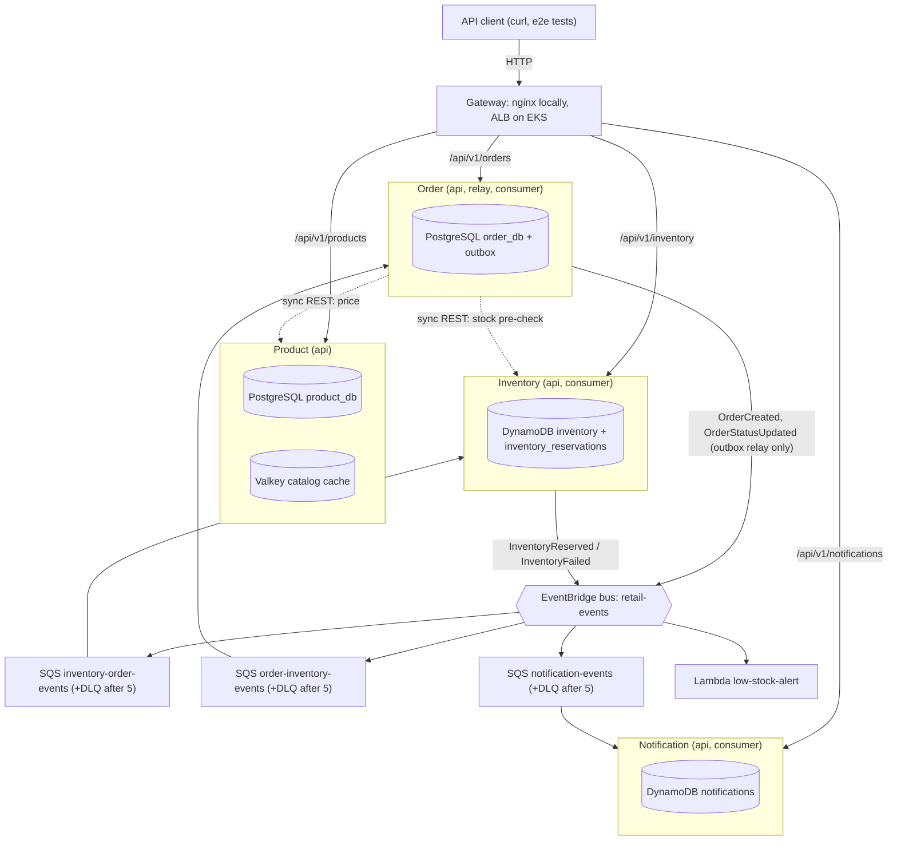
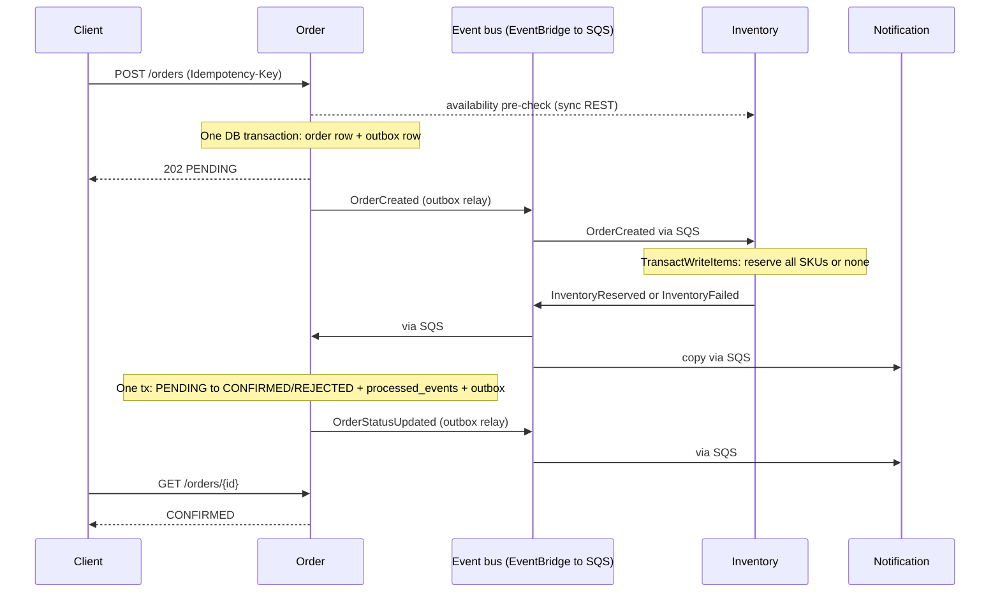

# Retail Microservices Platform — Design Doc

Author: M.L. · 30 Sep 2026 · Status: v1.4, M0–M4 built (v1.4: inventory API contract and hermetic unit tests; v1.3: product API contract and cache/outage behavior from M3, HTTP client moved to httpx2; v1.2: layout, bootstrap and tooling notes updated from M0–M2; OrbStack sized for an 8 GB Mac; v1.1: facts verified 30 Sep 2026; AWS access is GitHub-OIDC-only, so Phases 2–3 are reordered around a bootstrap workflow and in-VPC runners; bootstrap script and spec gaps fixed)

## 1. Overview

We build a four-service retail order platform that runs end-to-end on localhost first, then moves to AWS EKS with no application code changes — only configuration. Every AWS dependency is reached through an adapter whose endpoint is an environment variable, so LocalStack, PostgreSQL and Valkey containers stand in for EventBridge/SQS/DynamoDB, Aurora and ElastiCache.

**Goals**

- A customer can browse products, place an order, and see it move `PENDING → CONFIRMED | REJECTED` via asynchronous events.
- Correct under retries and duplicates: no double reservation, no lost events, no stuck orders.
- Observable from day one: structured logs with correlation IDs, Prometheus metrics, health endpoints.
- Cloud-portable: the same container images and env-var contract run on Docker Compose and EKS.

**Non-goals (this week)**

- Payments, carts, auth/login, cancellations, returns, multi-currency.
- Service mesh, Kafka, GitOps (ArgoCD/Flux) — documented as extensions only.
- A UI. The API plus an acceptance-test script is the demo surface.

**Build strategy**

| Phase | Scope | Plan day | Exit criterion |
| --- | --- | --- | --- |
| 1a — Local (Compose on OrbStack) | Services, data layer, events, tests | Day 1–2 | Acceptance test passes on `make up` |
| 1b — Local Kubernetes (OrbStack) | Helm chart, probes, HPA, ingress, rollback on the local cluster | Day 3 (morning) | Same test passes via local ingress; `helm rollback` demonstrated |
| 2 — Cloud infra, built through CI | Manual OIDC provider + `gha-bootstrap` role; `bootstrap.yml` (state bucket); minimal `infra.yml`; Terraform, ECR, EKS, in-VPC runners; the 1b chart with dev values. No AWS access exists outside GitHub Actions (ADR-14) | Day 3 | Same test passes against the EKS ingress, run from a workflow |
| 3 — CI/CD | Full `pr.yml`/`main.yml`/`promote.yml`, scans, promotion, rollback, `infra-destroy.yml` | Day 4 | PR-to-prod pipeline with a demonstrated rollback |
| 4 — Reliability | Dashboards, SLOs, alarms, failure drills, runbooks | Day 5 | Each drill in section 11 detected and recovered |

This document is detailed for Phase 1 and gives forward-compatible contracts for Phases 2–4 so nothing built locally has to be rewritten.

## 2. Key architecture decisions

Each decision below is binding for Claude Code; changing one means updating this table first.

| # | Decision | Why | Rejected alternative |
| --- | --- | --- | --- |
| ADR-01 | Python 3.13 + FastAPI for all four services | Fastest path to working, typed APIs; one toolchain; small learning surface for the week | Go (smaller images, more boilerplate), Spring Boot (JVM memory/startup on small nodes) |
| ADR-02 | Monorepo, one image per service, shared `libs/common` package | Atomic changes to event schemas; one CI pipeline with path filters | Polyrepo (schema drift, 4× pipeline work) |
| ADR-03 | Database per service: `product_db` and `order_db` are separate PostgreSQL databases with separate roles | Services cannot join across boundaries; enables independent migration | Shared schema (hidden coupling) |
| ADR-04 | Transactional outbox for Order Service events | Order write and event publish must be atomic; `POST /orders` is not a retryable message | Publish after commit (lost events on crash), 2PC (unavailable) |
| ADR-05 | Inventory uses idempotent redelivery instead of an outbox | It is triggered by SQS; if publish fails, the message is not deleted and the retry re-emits from the stored reservation | DynamoDB Streams + EventBridge Pipes (better in cloud, weak local emulation) — Phase 4 option |
| ADR-06 | EventBridge custom bus → SQS queue per consumer → DLQ | Bus gives content routing and fan-out; SQS gives durability, backpressure, retries | SNS→SQS (no content filtering on detail), direct SQS (producer knows consumers) |
| ADR-07 | All consumers idempotent keyed on `event.id` | SQS standard is at-least-once and unordered | FIFO queues (throughput caps, still need idempotency across the bus) |
| ADR-08 | Synchronous inventory pre-check, asynchronous reservation | Fast feedback for obvious out-of-stock; reservation remains authoritative and race-safe | Sync reservation (tight coupling, distributed rollback) |
| ADR-09 | Cache-aside with TTL for catalog reads only | Catalog is read-heavy and tolerates 5 min staleness; stock never cached | Write-through (more code), caching inventory (oversell risk) |
| ADR-10 | AWS SDK endpoint via `AWS_ENDPOINT_URL`, no code branches for local | Identical code path local and cloud; boto3 honours the env var natively | `if ENV == local` branches (untested prod paths) |
| ADR-11 | Schema migrations run as a separate one-shot process, never at app startup | N replicas racing migrations; later maps to a Helm pre-upgrade Job | Migrate on boot (race, slow readiness) |
| ADR-12 | Valkey 9.0 locally and on ElastiCache | ElastiCache now offers Valkey at lower cost than Redis OSS; wire-compatible with `redis-py` | Redis OSS 7 (fine, pricier on ElastiCache) |
| ADR-13 | PostgreSQL 17 locally, Aurora PostgreSQL in cloud (deviates from the original brief's Aurora/RDS MySQL; that brief is not in this repo) | Transactional DDL (a failed migration rolls back cleanly), `JSONB` for the outbox, partial indexes, `INSERT … ON CONFLICT DO NOTHING` for dedupe, `SKIP LOCKED` | Aurora MySQL 3 (the original brief's default; non-transactional DDL, weaker partial-index story) |
| ADR-14 | AWS is reached only from GitHub Actions through OIDC role assumption; no IAM users, access keys or local AWS credentials exist. The OIDC provider and the `gha-bootstrap` role are created by hand once; all other roles are Terraform-managed | Removes long-lived credentials entirely; every cloud change is reviewed, logged and reproducible | Local `terraform apply` with SSO or keys (unreviewed changes, credentials on a laptop) |
| ADR-15 | Jobs that need the EKS API (helm, kubectl, e2e, drills) run on ephemeral self-hosted runners inside the VPC; all other jobs use GitHub-hosted runners | EKS endpoint stays private and the ALB can be internal; Terraform AWS-API calls need no VPC access | Public EKS endpoint with IAM auth (simpler, larger attack surface) |

**Enterprise note:** ADR-04 and ADR-07 are the two that separate a demo from a system you would put your name on. Most event-driven outages in practice are lost or duplicated events, not slow ones.

## 3. System architecture

The customer path is synchronous only up to order acceptance; everything after `202 Accepted` happens through the event bus. Each service owns its store, and no service reads another's database.



*Orders enter through REST and settle through events. Dashed = synchronous REST; solid into the bus = events published; bus to queue to service = SQS delivery.*

Order is the only service with both sync dependencies (Product for price, Inventory for the pre-check) and an outbox; Notification only listens. Product has no events this week.

### Local to AWS mapping

| Concern | Local (Phase 1) | AWS (Phase 2+) | What changes |
| --- | --- | --- | --- |
| Compute | Docker Compose containers (M0–M8), then OrbStack Kubernetes (M9) | EKS Deployments on managed node groups | Nothing in the image; Helm values |
| Ingress | nginx gateway on :8080; Traefik in M9 | ALB via AWS Load Balancer Controller | Same path rules in Ingress |
| Relational | PostgreSQL 17 container | Aurora PostgreSQL 17, Multi-AZ | `DB_HOST`, secret source |
| Key-value | LocalStack DynamoDB | DynamoDB on-demand | `AWS_ENDPOINT_URL` unset |
| Cache | Valkey 9.0 container | ElastiCache for Valkey (TLS) | `CACHE_URL` |
| Events | LocalStack EventBridge + SQS | EventBridge + SQS | `AWS_ENDPOINT_URL` unset; `QUEUE_NAME` resolved at startup |
| Function | LocalStack Lambda | Lambda (Terraform-deployed) | Packaging only |
| Secrets | `.env` (git-ignored) | Secrets Manager + KMS via External Secrets Operator | Same env var names |
| AWS credentials | `test`/`test` for LocalStack | EKS Pod Identity role per ServiceAccount | SDK default chain, no code change |
| Metrics and logs | Prometheus + Grafana profile; stdout | Prometheus/Grafana + CloudWatch Logs | Same `/metrics` and JSON logs |

## 4. Service specifications and API contracts

All services expose JSON over HTTP under `/api/v1`, plus `/health/live`, `/health/ready` and `/metrics` at the root. Each service also emits an OpenAPI spec at `/openapi.json`; that generated spec is the contract of record once built.

| Service | Owns | Port (local) | Stores | Publishes | Consumes |
| --- | --- | --- | --- | --- | --- |
| product-service | Catalog, categories, prices | 8001 | PostgreSQL `product_db`, Valkey | — | — |
| inventory-service | Stock levels, reservations | 8002 | DynamoDB `inventory`, `inventory_reservations` | InventoryReserved, InventoryFailed | OrderCreated |
| order-service | Orders, order items, status | 8003 | PostgreSQL `order_db` (incl. outbox) | OrderCreated, OrderStatusUpdated | InventoryReserved, InventoryFailed |
| notification-service | Customer notifications (simulated) | 8004 | DynamoDB `notifications` | — | InventoryReserved, InventoryFailed, OrderStatusUpdated |
| gateway (nginx) | Path routing, stands in for ALB | 8080 | — | — | — |

### Endpoints

| Service | Method + path | Purpose | Notes |
| --- | --- | --- | --- |
| product | `GET /api/v1/products?category=&page=&size=` | List products | Cached per query key, TTL 300 s |
| product | `GET /api/v1/products/{sku}` | Product detail | Cache-aside, TTL 300 s |
| product | `POST /api/v1/products` | Create product (admin) | Invalidates list cache keys |
| product | `PUT /api/v1/products/{sku}` | Update price/details (admin) | Deletes `product:{sku}` and list keys |
| product | `GET /api/v1/categories` | List categories | Cached, TTL 3600 s |
| inventory | `GET /api/v1/inventory/{sku}` | Stock for one SKU | Never cached; strongly consistent read |
| inventory | `POST /api/v1/inventory/availability` | Batch check; body and response are defined in "Inventory API contract" below | Advisory only; reservation is authoritative |
| inventory | `PUT /api/v1/inventory/{sku}` | Set stock (admin/seed) | — |
| order | `POST /api/v1/orders` | Create order | Requires `Idempotency-Key` header; returns 202 + order in `PENDING` |
| order | `GET /api/v1/orders/{order_id}` | Order with items and status | — |
| order | `GET /api/v1/orders?customer_id=` | Orders for a customer | Newest first, paginated |
| notification | `GET /api/v1/notifications?order_id=` | Notifications for an order | For demo and test assertions |

### Product API contract (built in M3)

The generated OpenAPI spec at `/openapi.json` is the contract of record; this is its summary.

- **Product:** `{sku, name, description, category, price, currency, active, created_at, updated_at}`. `category` is the category *slug*. `price` is a decimal string with exactly two decimals (`"19.90"`), normalized on input and output so the wire format never depends on which adapter produced the value. Timestamps are UTC ISO 8601.
- **List:** `GET /products?category=&page=&size=` returns `{items, page, size, total}`, `page >= 1`, `1 <= size <= 100` (default 1 and 20), ordered by SKU, **active products only**. Categories return `{items: [{slug, name}]}`. An unknown `category` filter returns an empty page.
- **Detail:** `GET /products/{sku}` also returns inactive products (with `active: false`); the order service decides what to do with them. Unknown SKU: 404 `PRODUCT_NOT_FOUND`.
- **Create:** `POST /products` takes `{sku, name, description?, category, price, currency?}` and returns 201. SKU `^[A-Za-z0-9][A-Za-z0-9._-]{0,63}$`, category `^[a-z0-9][a-z0-9-]{0,63}$`, currency `^[A-Z]{3}$` (default `USD`). Duplicate SKU: 409 `SKU_EXISTS` (never overwrites). Unknown category: 422 `UNKNOWN_CATEGORY`.
- **Update:** `PUT /products/{sku}` replaces every mutable field (`name, description, category, price, currency, active`); `sku` is immutable and may not appear in the body. Unknown SKU: 404.
- **Validation:** unknown request fields are rejected (422) so typos surface. `price` must be a JSON *string*; a JSON number is rejected, because it would pass through a float on the way in. At most two decimals, `0 <= price < 10^8`. Validation errors name the field and rule but never echo the submitted value.
- **Store outage:** when PostgreSQL cannot serve a request (down, dropped connection, the role's 5 s `statement_timeout`, exhausted pool) the service answers 503 `STORE_UNAVAILABLE` with `Retry-After: 1` and a generic message, never a 500. The shared HTTP client retries 503 but not 500, so callers back off correctly. Cached reads still succeed.
- There is no authentication this week (non-goal), so the "admin" endpoints are open.

### Inventory API contract (built in M4)

The generated OpenAPI spec at `/openapi.json` is the contract of record; this is its summary.

- **Stock:** `GET /inventory/{sku}` returns `{sku, available, reserved, updated_at}`. `available` is what can still be promised; reserving moves units from `available` to `reserved`. Unknown SKU: 404 `INVENTORY_NOT_FOUND`.
- **Availability:** `POST /inventory/availability` takes `{"items": [{"sku", "quantity"}]}` (the design's `[{sku, qty}]` shorthand, made an object so it can grow, with `quantity` as everywhere else) and returns `{available, items: [{sku, requested, available, sufficient, reason}]}` in request order. `reason` is `null`, `OUT_OF_STOCK` or `UNKNOWN_SKU` (the same values as `InventoryFailed`); an unknown SKU reports `available: 0`. `available` is true only if every line is sufficient. 1 to 20 lines, distinct SKUs, `quantity` 1 to 100: the same limits as an order. **Advisory only** (ADR-08): the transactional reservation is the authority.
- **Set stock:** `PUT /inventory/{sku}` takes `{"available": n}` (0 to 1,000,000) and is an upsert: it creates the record with `reserved: 0` or keeps the existing `reserved`. `reserved` can never be set by hand, because reservations own it. Last writer wins against a concurrent reservation; this is an admin and seed tool, with no authentication this week.
- **Strict numbers:** quantities and stock must be JSON integers; `"5"`, `5.0` and `true` are rejected. Unknown request fields are rejected.
- **Reserved name:** `availability` cannot be an SKU, since it is the literal name of the batch endpoint and would otherwise match `/{sku}`.
- **Strong consistency, never cached:** every DynamoDB read uses `ConsistentRead=True` (`GetItem`, and `BatchGetItem` with per-table `ConsistentRead`), and every response under `/api/v1/inventory`, errors included, carries `Cache-Control: no-store`; a cached 404 would outlive the SKU being created.
- **Store outage:** connection failures, timeouts, throttling and a missing table answer 503 `STORE_UNAVAILABLE` with `Retry-After: 1` (the shared response from `retail_common.errors`). Permission and validation errors from DynamoDB are real bugs and stay 500. The client uses 1 s connect and 2 s read timeouts and at most 2 retries, so a failed request can take about 2 s. `UnprocessedKeys` from a batch read are retried up to 3 rounds, then reported as an outage.

### Create-order contract

Request:

```json
POST /api/v1/orders
Idempotency-Key: 6f1c2b1e-4a7d-4c55-9a51-0b8e3f0d2c11
{
  "customer_id": "cust-1001",
  "items": [ { "sku": "SKU-TSHIRT-BLK-M", "quantity": 2 } ]
}
```

Response `202 Accepted`:

```json
{
  "order_id": "01J9Z6Q4W8K3M2N1P0R7S5T4V3",
  "status": "PENDING",
  "total_amount": "39.98",
  "currency": "USD",
  "items": [ { "sku": "SKU-TSHIRT-BLK-M", "quantity": 2, "unit_price": "19.99" } ],
  "created_at": "2026-10-05T14:03:11Z"
}
```

Rules:

- Order Service fetches price from Product Service and **snapshots `unit_price` into the order**. Later price changes never alter existing orders.
- Same `Idempotency-Key` + same body (no expiry; the key is unique per customer) → return the original order (200). Same key + different body → 422.
- Pre-check says unavailable → 409 `OUT_OF_STOCK`, no order row written.
- Product or Inventory unreachable → 503 with `Retry-After`; no partial order.
- Money is `NUMERIC(10,2)` in PostgreSQL, `Decimal` in Python and a string in JSON. Never floats.
- IDs are ULIDs (sortable, safe to expose).
- `items` holds 1–20 lines with distinct SKUs and `quantity` 1–100; anything else → 422 before any downstream call.
- Concurrent requests with the same key: the loser hits `uq_orders_customer_idem`. Catch that violation (no bare `except`), roll back, load the winner's row and apply the same-body/different-body rule above.

### Error shape (all services)

```json
{ "error": { "code": "OUT_OF_STOCK", "message": "SKU-TSHIRT-BLK-M: requested 2, available 1", "correlation_id": "…" } }
```

## 5. Data model

Two PostgreSQL 17 databases (Aurora PostgreSQL compatible), three DynamoDB tables, one cache namespace per service. Migrations use Alembic; every migration must be backward compatible with the previous app version (expand → migrate → contract), because Phase 3 rollbacks roll back code, not schema.

Each database has two roles: `<svc>_owner` owns the schema and runs migrations; `<svc>_app` gets `SELECT, INSERT, UPDATE, DELETE` through `ALTER DEFAULT PRIVILEGES`, so the running service cannot alter its own schema. Tables live in the `public` schema of each database.

### product_db (PostgreSQL)

```sql
CREATE TABLE categories (
  id    INTEGER GENERATED ALWAYS AS IDENTITY PRIMARY KEY,
  slug  VARCHAR(64)  NOT NULL UNIQUE,
  name  VARCHAR(128) NOT NULL
);

CREATE TABLE products (
  sku          VARCHAR(64)   PRIMARY KEY,
  name         VARCHAR(255)  NOT NULL,
  description  TEXT,
  category_id  INTEGER       NOT NULL REFERENCES categories (id),
  price        NUMERIC(10,2) NOT NULL CHECK (price >= 0),
  currency     CHAR(3)       NOT NULL DEFAULT 'USD',
  active       BOOLEAN       NOT NULL DEFAULT TRUE,
  created_at   TIMESTAMPTZ   NOT NULL DEFAULT now(),
  updated_at   TIMESTAMPTZ   NOT NULL DEFAULT now()   -- set by the app on update
);

-- PostgreSQL does not index foreign keys automatically
CREATE INDEX ix_products_category_active ON products (category_id) WHERE active;
```

### order_db (PostgreSQL)

```sql
CREATE TABLE orders (
  order_id         CHAR(26)      PRIMARY KEY,                 -- ULID
  customer_id      VARCHAR(64)   NOT NULL,
  status           VARCHAR(16)   NOT NULL
                   CHECK (status IN ('PENDING', 'CONFIRMED', 'REJECTED')),
  status_reason    VARCHAR(255),
  total_amount     NUMERIC(12,2) NOT NULL,
  currency         CHAR(3)       NOT NULL,
  idempotency_key  VARCHAR(64)   NOT NULL,
  request_hash     CHAR(64)      NOT NULL,                    -- sha256 of canonical body
  version          INTEGER       NOT NULL DEFAULT 1,          -- optimistic lock
  created_at       TIMESTAMPTZ   NOT NULL DEFAULT now(),
  updated_at       TIMESTAMPTZ   NOT NULL DEFAULT now(),
  CONSTRAINT uq_orders_customer_idem UNIQUE (customer_id, idempotency_key)
);
CREATE INDEX ix_orders_customer_created ON orders (customer_id, created_at DESC);
CREATE INDEX ix_orders_pending_created  ON orders (created_at) WHERE status = 'PENDING';  -- stuck-order sweeper

CREATE TABLE order_items (
  order_id    CHAR(26)      NOT NULL REFERENCES orders (order_id),
  sku         VARCHAR(64)   NOT NULL,
  quantity    INTEGER       NOT NULL CHECK (quantity BETWEEN 1 AND 100),
  unit_price  NUMERIC(10,2) NOT NULL,
  PRIMARY KEY (order_id, sku)
);

CREATE TABLE outbox (
  id            BIGINT GENERATED ALWAYS AS IDENTITY PRIMARY KEY,
  event_id      CHAR(26)     NOT NULL UNIQUE,
  detail_type   VARCHAR(64)  NOT NULL,
  payload       JSONB        NOT NULL,                        -- full envelope
  created_at    TIMESTAMPTZ  NOT NULL DEFAULT now(),
  published_at  TIMESTAMPTZ,
  attempts      INTEGER      NOT NULL DEFAULT 0,
  last_error    VARCHAR(512)
);
CREATE INDEX ix_outbox_unpublished ON outbox (id) WHERE published_at IS NULL;

CREATE TABLE processed_events (
  event_id      CHAR(26)    PRIMARY KEY,
  processed_at  TIMESTAMPTZ NOT NULL DEFAULT now()
);
```

PostgreSQL-specific rules:

- Status is a `CHECK` constraint, not a `CREATE TYPE … AS ENUM`: adding a value later is a plain constraint swap, which fits expand/contract better.
- Dedupe is `INSERT INTO processed_events (event_id) VALUES (:id) ON CONFLICT DO NOTHING`; `rowcount = 0` means duplicate. No exception-driven control flow, no aborted transaction.
- `updated_at` has no `ON UPDATE` equivalent; SQLAlchemy sets it via `onupdate=func.now()`. No triggers.
- Alembic migrations run inside a transaction; PostgreSQL DDL is transactional, so a failed migration leaves no half-applied schema. Exception: `CREATE INDEX CONCURRENTLY` cannot run in a transaction and needs its own migration with `autocommit_block()`.
- **Gotcha — outbox bloat:** every publish is an `UPDATE`, which leaves a dead tuple. The relay deletes rows published more than 7 days ago in batches of 1,000, and the partial index keeps the hot scan small. Without this, autovacuum falls behind and relay latency creeps up over weeks.

### DynamoDB tables (on-demand capacity)

| Table | PK | SK | Attributes | Access pattern |
| --- | --- | --- | --- | --- |
| `inventory` | `sku` (S) | — | `available` (N), `reserved` (N), `updated_at` (S) | Get by SKU; conditional decrement on reserve |
| `inventory_reservations` | `order_id` (S) | — | `items` (L), `status` (S: RESERVED/FAILED), `event_id` (S), `reason` (S), `created_at` (S), `ttl` (N) | Idempotency record per order (TTL at least 30 days so it outlives SQS retention and any archive replay; otherwise a replayed OrderCreated reserves twice); replay source for re-emitting the outcome event |
| `notifications` | `order_id` (S) | `event_id` (S) | `type`, `channel`, `message`, `created_at`, `ttl` | Conditional put `attribute_not_exists(event_id)` = dedupe; query by order |

Reservation is one `TransactWriteItems` call: a `Put` on `inventory_reservations` with `attribute_not_exists(order_id)` plus one `Update` per SKU with `ConditionExpression: available >= :qty`, setting `available = available - :qty, reserved = reserved + :qty`. All succeed or none do. Limit: 100 items per transaction, well above the 20-line order cap.

**Gotcha:** On `TransactionCanceledException`, inspect `CancellationReasons`. `ConditionalCheckFailed` on the reservation item means a duplicate (re-emit stored outcome). On an inventory item it means insufficient stock (write a FAILED reservation, emit InventoryFailed). Treating both the same way is the classic oversell/double-fail bug.

**Unknown vs insufficient:** a missing `inventory` item and a stock shortfall both fail `available >= :qty`. Add `attribute_exists(sku)` to the condition and set `ReturnValuesOnConditionCheckFailure: ALL_OLD` on each `Update`; `CancellationReasons[i].Item` is then absent for an unknown SKU (`UNKNOWN_SKU`) and present, with `available`, for a shortfall (`OUT_OF_STOCK`, `failed_items[].available`). Use `ConsistentRead=True` for `GET /inventory/{sku}` and the availability check.

### Cache design (Valkey)

| Key | Value | TTL | Invalidation |
| --- | --- | --- | --- |
| `product:v1:{sku}` | Product JSON | 300 s | Delete on PUT |
| `products:v1:list:{category}:{page}:{size}` | Page JSON | 300 s | Delete pattern via a tracked key set `products:v1:listkeys` on any write |
| `categories:v1` | Categories JSON | 3600 s | Delete on category change |

Cache is optional at runtime: a Valkey error logs a warning, increments `cache_errors_total`, and falls through to PostgreSQL. The service must stay ready with the cache down. Never use `KEYS *` for invalidation; it blocks Valkey on large keyspaces.

Implementation notes (M3):

- Writes commit to PostgreSQL first and invalidate afterwards. `PUT` deletes `product:v1:{sku}` and every tracked list key; `POST` deletes the list keys. The remaining race (a reader that loaded the old row just before the write) is bounded by the TTL, which the design accepts.
- Only pages 1 to 50 are cached, so a client walking pages cannot grow the key space or the tracking set without bound. The tracking set has a 3600 s TTL refreshed on every add, so it always outlives the 300 s entries it tracks, and the key is added to it *before* being written.
- Invalidation reads and deletes the tracking set in one `MULTI/EXEC`, then deletes the keys in chunks of 500; it never scans.
- Sockets use 0.25 s connect and read timeouts, so a hung Valkey costs a request fractions of a second. Errors are counted in `cache_errors_total{keyspace}` and are not counted as misses. A corrupt or foreign-version entry is dropped and treated as a miss.
- Category rows are written only by the seed and migrations, which bypass the cache: after `make seed` a cached category list or page can lag by up to its TTL. A fresh `make up` starts with an empty cache.

## 6. Event design

One custom EventBridge bus `retail-events`, one SQS queue per consumer service, one DLQ per queue, and a versioned envelope shared through `libs/common/events`.

### Envelope

EventBridge `PutEvents` entry: `Source = retail.<service>`, `DetailType = <EventName>`, `Detail = envelope JSON`. Consumers receive the full EventBridge event in the SQS body and read `detail`.

```json
{
  "event_id": "01J9Z6R0C4…",          
  "event_type": "OrderCreated",
  "schema_version": "1.0",
  "occurred_at": "2026-10-05T14:03:11.412Z",
  "producer": "order-service",
  "correlation_id": "b7e1…",           
  "causation_id": null,                
  "data": { }
}
```

- `event_id`: ULID, the idempotency key for every consumer.
- `correlation_id`: from the originating HTTP request; propagated unchanged through every event and log line.
- `causation_id`: `event_id` of the event that triggered this one.
- `occurred_at`: UTC with millisecond precision. The model truncates at construction so an envelope equals itself after a round trip over the wire.
- Versioning: additive fields keep the major version. A breaking change creates `schema_version: "2.0"` and the producer dual-publishes until all consumers migrate. Consumers ignore unknown fields.

### Catalog

| Event | Producer | Consumers | `data` payload |
| --- | --- | --- | --- |
| OrderCreated | order-service (via outbox) | inventory | `order_id, customer_id, items[{sku, quantity}], total_amount, currency` |
| InventoryReserved | inventory-service | order, notification, low-stock Lambda | `order_id, items[{sku, quantity, remaining}]` |
| InventoryFailed | inventory-service | order, notification | `order_id, reason (OUT_OF_STOCK / UNKNOWN_SKU), failed_items[{sku, requested, available}]` |
| OrderStatusUpdated | order-service (via outbox) | notification | `order_id, customer_id, old_status, new_status, reason` |

### Routing

| Rule | Event pattern | Target |
| --- | --- | --- |
| `to-inventory` | `detail-type: [OrderCreated]` | SQS `inventory-order-events` |
| `to-order` | `detail-type: [InventoryReserved, InventoryFailed]` | SQS `order-inventory-events` |
| `to-notification` | `detail-type: [InventoryReserved, InventoryFailed, OrderStatusUpdated]` | SQS `notification-events` |
| `to-low-stock` | `detail-type: [InventoryReserved]` | Lambda `low-stock-alert` (async invoke, on-failure DLQ) |
| `archive-all` | `source: [{prefix: "retail."}]` | EventBridge archive, 7-day retention (cloud only; enables replay) |

Queue settings (all three):

- `VisibilityTimeout` = 60 s (≥ 6× p99 handler time; handlers target < 5 s).
- Redrive: `maxReceiveCount = 5` → `<queue>-dlq`, `MessageRetentionPeriod` 14 days on DLQ.
- Long polling: `WaitTimeSeconds = 20`, batch size 10.
- Delete a message only after the handler's DB transaction commits.

**Gotcha:** EventBridge→SQS needs a queue resource policy allowing `events.amazonaws.com` with `aws:SourceArn` = the rule ARN. Missing it fails silently — the rule matches, nothing arrives. Watch the rule's `FailedInvocations` metric.

### Consumer contract (every handler)

1. Parse envelope; unknown `event_type` → log and delete (not an error).
2. Validate `data` against the Pydantic model for that `schema_version`; invalid → raise `PoisonMessage`, never retried in-process, lands in DLQ after `maxReceiveCount`.
3. Dedupe on `event_id` inside the same transaction as the business write.
4. Apply business change guarded by current state (state machine in section 7).
5. Commit, then delete the SQS message. Transient errors → do not delete; SQS redelivers after visibility timeout.

Implementation notes (`retail_common.events.consumer`, M1):

- The handler owns the dedupe-plus-business-write transaction and returns `HandlerOutcome.PROCESSED` or `DUPLICATE`; the consumer counts that outcome and deletes the message.
- Unknown event types and unknown schema *major* versions are logged and deleted, which is what lets a producer dual-publish `2.0` safely.
- Poison (unparseable, invalid, or a handler raising `PoisonMessage`) and transient failures both leave the message undeleted; they differ only in the `poison` vs `error` outcome and log level. A poison message therefore waits out the 60 s visibility timeout on each of its 5 receives (about 5 minutes) before reaching the DLQ.
- Each message runs under its own correlation id (the event's, if it is a safe value) and the caller's context is restored afterwards.
- Log lines and poison reasons carry field paths and messages only, never payload values.

### Order Service outbox relay

- `POST /orders` writes `orders`, `order_items` and an `outbox` row in one PostgreSQL transaction.
- A relay process (same image, command `relay`) loops: `SELECT … FROM outbox WHERE published_at IS NULL ORDER BY id LIMIT 50 FOR UPDATE SKIP LOCKED`, calls `PutEvents` (max 10 entries per call), sets `published_at` for entries with no `ErrorCode`, increments `attempts` for failures.
- `SKIP LOCKED` lets multiple relay replicas run safely. Poll interval 500 ms when idle.
- `PutEvents` returns HTTP 200 with partial failures in `FailedEntryCount`; check per entry.
- Consequence: events can be published more than once (crash between PutEvents and UPDATE). That is why ADR-07 exists.

### Lambda: low-stock-alert

Python 3.13 function triggered directly by EventBridge (not SQS) to show a second integration pattern. For each item with `remaining < LOW_STOCK_THRESHOLD` (default 5), log a structured `low_stock` record and put a `LowStockDetected` CloudWatch metric (EMF log format, so no extra API call). Idempotency is not required: the effect is a log and a metric.

## 7. Order saga and state machine

An order is accepted in one PostgreSQL transaction and reaches a terminal status only through events; local target is p50 under 2 s from `202` to `CONFIRMED`, SLO 99% within 30 s.



*Happy path shown; InventoryFailed takes the same route and ends in REJECTED.*

The three boxed steps are the only places state changes, and each is a single local transaction. Nothing ever spans two services' stores.

### Order status transitions

| Current status | Event received | Action | Emits (via outbox) |
| --- | --- | --- | --- |
| PENDING | InventoryReserved | Set CONFIRMED | OrderStatusUpdated |
| PENDING | InventoryFailed | Set REJECTED, `status_reason` = event reason | OrderStatusUpdated |
| CONFIRMED or REJECTED | Any inventory outcome | Ignore; log `stale_event`; count `outcome=duplicate` | — |
| Any | `event_id` already in `processed_events` | Acknowledge and skip | — |

Implementation rule: the transition is `UPDATE orders SET status = :new, version = version + 1 WHERE order_id = :id AND status = 'PENDING'`, followed in the same transaction by the `processed_events` insert and the outbox insert. `rowcount = 0` means the order is already terminal: commit only the `processed_events` row and delete the message. This guard, not message ordering, is what keeps out-of-order and duplicate deliveries harmless.

## 8. Cross-cutting concerns

Every service implements the same config, health, logging, metrics and resilience contract via `libs/common`, so Kubernetes manifests in Phase 2 are one template.

### Configuration (12-factor, Pydantic Settings)

| Variable | Example (local) | Cloud source |
| --- | --- | --- |
| `SERVICE_NAME` | `order-service` | Helm values |
| `ENVIRONMENT` | `local` | Helm values (`dev` / `prod`) |
| `LOG_LEVEL` | `INFO` | ConfigMap |
| `AWS_REGION` | `us-east-1` | ConfigMap |
| `AWS_ENDPOINT_URL` | `http://localstack:4566` | **Unset** in cloud |
| `DB_HOST` / `DB_PORT` / `DB_NAME` | `postgres` / `5432` / `order_db` | ConfigMap (RDS Proxy or Aurora writer endpoint) |
| `DB_USER` / `DB_PASSWORD` | from `.env` (`order_app`; migrate job uses `order_owner`) | Secrets Manager → Kubernetes Secret (External Secrets Operator) |
| `DB_SSLMODE` | `disable` | `verify-full`; **verify in Phase 2** which CA chain RDS Proxy presents (it may not be the RDS CA bundle) |
| `CACHE_URL` | `redis://valkey:6379/0` | ConfigMap (`rediss://` with TLS) |
| `EVENT_BUS_NAME` | `retail-events` | ConfigMap |
| `QUEUE_NAME` | `inventory-order-events` | ConfigMap. Consumers call `GetQueueUrl` at startup, so no LocalStack-specific URL format leaks into config |
| `PRODUCT_SERVICE_URL` / `INVENTORY_SERVICE_URL` | `http://product-service:8001` | ClusterIP DNS |
| `HTTP_TIMEOUT_CONNECT_S` / `HTTP_TIMEOUT_READ_S` | `1.0` / `2.0` | ConfigMap |

No credentials in code, images, or Git. Locally, `AWS_ACCESS_KEY_ID=test` / `AWS_SECRET_ACCESS_KEY=test` for LocalStack only. In cloud the SDK uses EKS Pod Identity credentials; no keys exist.

### Health endpoints

- `GET /health/live` → 200 if the process event loop responds. **Checks no dependencies.** A DB outage must not trigger restart storms across every pod.
- `GET /health/ready` → 200 only if required dependencies respond within 500 ms: PostgreSQL `SELECT 1` or DynamoDB `DescribeTable` (cached 10 s). Cache is **not** required. Returns JSON with per-dependency status.
- Consumers/relay expose the same endpoints on a small side HTTP server (port 9000) so Kubernetes probes them the same way.

### Logging

- JSON to stdout via `structlog`, one line per event: `timestamp, level, service, environment, message, correlation_id, event_id?, order_id?, trace_id?`.
- `X-Correlation-ID` accepted on inbound HTTP or generated; forwarded on outbound HTTP; placed in every event envelope.
- Never log request bodies with customer data, secrets, or full SQL parameters.

### Metrics (Prometheus, `/metrics`)

| Metric | Type | Labels |
| --- | --- | --- |
| `http_requests_total` | counter | `method, route, status` |
| `http_request_duration_seconds` | histogram | `method, route` |
| `events_published_total` / `events_publish_failures_total` | counter | `event_type` |
| `events_consumed_total` | counter | `event_type, outcome` (`processed / duplicate / poison / error`) |
| `event_handler_duration_seconds` | histogram | `event_type` |
| `outbox_unpublished` | gauge | — |
| `outbox_oldest_unpublished_age_seconds` | gauge | — |
| `orders_total` | counter | `final_status` |
| `order_time_to_terminal_seconds` | histogram | — (PENDING→CONFIRMED/REJECTED) |
| `cache_hits_total` / `cache_misses_total` / `cache_errors_total` | counter | `keyspace` |

Use the `route` template (`/api/v1/orders/{order_id}`), never the raw path — raw IDs explode label cardinality and cost real money on Datadog/AMP.

### Resilience

- Outbound HTTP: `httpx2` with connect 1 s / read 2 s timeouts; retry only GETs plus the read-only `POST /inventory/availability` (the single allowed POST retry), max 2 retries, exponential backoff with jitter (`tenacity`). Never retry any other POST.
- DB pool: SQLAlchemy with psycopg 3, `pool_size=5, max_overflow=5, pool_pre_ping=True, pool_recycle=1800`. Each PostgreSQL connection is a backend process, so keep `replicas × (pool_size + max_overflow)` well under the instance `max_connections`; in cloud put RDS Proxy in front so HPA scale-out cannot exhaust connections.
- Set `statement_timeout = 5s` and `idle_in_transaction_session_timeout = 30s` on the `<svc>_app` roles. A stuck transaction holding the outbox lock is the failure you want killed, not waited on.
- Stuck-order sweeper (order-service, runs in the relay process every 60 s): orders `PENDING` longer than 5 min are logged and counted in `orders_stuck` gauge. No auto-reject this week; this is the alarm source for the stuck-queue runbook.
- Graceful shutdown: on SIGTERM, stop accepting HTTP, finish in-flight requests, consumers stop polling and finish the current batch within 25 s (Kubernetes `terminationGracePeriodSeconds: 30`).

## 9. Repository layout and tech stack

One monorepo, `uv` workspaces, one Dockerfile per service built from the repo root so `libs/common` is included. Folders for Phases 2–4 are created now as empty placeholders with a README, so paths never move.

```text
retail-platform/
├── CLAUDE.md                     # working rules (section 14); git-ignored, kept locally
├── docs/
│   ├── DESIGN.md                 # this document
│   ├── adr/                      # one file per ADR when decisions change
│   └── runbooks/                 # Phase 4
├── libs/common/                  # installable package: retail_common
│   └── retail_common/
│       ├── config.py             # BaseServiceSettings, AwsSettings
│       ├── service.py            # create_service_app(): wires logging, correlation, metrics, errors, health
│       ├── logging.py            # structlog setup, correlation-id middleware
│       ├── metrics.py            # Prometheus middleware + shared metrics
│       ├── health.py             # live/ready router with pluggable checks
│       ├── http_client.py        # httpx2 client w/ timeouts, retries, header propagation
│       ├── events/
│       │   ├── envelope.py       # Envelope model, ULID ids
│       │   ├── schemas.py        # OrderCreated, InventoryReserved, … (v1)
│       │   ├── publisher.py      # EventBridgePublisher (PutEvents, partial-failure handling)
│       │   └── consumer.py       # SqsConsumer loop, dedupe hook, poison handling
│       └── errors.py             # error model + exception handlers
├── services/
│   ├── product-service/
│   │   ├── app/  (main.py, config.py, api/, domain/, repo/, cache.py)
│   │   ├── migrations/           # Alembic
│   │   ├── tests/  (unit/, integration/)
│   │   ├── Dockerfile
│   │   └── pyproject.toml
│   ├── inventory-service/        # app/ + consumer entrypoint
│   ├── order-service/            # app/ + relay entrypoint + migrations/
│   └── notification-service/     # consumer + small read API
├── functions/low-stock-alert/    # Lambda handler + tests
├── gateway/nginx.conf            # path routing, mirrors ALB Ingress rules
├── local/
│   ├── docker-compose.yml
│   ├── localstack/init/ready.d/10-bootstrap.sh
│   ├── postgres/init/01-databases.sh
│   ├── seed/                     # catalog.py (data) + seed.py; shipped in the product image
│   └── observability/ (prometheus.yml, grafana/)
├── tests/e2e/                    # acceptance + failure drills (pytest)
├── deploy/helm/                  # M9 (placeholder until then)
├── infra/terraform/              # Phase 2 (placeholder)
├── .github/workflows/            # Phases 2–3 (placeholder): bootstrap, infra, infra-destroy, pr, main, promote
├── Makefile
├── .env.example                  # committed; .env is git-ignored
└── pyproject.toml                # uv workspace root, ruff, mypy, pytest config
```

Inside each service: `api/` (FastAPI routers, request/response models) → `domain/` (pure logic, no I/O) → `repo/` (SQLAlchemy / boto3 adapters). Domain code never imports boto3, SQLAlchemy or httpx2; that is what makes unit tests fast and the cloud swap config-only.

Every service's top-level package is named `app`, so two services cannot share one Python environment. Services are therefore uv workspace members with `package = false` (run from their own directory or image, never installed), and `make lint` / `make test` run mypy and pytest once per service in separate processes with separate caches.

### Stack (pin exact versions in `uv.lock`)

| Concern | Choice |
| --- | --- |
| Runtime | Python 3.13, FastAPI, Uvicorn |
| Validation / config | Pydantic v2, pydantic-settings |
| SQL | SQLAlchemy 2.x (sync), psycopg 3 (binary), Alembic |
| AWS | boto3 (EventBridge, SQS, DynamoDB); `moto` for unit tests |
| Cache | redis-py against Valkey 9.0 |
| HTTP client | httpx2 + tenacity |
| IDs | `python-ulid` |
| Logging / metrics | structlog, prometheus-client |
| Tooling | uv, ruff (lint + format), mypy (strict on `libs/common` and `domain/`), pytest, pytest-cov |
| Containers | OrbStack (Docker engine + single-node Kubernetes), Docker Compose v2, docker buildx (multi-arch); base image `python:3.13-slim`, non-root user, multi-stage |

`httpx2` is the Pydantic team's successor to `httpx` (same API for what we use). Starlette's `TestClient` requires it and deprecates `httpx`, so using it for both our outbound client and the tests avoids shipping two HTTP libraries.

The Dockerfile is production-shaped from day one: multi-stage, `uv sync --frozen --no-dev`, non-root UID 10001, no shell tools in the final stage beyond what the base provides, `HEALTHCHECK` omitted (Kubernetes probes own that).

## 10. Local environment

`make up` brings the whole platform up with Docker Compose in under 2 minutes; `make e2e` runs the acceptance test against `http://localhost:8080`. Each service image runs several processes by command, mirroring the Deployments it becomes on EKS.

### Process inventory

| Compose service | Image | Command | Port | Becomes on EKS |
| --- | --- | --- | --- | --- |
| postgres | `postgres:17` | — | 5432 | Aurora PostgreSQL 17 (behind RDS Proxy) |
| valkey | `valkey/valkey:9.0` | — | 6379 | ElastiCache for Valkey |
| localstack | `localstack/localstack` at a pinned CalVer tag (2026.03.0 or later), auth token required | — | 4566 | EventBridge, SQS, DynamoDB, Lambda |
| product-migrate / order-migrate | service image | `migrate` | — | Helm pre-install/pre-upgrade Job |
| seed | product image | `seed` | — | Manual/CI job (dev only) |
| product-service | product | `api` | 8001 | Deployment + HPA |
| inventory-service | inventory | `api` | 8002 | Deployment + HPA |
| inventory-consumer | inventory | `consumer` | 9000 | Deployment (scale on queue depth, KEDA later) |
| order-service | order | `api` | 8003 | Deployment + HPA |
| order-relay | order | `relay` | 9000 | Deployment, 1–2 replicas |
| order-consumer | order | `consumer` | 9000 | Deployment |
| notification-service | notification | `api` | 8004 | Deployment |
| notification-consumer | notification | `consumer` | 9000 | Deployment |
| gateway | `nginx:1.27-alpine` | — | 8080 | ALB via AWS Load Balancer Controller Ingress |
| prometheus / grafana | official images | profile `observability` | 9090 / 3000 | kube-prometheus-stack or AMP/AMG |

Container ports 9000 on consumers are internal only (health + metrics).

### Compose skeleton

```yaml
name: retail
x-svc: &svc
  env_file: ../.env
  restart: unless-stopped
  environment: &env
    AWS_REGION: us-east-1
    AWS_ENDPOINT_URL: http://localstack:4566
    AWS_ACCESS_KEY_ID: test
    AWS_SECRET_ACCESS_KEY: test
    EVENT_BUS_NAME: retail-events
    CACHE_URL: redis://valkey:6379/0
    DB_PORT: "5432"
    DB_SSLMODE: disable
    LOG_LEVEL: INFO
    ENVIRONMENT: local

services:
  postgres:
    image: postgres:17
    environment:
      POSTGRES_PASSWORD: ${POSTGRES_PASSWORD}
      # read by init/01-databases.sh to create <svc>_owner / <svc>_app roles
      PRODUCT_OWNER_PASSWORD: ${PRODUCT_OWNER_PASSWORD}
      PRODUCT_APP_PASSWORD: ${PRODUCT_APP_PASSWORD}
      ORDER_OWNER_PASSWORD: ${ORDER_OWNER_PASSWORD}
      ORDER_APP_PASSWORD: ${ORDER_APP_PASSWORD}
    volumes: ["./postgres/init:/docker-entrypoint-initdb.d:ro", "pg-data:/var/lib/postgresql/data"]
    ports: ["5432:5432"]
    healthcheck: { test: ["CMD-SHELL", "pg_isready -h 127.0.0.1 -U postgres"], interval: 5s, retries: 20 }

  valkey:
    image: valkey/valkey:9.0
    ports: ["6379:6379"]

  localstack:
    image: localstack/localstack:${LOCALSTACK_TAG}
    environment:
      SERVICES: events,sqs,dynamodb,lambda,logs,iam,sts
      LOCALSTACK_AUTH_TOKEN: ${LOCALSTACK_AUTH_TOKEN:?set it in .env}
      LAMBDA_DOCKER_NETWORK: retail_default   # Lambda containers join the Compose network
    volumes:
      - "./localstack/init/ready.d:/etc/localstack/init/ready.d:ro"
      - "../functions:/opt/functions:ro"
      - "/var/run/docker.sock:/var/run/docker.sock"   # required for Lambda execution
    ports: ["4566:4566"]
    healthcheck:
      test: ["CMD-SHELL", "test -f /tmp/bootstrap.done"]
      interval: 5s
      retries: 30

  order-migrate:
    build: { context: .., dockerfile: services/order-service/Dockerfile }
    command: ["migrate"]
    environment:
      DB_HOST: postgres
      DB_PORT: "5432"
      DB_NAME: order_db
      DB_USER: order_owner
      DB_PASSWORD: ${ORDER_OWNER_PASSWORD}
    depends_on: { postgres: { condition: service_healthy } }

  order-service:
    <<: *svc
    build: { context: .., dockerfile: services/order-service/Dockerfile }
    command: ["api"]
    environment:
      <<: *env
      SERVICE_NAME: order-service
      DB_HOST: postgres
      DB_NAME: order_db
      DB_USER: order_app
      DB_PASSWORD: ${ORDER_APP_PASSWORD}
      PRODUCT_SERVICE_URL: http://product-service:8001
      INVENTORY_SERVICE_URL: http://inventory-service:8002
    depends_on:
      order-migrate: { condition: service_completed_successfully }
      localstack: { condition: service_healthy }
  # order-relay / order-consumer: same build, command ["relay"] / ["consumer"], QUEUE_NAME set
  # product-*, inventory-*, notification-*: same pattern

volumes:
  pg-data: {}
```

### LocalStack bootstrap (`local/localstack/init/ready.d/10-bootstrap.sh`)

Creates exactly the resources Terraform will create in Phase 2, with the same names. Keep the two in sync; a stretch goal is to replace this script with the Phase 2 Terraform module applied via `tflocal`.

The script in the repository is the verified version. It ran unmodified on the first real start against `localstack/localstack:2026.03.0` and created the bus, 4 rules, 3 queues plus 3 DLQs, 3 DynamoDB tables and the Lambda. Its differences from the original design sketch:

- The Lambda zip is built from *inside* the function directory so `handler.py` sits at the archive root. The sketch zipped an absolute path, which stores the file under `opt/functions/...` where `handler.lambda_handler` cannot resolve.
- DynamoDB TTL is enabled on `inventory_reservations` and `notifications` (attribute `ttl`).
- M2 ships a stub `handler.py`; M7 replaces it. The script needs it present or `set -e` aborts the bootstrap.
- The unused queue-URL echo is gone, and the script ends by printing `retail bootstrap complete` and touching `/tmp/bootstrap.done`, which is the Compose healthcheck.

LocalStack state is in memory: the script runs on every start, and DynamoDB data (seeded stock) does not survive a restart while PostgreSQL data does. Run `make seed` after `make up`.

**LocalStack needs an auth token (verified).** Since release 2026.03.0, `localstack/localstack` is a single image that will not start without `LOCALSTACK_AUTH_TOKEN`, and tags use calendar versioning. The free Hobby plan covers the services used here but is for non-commercial use; for employer work, use a paid or CI token. Put the token in `.env` (git-ignored) and pin a CalVer tag in `LOCALSTACK_TAG`. If a token is not an option, fall back to `amazon/dynamodb-local` + ElasticMQ for SQS + an in-process `LocalEventBus` adapter that applies the routing table above; the publisher port in `retail_common.events` makes that a config switch, not a rewrite.

LocalStack does not enforce IAM, SQS queue policies or Lambda invoke permissions. Terraform must still create `aws_lambda_permission` for EventBridge and the queue policies from section 6, or the cloud flow fails silently where the local one worked.

**Compose gotchas.** The Makefile always runs `docker compose --env-file .env -f local/docker-compose.yml`. Without `--env-file`, `${VAR}` interpolation reads `local/.env`, not the repo-root `.env`, and passwords silently become empty. The Postgres healthcheck uses `-h 127.0.0.1` because the image's init phase runs a socket-only temporary server; a socket-based `pg_isready` reports ready before the init script has created the databases and roles.

### Makefile targets

`up`, `down`, `reset` (drop volumes), `logs s=<svc>`, `seed`, `test` (unit), `itest` (integration), `e2e`, `drill-consumer-down`, `drill-poison`, `lint`, `fmt`, `dlq-peek q=<queue>`, `dlq-redrive q=<queue>`; plus `lock` and `sync` for the uv environment.

Conventions (built in M0–M2): `up` runs `docker compose up -d --build --wait`, so it blocks until PostgreSQL, Valkey and LocalStack (healthy only after the bootstrap finishes) are healthy and fails if a container exits. Images are tagged `retail/<svc>:dev-<git sha>` through `IMAGE_TAG`, never `:latest` (Compose would otherwise tag builds `:latest`), so Compose must be run through `make`. `down`, `reset` and `logs` work even before `LOCALSTACK_AUTH_TOKEN` is set. `seed` runs the `seed` job (Compose profile `tools`). `test` also enforces the 80% coverage gate on `libs/common`. `itest` runs each service's `tests/integration` in-process against the real stores of the running stack (`make up` first; `--env-file .env` supplies the database passwords). Integration tests prefix everything they create with `ITEST-`/`itest-`, clean up after themselves, and use Valkey database 15 so a developer's cache is never touched.

### OrbStack and local Kubernetes

OrbStack is the local runtime for both local stages: its Docker engine runs Compose (M0–M8), and its built-in single-node Kubernetes cluster runs the Helm chart (M9) before anything touches EKS. That makes Helm, probes, HPA and rollback free to rehearse, which is where most first EKS deployments fail.

| Stage | Apps run in | Backing services run in | Ingress | Purpose |
| --- | --- | --- | --- | --- |
| Compose (M0–M8) | Compose containers | Compose | nginx gateway :8080 | Fast inner loop |
| Local Kubernetes (M9) | OrbStack Kubernetes, namespace `retail` | Compose, outside the cluster | Traefik | Rehearse Helm, probes, HPA, rollback |
| EKS (Phase 2) | EKS, namespace `retail` | Aurora, ElastiCache, DynamoDB, EventBridge/SQS | ALB | Production shape |

PostgreSQL, Valkey and LocalStack stay outside the cluster in M9 on purpose. That matches EKS, where data lives in managed services, and keeps stateful workloads out of Kubernetes.

Rules and gotchas:

- **No registry needed locally (verified).** OrbStack's Kubernetes uses the same container engine as Docker, so images from `docker build` are available to pods without a push. Tag `dev-<git sha>` and set `imagePullPolicy: IfNotPresent` in local values; `:latest` makes Kubernetes always try to pull.
- **Pods reach Compose through the host.** Compose publishes 5432, 6379 and 4566 on the Mac. `host.docker.internal` is documented for Docker containers; confirm it also resolves from pods before building on it: `kubectl --context orbstack run nettest --rm -it --restart=Never --image=busybox:1.37 -- nc -z -w 2 host.docker.internal 5432`. Then create `ExternalName` Services `postgres`, `valkey` and `localstack` in namespace `retail` pointing at that host, so pods keep the same `DB_HOST=postgres` as Compose.
- **Ingress (verified).** OrbStack installs no ingress controller; LoadBalancer services are reachable from the Mac at `*.k8s.orb.local`. Install Traefik with Helm and route host `retail.k8s.orb.local`. `ingressClassName` and annotations are per-env values (`traefik` locally, `alb` on EKS), and paths mirror `gateway/nginx.conf`. Do not use ingress-nginx: it was retired in March 2026 and receives no security fixes.
- **No cloud identity locally.** No Pod Identity or External Secrets in M9. `values-local.yaml` renders a plain Secret from `.env` with LocalStack `test` credentials; the chart toggles `externalSecret.enabled` and the ServiceAccount role per env.
- **CPU architecture.** On Apple Silicon, local images are `linux/arm64`. EKS nodes are therefore Graviton (arm64) in this design, and CI builds `linux/arm64,linux/amd64` with `docker buildx`. An amd64-only image on arm64 nodes fails at start with `exec format error`.
- **Resources.** Give the OrbStack VM 6 GB on an 8 GB Mac (`orbctl config set memory_mib 6144`, then `orbctl stop`; it restarts on the next Docker command), or 8 GB or more on a larger machine. The limit is a cap, not a reservation, but equalling the Mac's total RAM risks swapping. The LocalStack Lambda runtime adds a container on top of the stack. Local values request 50m CPU / 128Mi per pod so 13 processes plus Traefik fit. HPA needs metrics-server: install it if `kubectl --context orbstack top nodes` fails.
- **Context safety.** Every `k8s-*` Make target passes `--kube-context orbstack` / `--context orbstack` explicitly, so a local command can never land on an EKS cluster that happens to be the current context.

Additional Make targets: `k8s-build`, `k8s-deploy` (`helm upgrade --install --atomic` with local values), `k8s-e2e` (acceptance test through the local ingress), `k8s-rollback`, `k8s-down`.

## 11. Testing strategy

Three layers, each runnable alone; Phase 3 CI runs the first two on every PR and the third against dev after deploy.

| Layer | Scope | Tools | Target runtime | Gate |
| --- | --- | --- | --- | --- |
| Unit | `domain/`, envelope, handlers with fakes | pytest, moto, fakeredis | < 30 s total | ≥ 80% line coverage on `domain/` and `libs/common` |
| Integration | One service + its real stores | pytest against Compose PostgreSQL/Valkey/LocalStack | < 3 min | All green |
| End-to-end | Whole platform via gateway | `tests/e2e`, httpx2, polling with timeout | < 2 min | Acceptance + drills below |

Unit tests that must exist (these catch the real bugs):

- Reservation: sufficient stock; insufficient on one of several SKUs (nothing decremented); duplicate `OrderCreated` (no second decrement, same outcome event re-emitted); unknown SKU.
- Order consumer: `InventoryReserved` on PENDING → CONFIRMED + OrderStatusUpdated in outbox; same event twice → one transition; `InventoryFailed` after CONFIRMED → ignored and logged (out-of-order guard).
- Create order: idempotent replay returns same order; same key different body → 422; price snapshot stored.
- Outbox relay: partial `PutEvents` failure marks only successful rows published.
- Cache: Valkey down → product read still succeeds from PostgreSQL.

### Integration tests

Each service's integration suite runs the app in-process against the real Compose stores and is parametrized over cache up and cache down where a cache exists. Beyond happy paths, product-service's suite covers: cache-aside proof (a hit survives a change made behind the cache's back), invalidation, TTLs and tracking-set behavior, Valkey dying mid-flight (a TCP proxy fixture kills established connections, restores them, or accepts and never answers), PostgreSQL unreachable (503 and cached reads survive), and migration 0001 inspected from the catalog (types, identity, partial index, constraints, ownership, and that the app role holds exactly DML). A mutation check, run when the suite was written, confirmed it fails when invalidation or error swallowing is removed.

Inventory's suite adds the consistency proof. LocalStack and moto are always strongly consistent, so a behavioural test cannot show the code asked for it. Two independent checks do: botocore's `Stubber`, which rejects any call whose parameters differ from the expected ones (so dropping `ConsistentRead=True` fails it), and a request hook in the integration test that records the parameter on every DynamoDB read as sent. The suite also covers read-after-write 50 times in a row, a reservation made behind the API's back being seen immediately, and DynamoDB unreachable (503 on every endpoint, liveness still 200).

**Unit tests are hermetic.** Each suite's `conftest.py` strips `AWS_ENDPOINT_URL*`, `AWS_PROFILE` and `AWS_SESSION_TOKEN` and sets dummy credentials. Without it, a shell that exports an endpoint made the moto-based tests talk to LocalStack instead of the mock. The integration conftests do the opposite on purpose: they force the endpoint to `localhost:4566` with dummy credentials before any client is built, so they cannot reach a real account either.

### Acceptance test (steps 1–10)

1. `GET /api/v1/products` returns seeded products; second call of `GET /api/v1/products/{sku}` is a cache hit (`cache_hits_total` increments).
2. Record stock for SKU A (`GET /api/v1/inventory/A`).
3. `POST /api/v1/orders` with 2 × A → 202, `PENDING`.
4. Poll `GET /api/v1/orders/{id}` every 250 ms, max 15 s → `CONFIRMED`.
5. Stock for A decreased by exactly 2.
6. `GET /api/v1/notifications?order_id=` shows InventoryReserved and OrderStatusUpdated notifications.
7. Async rejection: stop inventory-consumer, POST an order for SKU B (pre-check passes), set B's stock to 0, start the consumer → `REJECTED` with reason `OUT_OF_STOCK`.
8. Replay step 3 with the same `Idempotency-Key` → same `order_id`, stock unchanged.
9. All `/health/ready` return 200; all DLQs empty.
10. Every log line for the order shares one `correlation_id` across all four services.

### Failure drills (local now, EKS in Phase 4)

| Drill | How | Expected detection | Expected recovery |
| --- | --- | --- | --- |
| Consumer down | `docker compose stop inventory-consumer`, place 5 orders | Orders stay PENDING; queue depth 5; `orders_stuck` rises after 5 min | Start consumer → queue drains, all CONFIRMED, no duplicates |
| Poison message | Publish malformed `OrderCreated` directly to the bus | `events_consumed_total{outcome="poison"}`; message in DLQ after 5 receives | Inspect via `make dlq-peek`; fix; `make dlq-redrive` |
| Duplicate delivery | Send the same `OrderCreated` envelope twice | `outcome="duplicate"` increments | Stock decremented once |
| Bus unavailable | Stop LocalStack for 60 s, place an order | `POST /orders` still returns 202 (outbox); `outbox_unpublished` > 0 | LocalStack back → relay drains outbox, order CONFIRMED |
| Cache down | Stop Valkey | `cache_errors_total` rises; latency up | Reads still 200; readiness unaffected |
| DB down | Stop PostgreSQL | order/product `/health/ready` → 503; `/health/live` stays 200 | PostgreSQL back → ready without restarts |

The "Bus unavailable" drill is the one that proves ADR-04. If it fails, the outbox is not actually transactional.

## 12. Phase 1 milestones (Claude Code work plan)

Ten milestones, each a separate PR-sized unit that leaves `make up` working. Claude Code finishes one, runs its checks, and stops for review before the next.

- [x] **M0 — Scaffold.** Repo tree from section 9, uv workspace, ruff/mypy/pytest config, Makefile, `.env.example`, `CLAUDE.md`, empty service apps returning `/health/live`. *Done when:* `make lint test` passes; `make up` starts four services with 200 on `/health/live`.
- [x] **M1 — `libs/common`.** Settings, structlog + correlation middleware, metrics middleware, health router, error model, httpx2 client, envelope + v1 schemas, EventBridge publisher, SQS consumer loop. *Done when:* unit tests cover partial `PutEvents` failure, poison vs transient handling, correlation propagation.
- [x] **M2 — Local infrastructure.** Compose with PostgreSQL, Valkey, LocalStack (auth token in .env), gateway; PostgreSQL init (two DBs; per service an owner role for migrations and an app role with DML only); LocalStack bootstrap (including DynamoDB TTL and a stub `functions/low-stock-alert/handler.py` that M7 replaces); seed script (5 categories, 20 products, stock 10–50 each; the catalog half needs the M3 migration and fails loudly if the schema is missing; stock seeds regardless). *Done when:* `awslocal events list-rules --event-bus-name retail-events` shows 4 rules; tables and queues exist; seed is idempotent.
- [x] **M3 — Product Service.** Alembic migration, CRUD, cache-aside + invalidation, readiness on PostgreSQL. *Done when:* integration tests pass with Valkey up and down.
- [x] **M4 — Inventory Service API.** Get stock, batch availability, admin set-stock. *Done when:* strongly consistent reads verified in integration test.
- [ ] **M5 — Order Service (sync path + outbox).** Migration, create order with price snapshot, idempotency key, pre-check, outbox write in the same transaction, relay process. *Done when:* `POST /orders` → row in `orders` + `outbox`; relay publishes; the "Bus unavailable" drill passes.
- [ ] **M6 — Async flow.** Inventory consumer (transactional reservation, duplicate re-emit), Order consumer (state machine, `processed_events`), outcome → `OrderStatusUpdated` via outbox. *Done when:* acceptance steps 1–8 pass.
- [ ] **M7 — Notification + Lambda.** Notification consumer + read API; low-stock Lambda with unit test and LocalStack invocation. *Done when:* acceptance steps 1–10 pass; low-stock log visible in LocalStack logs.
- [ ] **M8 — Hardening.** All failure drills scripted as Make targets and pytest e2e cases; stuck-order sweeper; Prometheus + Grafana profile with one dashboard (RED per service, queue depth, outbox lag); README with run instructions. *Done when:* `make e2e` runs acceptance + all drills green from a clean `make reset && make up`.
- [ ] **M9 — Local Kubernetes on OrbStack.** Helm library chart `deploy/helm/retail-service` built to the section 13 spec, `values-<svc>-local.yaml`, Traefik ingress mirroring the gateway paths, migration Jobs as `pre-install,pre-upgrade` hooks, HPA on the API services, PDBs, multi-arch `docker buildx` build. *Done when:* `make k8s-deploy k8s-e2e` passes; `kubectl delete pod` on any service recovers with no failed orders; a deliberately broken release (bad readiness path) fails `--atomic`, and `helm rollback` restores a passing e2e.

Phase 1 is complete when M9 is done. Only then start Phase 2 (Terraform, ECR, EKS).

## 13. Phases 2–4: cloud, CI/CD, reliability

These are contracts Phase 1 must not violate, not a full spec; each phase gets its own design pass before build. Items marked **verify** depend on current AWS versions or pricing. **Provisional:** the cloud, pipeline and Terraform strategy is revisited with the owner after M9 and before any Phase 2 work; the remote repo holds the dev environment only.

### Phase 2 — Bootstrap, Terraform, ECR, EKS, Helm, all through CI (Day 3)

**AWS access model (ADR-14, ADR-15).** No AWS credential exists outside GitHub Actions. Every workflow assumes a role by ARN through OIDC (`aws-actions/configure-aws-credentials`, pinned by SHA, `permissions: id-token: write, contents: read`). Role ARNs are GitHub Actions *variables* per Environment (an ARN is not a secret). Claude Code can therefore write and statically check the cloud code (`terraform fmt/validate` with `init -backend=false`, tflint, checkov, `helm lint`, kubeconform) but can never run `plan`, `apply`, `aws` or `kubectl` against AWS; those happen only in workflows, so workflows must print diagnostics on failure (`terraform show`, `helm status`, `kubectl describe`/events).

Bring-up order:

1. **Manual, once, by the owner (console or CloudShell):** create the IAM OIDC provider `token.actions.githubusercontent.com` (audience `sts.amazonaws.com`) and the role `gha-bootstrap`. Trust: `aud = sts.amazonaws.com` and `sub = repo:<org>/<repo>:environment:bootstrap`. Permissions: S3 on the state bucket, and IAM create/update on `role/gha-*` and `policy/gha-*`. Create the GitHub Environment `bootstrap` (required reviewer) and set `AWS_ROLE_ARN_BOOTSTRAP` and `AWS_REGION`. Nothing else is created by hand. Because this role can mint roles it is effectively admin; the pinned `sub`, the reviewer gate, and `workflow_dispatch`-only trigger are its controls.
2. **`bootstrap.yml` (`workflow_dispatch`, environment `bootstrap`), job 1:** idempotent AWS CLI calls (not Terraform; there is no state to start from) create `retail-tfstate-<account-id>-<region>` with versioning, SSE, all public access blocked, a TLS-only bucket policy and noncurrent-version expiry. **Job 2:** `terraform apply` of `infra/terraform/bootstrap/` (state key `bootstrap/terraform.tfstate`), which uses the `github-oidc` module to create the roles in the table below.
3. **`infra.yml` on GitHub-hosted runners** applies `envs/<env>/platform` (network, eks, data, events, ecr, runners). The EKS endpoint is private, but creating the cluster only needs the AWS API, so hosted runners suffice.
4. **`infra.yml` on the in-VPC runners** applies `envs/<env>/cluster-addons` (AWS Load Balancer Controller, External Secrets Operator, namespace, `ExternalSecret`/ingress class). Terraform's `helm`/`kubernetes` providers need the private API, so this stack cannot run on hosted runners.
5. `main.yml` builds, pushes to ECR, and runs `helm upgrade --install --atomic` and e2e on the in-VPC runners.

| Role | Trust `sub` | Permissions | Used by |
| --- | --- | --- | --- |
| `gha-bootstrap` (manual) | `environment:bootstrap` | State bucket S3; IAM on `gha-*` | `bootstrap.yml` |
| `gha-tf-plan` | `pull_request` | ReadOnlyAccess, state read, write `*.tflock` only | `pr.yml` plan (hosted). Fork PRs get no OIDC token, so they get no role |
| `gha-tf-apply-<env>` | `environment:<env>` | Broad (accepted least-privilege gap for this week, recorded here) | `infra.yml` apply |
| `gha-deploy-<env>` | `environment:<env>` | ECR push/pull, `eks:DescribeCluster`; EKS access entry with `AmazonEKSEditPolicy` scoped to namespace `retail` | `main.yml`, `promote.yml`, drills (runners) |

Terraform references the OIDC provider with a `data` source (an account can hold one provider per URL) and never manages `gha-bootstrap`. Tear-down is `infra-destroy.yml` (manual, environment-gated); `bootstrap` resources are never destroyed by it.

**In-VPC runners (`modules/runners`).** Ephemeral EC2 runners (arm64, private-app subnets, one job each via `--ephemeral`), label `retail-vpc`, in a runner group limited to this repo. Their instance profile grants nothing beyond SSM; jobs get AWS access only through OIDC, never the instance role. The runner registration credential is a GitHub App key or fine-grained token held in Secrets Manager (a GitHub credential, not an AWS one). Mechanism (EC2 ASG with JIT registration vs actions-runner-controller on a dedicated node group) is chosen in the Phase 2 design pass — **verify**. **The repo is public, so:** self-hosted jobs run only for `push` to `main`, `workflow_dispatch`, tags, and approved environments — never `pull_request`; enable "Require approval for all outside collaborators"; fork PRs never reach these runners.

**Terraform layout:** `infra/terraform/{bootstrap,modules/{network,eks,data,events,ecr,github-oidc,runners,observability},envs/{dev,prod}/{platform,cluster-addons}}`. Remote state in the bootstrap bucket with native locking (`use_lockfile = true`, Terraform ≥ 1.11, where S3 locking is GA); DynamoDB state locking is deprecated. Pin provider versions; one state per env and stack.

| Area | Decision | Enterprise note |
| --- | --- | --- |
| Network | VPC across 3 AZs: public (ALB, NAT), private-app (nodes), private-data (Aurora, ElastiCache) | Single NAT in dev, one per AZ in prod. Add VPC endpoints (S3 + DynamoDB gateway; ECR api/dkr, SQS, STS, Secrets Manager, EventBridge, Logs interface) — NAT data processing is the #1 surprise bill on EKS |
| EKS | Managed node group, AL2023 AMIs, 3 × m7g.large Graviton/arm64 (dev: 2), matching Apple Silicon builds and cheaper per vCPU, access entries instead of `aws-auth` ConfigMap | Kubernetes 1.36, the newest EKS version in standard support (until 2 Aug 2027); pin it in Terraform. EKS publishes no Amazon Linux 2 AMIs after 1.32, so AL2023 or Bottlerocket only. EKS Auto Mode is a valid simpler alternative with less learning value |
| Add-ons | vpc-cni, coredns, kube-proxy, eks-pod-identity-agent, metrics-server; Helm: AWS Load Balancer Controller, External Secrets Operator | Install add-ons via Terraform `aws_eks_addon` / `helm_release`, versions pinned |
| Workload IAM | EKS Pod Identity, one IAM role per ServiceAccount | Least privilege per process: relay = `events:PutEvents` on the bus only; each consumer = receive/delete on its own queue only |
| Aurora | Aurora PostgreSQL 17.10 (18.x is GA on Aurora and RDS Proxy supports 18.3+; 17 is kept for consistency with local PostgreSQL 17, revisit after the week), dev 1 instance, prod writer + reader in 2 AZs; KMS CMK; 7-day backups; deletion protection; RDS-managed master secret; RDS Proxy in front for connection pooling | App users created by a bootstrap migration, secrets in Secrets Manager, never Terraform outputs |
| ElastiCache | Valkey 9.0, TLS in transit, AUTH, prod 1 replica Multi-AZ | ElastiCache Serverless is simpler but has a minimum hourly cost — **verify** pricing |
| DynamoDB | On-demand, PITR on, SSE with KMS, TTL on `ttl` | — |
| Events | Same names as bootstrap script; SQS SSE; queue policies scoped by `aws:SourceArn`; EventBridge archive | — |
| ECR | One repo per service, tag immutability, scan on push (Inspector enhanced), lifecycle keep 30 | Tags `sha-<git sha>`; deploy by digest in prod |

**Helm:** the M9 library chart, reused unchanged with new values files, `deploy/helm/retail-service` + `values-<service>-<env>.yaml`. The chart renders, per process: Deployment (rolling, `maxUnavailable: 0`, `maxSurge: 25%`), ServiceAccount, Service (APIs only), PodDisruptionBudget (`minAvailable: 1`), HPA (APIs: CPU 70%, min 2, max 6), zone `topologySpreadConstraints`, probes on `/health/live` and `/health/ready`, `securityContext` (`runAsNonRoot`, `readOnlyRootFilesystem`, drop ALL, plus an `emptyDir` mounted at `/tmp`), ExternalSecret, and the migration Job as a `pre-install,pre-upgrade` hook. One shared Ingress (ALB, `scheme: internal` so e2e runs from the in-VPC runners, HTTPS via ACM, `group.name: retail`) mirrors `gateway/nginx.conf` paths. There is no domain yet, so dev serves HTTP on the internal ALB; HTTPS via ACM needs a domain you control plus a Route 53 private zone and is deferred.

### Phase 3 — GitHub Actions (Day 4)

| Workflow | Trigger | Steps |
| --- | --- | --- |
| `bootstrap.yml` | `workflow_dispatch`, environment `bootstrap` | Phase 2 step 2: state bucket (AWS CLI), then the `bootstrap/` Terraform stack that creates the `gha-*` roles. Hosted runner, `gha-bootstrap` |
| `pr.yml` | Pull request (hosted runners only) | Path-filtered matrix: ruff, mypy, pytest (unit + integration via Compose), Docker build, Trivy image + config scan (fail on fixable HIGH/CRITICAL), `terraform fmt -check`, `validate`, tflint, Checkov, `helm lint` + kubeconform, `terraform plan` via `gha-tf-plan` posted as PR comment |
| `main.yml` | Merge to `main` | Build once (hosted) → push `sha-<sha>` to ECR → on `retail-vpc` runners: OIDC assume `gha-deploy-dev` → `helm upgrade --install --atomic --wait --timeout 10m` → e2e acceptance against dev |
| `promote.yml` | Manual / tag | GitHub Environment `prod` with required reviewers → deploy the **same image digest** (never rebuild) on `retail-vpc` runners → smoke test → record release |
| `infra.yml` | Changes under `infra/` | Plan on PR (hosted); apply on merge per env with environment approval: `platform` stack on hosted runners, then `cluster-addons` on `retail-vpc` runners |
| `infra-destroy.yml` | `workflow_dispatch`, environment-gated | Destroys an env (cluster-addons first, then platform); never touches `bootstrap`. Supports the idle-cost rule in §14 |

Non-negotiables: each OIDC trust policy is pinned to an exact `sub` (`environment:<env>` or `pull_request`; never a wildcard or `ref:*`); third-party actions pinned by commit SHA; branch protection with required checks; no long-lived AWS keys in GitHub; self-hosted runners never serve `pull_request` or fork code (public repo). Rollback = `helm rollback <release> <revision>` or redeploy the previous digest; works only because migrations are expand/contract (section 5).

### Phase 4 — Observability and reliability (Day 5)

| SLI | SLO (28-day) | Source |
| --- | --- | --- |
| Availability: non-5xx share of `/api/*` requests | 99.5% | ALB metrics + `http_requests_total` |
| Read latency p95 (`GET` products/orders) | < 300 ms | `http_request_duration_seconds` |
| Create-order latency p95 | < 500 ms | same |
| Order processing: orders reaching a terminal state within 30 s | 99% | `order_time_to_terminal_seconds` |

Alarms (page vs ticket decided in the Phase 4 pass): SQS `ApproximateAgeOfOldestMessage` > 120 s; any DLQ `ApproximateNumberOfMessagesVisible` > 0; `outbox_oldest_unpublished_age_seconds` > 60; ALB 5xx rate and p95 `TargetResponseTime`; Aurora CPU, `DatabaseConnections`, `FreeableMemory`; Aurora MaximumUsedTransactionIDs > 1 billion (wraparound risk) and replica lag; pod restarts > 3 in 10 min; EventBridge rule `FailedInvocations` > 0. Logs via Fluent Bit (Container Insights) to CloudWatch; metrics via kube-prometheus-stack or Amazon Managed Service for Prometheus + Grafana.

The failure drills in section 11 run on EKS as `workflow_dispatch` jobs on the `retail-vpc` runners using `gha-deploy-<env>` (for example `kubectl scale deploy/inventory-consumer --replicas=0`); there is no laptop access to the cluster.

Runbooks to write, each tied to an alarm: failed deployment/rollback, unhealthy pods, database connectivity, stuck queue/DLQ redrive, outbox lag.

## 14. Guardrails for Claude Code, open questions, risks

### Working rules (copy into `CLAUDE.md`)

```markdown
# CLAUDE.md
Source of truth: docs/DESIGN.md. If code and doc disagree, stop and ask; do not silently diverge.

## Workflow
- Work one milestone (M0–M9) at a time. Finish with: make lint test (and itest/e2e when the milestone says so).
- Stop after each milestone with a summary of what changed, what was verified, and any deviation from DESIGN.md.
- Ask before adding a dependency, a service, a table, an event type, or changing an API contract.
- Develop on the `dev` branch; `main` is protected and only takes PRs from `dev`. Commit only when asked, and push or open a PR only when asked.
- No AI attribution in commits or PRs (no Co-Authored-By or "Generated with" lines).
- Run lint, test, up, down, seed and logs through `make`: Compose needs the Makefile's `IMAGE_TAG` and `--env-file .env`.
- Record a new or changed API contract in docs/DESIGN.md in the same change.
- `make itest` needs the stack up (`make up`). Integration tests may only touch their own data (`ITEST-`/`itest-` prefixes) and Valkey database 15; never flush database 0 or delete other rows.
- A test that guards critical behavior (invalidation, error handling, idempotency) must be shown able to fail: break the code once, see the test fail, restore it.
- Unit tests are hermetic: no real AWS and no LocalStack. Each suite's conftest strips `AWS_ENDPOINT_URL*`/`AWS_PROFILE` and sets dummy credentials; only integration tests may reach LocalStack, and they force its endpoint.
- Every service's package is named `app`, so mypy and pytest run once per service (`make lint test` does this); never run one pytest or mypy over several services.

## Must
- Domain code has no I/O imports (boto3, sqlalchemy, httpx2, redis).
- Every consumer is idempotent on event_id; dedupe happens in the same transaction as the business write.
- Order events go through the outbox. Never call PutEvents from a request handler.
- Money: Decimal, strings in JSON. NUMERIC(10,2) for prices, NUMERIC(12,2) for order totals. API input rejects JSON numbers for money; output always has exactly two decimals. IDs: ULID.
- AWS clients are built from env only; no endpoint URLs or credentials in code.
- Cloud AWS access exists only through GitHub Actions OIDC: workflows assume a role by ARN (stored as a GitHub variable, not a secret) with `permissions: id-token: write` and least-privilege per-purpose roles.
- Workflows that touch EKS run on the ephemeral self-hosted runners in the VPC; everything else runs on GitHub-hosted runners.
- Liveness checks nothing external. Readiness checks required stores only.
- Structured JSON logs with correlation_id; metric labels use route templates.
- Migrations: Alembic, backward compatible, forward-only (downgrade raises), run via the migrate command only, as the schema owner role.
- Stock reads from DynamoDB use `ConsistentRead=True`, and every inventory response (errors included) is `Cache-Control: no-store`.
- A store that cannot serve a request (down, timeout, pool exhausted) is a 503 with Retry-After and a generic message, never a 500. A cache failure is a miss, never an error.

## Must not
- Commit secrets or .env. Use .env.example.
- Read, print or log values from .env (LOCALSTACK_AUTH_TOKEN, passwords). Check only whether a value is set.
- Cache inventory/stock data.
- Use :latest image tags anywhere (Compose, CI, or Helm values).
- Use KEYS * in Valkey, floats for money, or bare except.
- Add Kafka, a service mesh, a UI, auth, payments, or GitOps tooling.
- Write Helm before M8 is done, or Terraform / GitHub Actions before M9 is done.
- Run kubectl or helm without an explicit --context; local work always targets the orbstack context.
- Use, request, create or store AWS credentials (no `aws configure`, access keys, or AWS_* secrets in GitHub).
- Run terraform plan/apply, aws, kubectl or helm against AWS/EKS from the laptop. Locally only: terraform fmt/validate (`init -backend=false`), tflint, checkov, helm lint, kubeconform.
- Manage the OIDC provider or the `gha-bootstrap` role in Terraform (created by hand; Terraform reads the provider via a data source).
- Run self-hosted runners for fork PRs, or for any job that is not a deploy/drill/e2e job on main or an approved environment.
```

### Open questions

- [x] Python 3.13 / FastAPI confirmed (30 Sep 2026); ADR-01 stands.
- [x] LocalStack: free Hobby plan token (non-commercial use), not paid (30 Sep 2026). The token goes in the git-ignored `.env` as `LOCALSTACK_AUTH_TOKEN`. CI use of the Hobby token is unresolved; decide in the pipeline-strategy pass.
- [x] Apple Silicon confirmed (30 Sep 2026): arm64 images, Graviton nodes, multi-arch builds.
- [ ] Should `reserved` stock ever be released or committed? This design never releases (no cancellation). Needed before adding cancellations in a later week.
- [x] Environments: the remote repo (https://github.com/loriamichaelj/retail-platform) carries the **dev environment only** (30 Sep 2026). Prod roles, the `prod` Environment and `promote.yml` are deferred; the prod rows in section 13 are illustrative until a prod decision is made.
- [x] Bootstrap: OIDC provider and `gha-bootstrap` role created by hand; state bucket via `bootstrap.yml` (decided 30 Sep 2026).
- [x] EKS access: self-hosted ephemeral runners in the VPC, private endpoint (decided 30 Sep 2026). Repo is public, so the runner restrictions in section 13 apply.
- [x] No domain yet (30 Sep 2026): dev uses HTTP on the internal ALB; HTTPS/ACM is deferred until a domain exists.
- [x] Runner mechanism: EC2 Auto Scaling group with ephemeral, JIT-registered runners (30 Sep 2026).
- [ ] Pipeline, cloud and Terraform strategy: deliberately deferred until M9 is done locally. Section 13 is provisional until then.
- [ ] Budget ceiling for the week's AWS spend (EKS control plane, NAT, Aurora, ElastiCache run 24/7). Decides single-NAT, instance sizes, and whether to `terraform destroy` nightly.

### Risks

| Risk | Impact | Mitigation |
| --- | --- | --- |
| LocalStack behaviour differs from AWS (IAM not enforced, queue policies ignored) | Works locally, fails silently in cloud | Phase 2 re-runs the full e2e and drills against dev; alarm on `FailedInvocations` |
| Outbox relay implemented as "publish then mark" outside a lock | Duplicate or skipped events | Unit test for partial failure; `SKIP LOCKED`; idempotent consumers absorb duplicates |
| Reservation logic conflates duplicate vs out-of-stock cancellations | Oversell or false rejects | Explicit `CancellationReasons` handling + unit tests (section 5) |
| Scope creep from Day 1–2 into Day 3+ | No cloud deployment by Day 5 | Milestone gates; M9 is the hard stop for Phase 1 |
| Idle AWS resources over nights/weekend | Unexpected bill | Tag everything `project=retail-week3`, AWS Budgets alert, destroy dev via `infra-destroy.yml` when idle |
| Self-hosted runner on a public repo executes untrusted fork code | Code execution inside the VPC next to the cluster | Runners serve only main/dispatch/tag/environment jobs, never `pull_request`; approval required for outside collaborators; ephemeral single-job runners; instance profile grants SSM only |
| `gha-bootstrap` can create IAM roles | Effectively admin if the trust is widened or the workflow is edited | Exact `sub` pin to `environment:bootstrap`, required reviewer, `workflow_dispatch` only, branch protection on `.github/` |
| No local way to run plan/apply/kubectl | Slow feedback; cloud errors surface only in CI | Static checks locally; workflows dump diagnostics on failure; small, frequent infra PRs |
